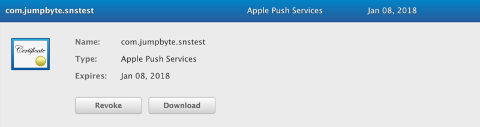
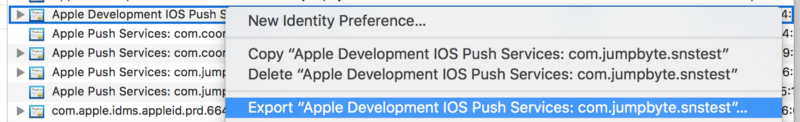
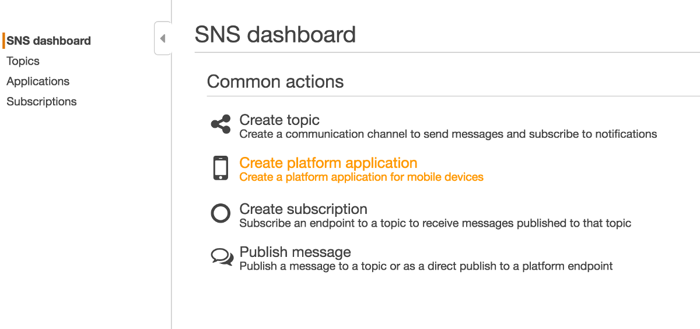
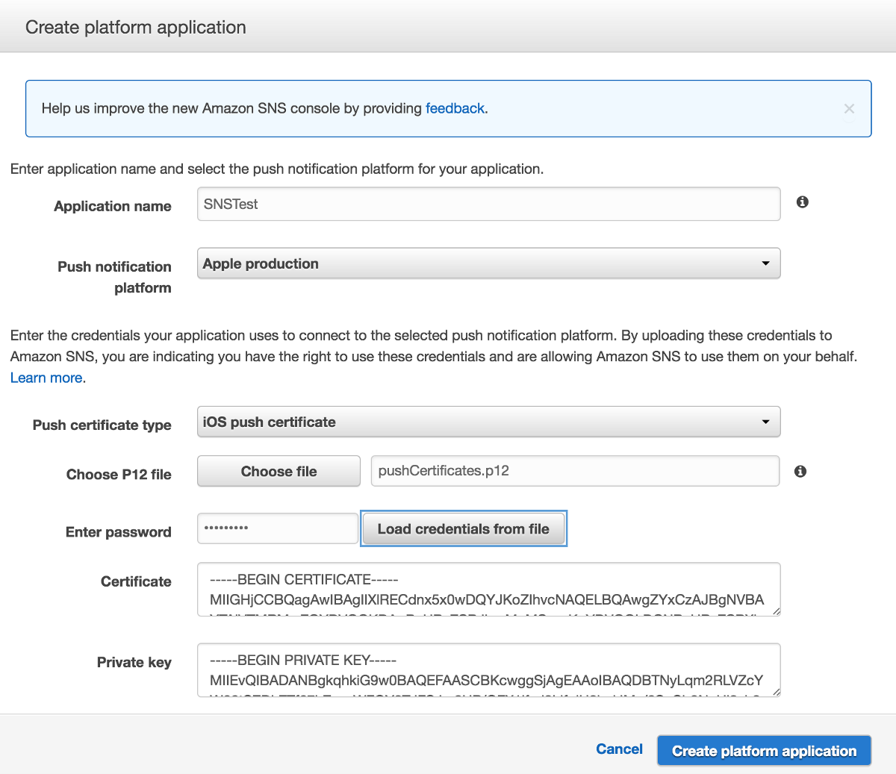
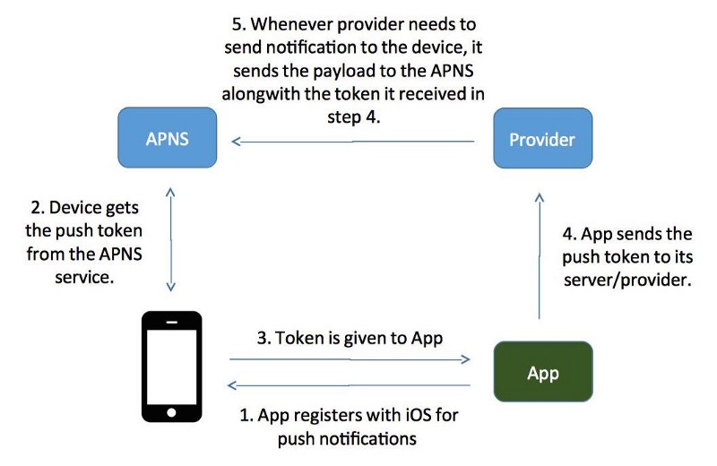
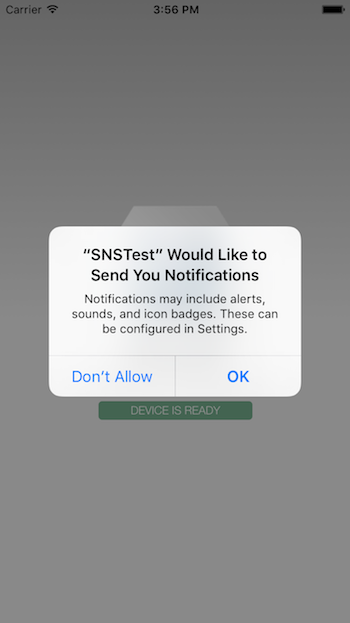
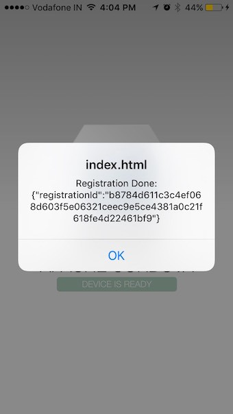
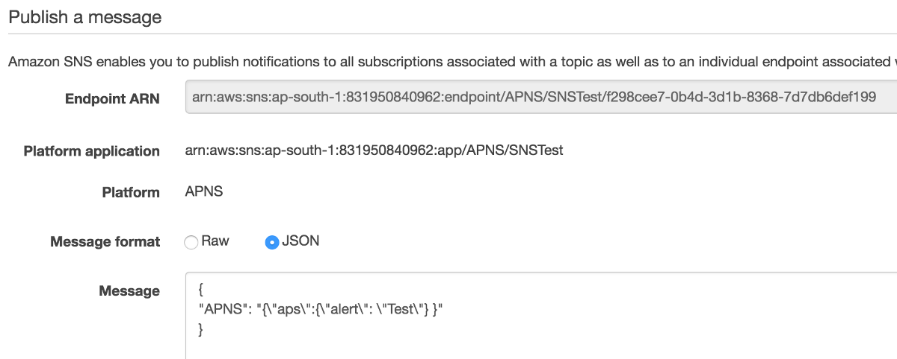
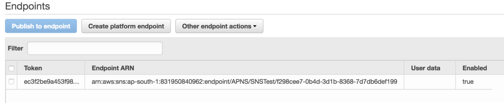
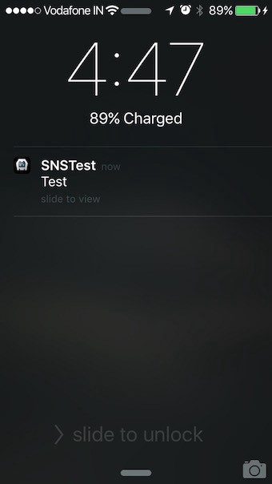

One of my clients decided to use the AWS SNS for Push Notifications, mainly to keep everything related to app on AWS and simple billing.

While most other popular services like Urban Airship, Parse, Batch, OneSignal, etc makes it easy for developers to integration Push with their custom plugins/libraries, SNS doesn’t have a specific library which sometimes makes it bit difficult for developer setup and follow without proper understanding of how Push Service really works, hence I decided to put a small document to cover the process (and also make it easy to remember for myself next time :).

> As I look back, the first time I used Push Notification for a Cordova (then PhoneGap) Mobile App was around Jan 2012 with Urban Airship.

> I ended up integrating Push Notification for that app using Urban Airship for iOS and Android, and programmed natively for BlackBerry and Windows Phone. The client is still using (Dec 2016) Urban Airship (now paid service) for the same app since then.

### Steps

*   Create App Bundle ID, Provision Profile and APNS Certificates
*   Setup SNS Platform Application from SNS Console
*   Create Cordova/Ionic app and Install the Push plugin
*   Collect the Device Token and Register with SNS Application
*   Send and Test the Push Notification from SNS

### Create App ID, Provision Profile and APNS Certificates

Login to the [Apple Developer Member Centre](https://developer.apple.com/account/) and create iOS App ID, provision profile and the Push Certificates.

I created an App Id `com.jumpbyte.snstest` and used one of the pre-created AdHoc Distribution Provision profile. Then I created the Apple Push Certificate for Distribution/Ad Hoc support.

Apple Push Certificate for Distribution and AdHoc support

Once the push certificate is created, download it to your machine and export to create a .p12 file. This file will be later required to create iOS Push Platform in SNS.

Export the Push Notification Certificate for SNS Platform

### Setup SNS Platform

Login to you SNS console — [**https://console.aws.amazon.com/sns**](https://console.aws.amazon.com/sns)

AWS SNS Dashboard

Select the Push Notification type and fill in the detail to create the platform. Make sure you select `Apple Production` as we have created the Certificate for Production purpose and not for Development purpose.

If you had created Development certificate then you will need to select the Development platform here.

Create SNS Application Platform

### Create Cordova/Ionic App

Now create an Ionic/Cordova project and add the Push plugin:

$ ionic start snstest blank -i com.jumpbyte.snstest  
$ ionic platform add ios  
`$ ionic plugin add phonegap-plugin-push`

on Mac, the latest Push plugin version uses CocoaPods for installation, so if it fails to install with error **Missing CocoaPods**, just install it before installing the plugin:

$ sudo gem install cocoapods

Now that the project is setup, we need to call the push plugin to register with APNS and collect the token and then created the SNS Endpoint. The below diagram shows how that part really works (in out case Provider is SNS):

Now open the project and update the app.js file to add push registration code as I have put below. Just make sure this code is run after the `deviceready` event is fired:

Our code is now ready to run on device, remember the push will not work on iOS Simulator so for testing you will have to run the code on real device.

If everything is working fine, then you should see the following dialog when you run the app for the first time:

User Permission required for Push Notification

Accept the alert and that will register the device with Apple Push Notification Service to generate the unique token for your device.

App Successfully Registered with APNS

### Collect the Device Token and Register with SNS

The difficult part starts now as what to do with this Token, while most other Push Services take care of this part internally, in case of AWS SNS, we will need to do this manually.

We will need to register this token in SNS and create an ARN for the device to send push later.

> I register the Token to SNS from the application backend, that way I don’t need to save the important AWS Auth keys inside the mobile app, and depending on the Dev/Prod App build, I can save the token to target SNS Application easily.

Add the Device Token in Application to generate ARN

### Send and Test Push Notification from SNS

Once we add the token in the SNS application, it will create an ARN which we can use to send a push notification and test whether everything is working or not.

Send Push Notification from SNS Console

And once I send this notification, it should receive to the device.

**Note: If there is any configuration mismatch between AWS SNS and Push Notification Certificates, once you send the push to device, the _Enabled field for the Token_ will become _false_.**

Push Arrived on the device

So finally with this, the push notification arrived and we can use the same ARN for future notification purpose.

**You can do some really cool stuff with Push Notifications like:**

*   Silent Notification, which would just update the Badge and will not interrupt the user with a buzz and without the actual notification in the Notification Centre
*   Background Fetch, so when notification arrives you want to download some data from the server, so that when user opens the app next time, he can see the updates immediately. More explained here: [https://medium.com/posts-from-emmerge/ios-push-notification-background-fetch-demystified-7090358bb66e#.7mxirwxsh](https://medium.com/posts-from-emmerge/ios-push-notification-background-fetch-demystified-7090358bb66e#.7mxirwxsh)
*   Push Notifications and VoIP, if you are developing those flashy Audio Call app. More info here: [http://www.nikola-breznjak.com/blog/ios/create-native-ios-app-can-receive-voip-push-notifications/](http://www.nikola-breznjak.com/blog/ios/create-native-ios-app-can-receive-voip-push-notifications/)

**Found this post useful? Kindly tap the ❤ button below! :)**