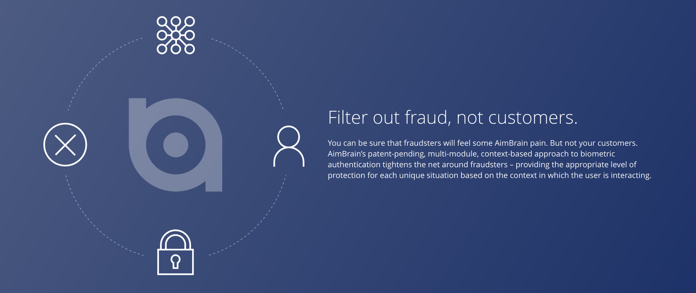
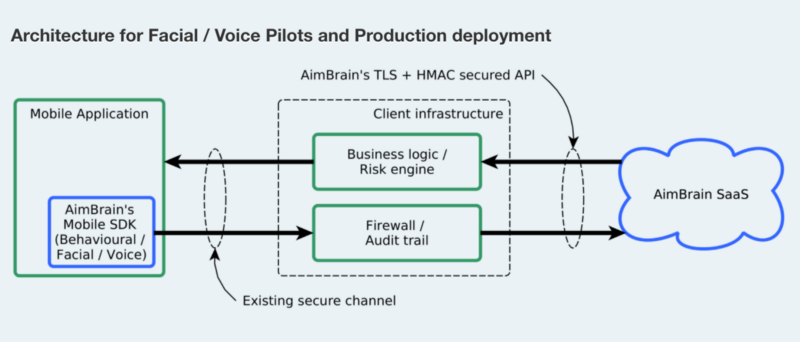

AimBrain Biometric Security for Mobile Apps

I recently got a chance to work with AimBrain Team, to help them develop a Cordova plugin for their Android/iOS SDK.

Basically AimBrain provides service for Mobile App to go Password-less, they use combination of behavioural, facial and voice recognition for verifying the identify of the user.

Here is a small demo of how their behavioural security works:

At first I thought it is going to bit complex to mix all these things together, but after using their Android SDK, it was clear that they have spent a lot of time making sure the solution is easy to use and works as expected.

As the service is not available for general users, I had to wait a bit to get hold of the Sandbox keys, but once I got it, it took me just few hours to get everything up and running with a demo Android app.

The plugin is still under testing and will be out soon. But I am putting here a small example on how to start using it from JavaScript.

$ cordova plugin add cordova-aimbrain-plugin

The following code shows the Facial module in working, the app user can register by providing his/her video or photo as an identity instead of providing password.

AimBrain User Registration with Facial Module

Once the registration is done, the login process is also very simple to follow:

[**dhavaln/cordova-aimbrain-demo**  
_cordova-aimbrain-demo - Cordova App for AimBrain SDK_github.com](https://github.com/dhavaln/cordova-aimbrain-demo "https://github.com/dhavaln/cordova-aimbrain-demo")

As a freelance service provider, I get to work with a lot of companies doing innovative stuff and AimBrain is one of those niche companies. I am glad that I got a chance to work with them.

Keep doing the awesome work guys :)

**Found this post useful? Kindly tap the ❤ button below! :)**