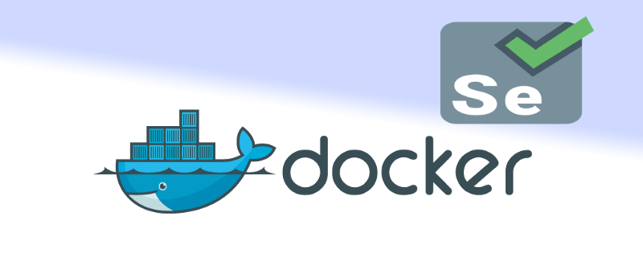

[**Setup Jenkins on CentOS with Docker for Selenium**  
_I haven’t found any walk-through about setting up Jenkins on CentOS with Docker for Selenium, and since I got to do it…_medium.com](https://medium.com/@prashant_48386/setup-jenkins-on-centos-with-docker-for-selenium-b7dba07b9ffa "https://medium.com/@prashant_48386/setup-jenkins-on-centos-with-docker-for-selenium-b7dba07b9ffa")[](https://medium.com/@prashant_48386/setup-jenkins-on-centos-with-docker-for-selenium-b7dba07b9ffa)

In my previous post, I went through the process of setting up Jenkins on CentOS. Today I worked through setting up The selenium grid with docker.

#### What Is Docker?

Docker is an open-source software platform to create, deploy and manage virtualized application containers on a common operating system, with an ecosystem of allied tools. Docker Inc., the company that originally developed Docker, supports a commercial edition and is the principal sponsor of the open-source tool.

Docker is a tool that packages, provisions and runs containers independent of the OS. Container technology is available through the operating system: A container packages the application service or function with all of the libraries, configuration files, dependencies and other necessary parts to operate. Each container shares the services of one underlying operating system.

Docker was created to work on the Linux platform, but has extended to offer greater support for non-Linux operating systems, including Microsoft Windows and Apple OS X. Versions of Docker for Amazon Web Services (AWS) and Microsoft Azure are available.

#### Configure Selenium Grid in Docker Containers

To get Selenium Grid up and running, we need to do below steps in Hub/Nodes machines

**Install Java**  
**Install Required Browsers (versions if needed)**  
**Selenium server jars**

Once the installation is completed, please test your installation by running the below command:

```
$ docker info
```

#### Install Docker

But first, let’s update the package

```
$ sudo yum check-update
```

Now run this command. It will add the official Docker repository, download the latest version of Docker, and install it

```
$ curl -fsSL [https://get.docker.com/](https://get.docker.com/) | sh
```

After the installation has completed, start the Docker daemon

```
$ sudo systemctl start docker
```

Verify your Docker status :

```
$ systemctl status docker
```

The Output should be similar to this.


Output

```
● docker.service - Docker Application Container Engine   Loaded: loaded (/lib/systemd/system/docker.service; enabled; vendor preset: enabled)   Active: active (running) since Sun 2016-05-01 06:53:52 CDT; 1 weeks 3 days ago     Docs: https://docs.docker.com Main PID: 749 (docker)
```

To configure the hub on a docker container, we need to pull Selenium Hub from Docker repository using below command:-

```
$ docker pull selenium/hub

Now we need to Run the Hub using below command

$ docker run –d –name selenium-hub selenium/hub

If you want to assign the port, run the below command

$ docker run –d –p 4545:4444 –name selenium-hub selenium/hub

To register nodes to the Hub, we need to pull nodes from Docker Hub using below commands

$ docker pull selenium/node-firefox

$ docker pull selenium/node-chrome
```

OR

```
$ docker pull selenium/node-firefox-debug

$ docker pull selenium-node-chrome-debug

Command to link both Chrome and Firefox nodes to selenium-hub

$ docker run –d –link selenium-hub:hub selenium/node-firefox

$ docker run –d –link selenium-hub:hub selenium/node-chrome

```

#### Using Docker compose

We will create a `docker-compose.yml` file and see how the images interact with each other.

#### Install Docker Compose

First, install `python-pip`as prerequisite

```
$ sudo yum install epel-release

$ sudo yum install -y python-pip
```

Now Install docker-compose

```
$ sudo pip install docker-compose
```

Put the following content into the `.yml`file.

Execute the following command to create the container

```
$ docker-compose up
```

For stop all running Docker container we need following

```
$ docker-compose stop
```

**Note:** `docker-compose kill` is also available if you need to shut down forcefully.

For Delete Docker container we need following

```
$ docker-compose rm
```

After setup selenium grid by visiting the following address from your web browser:

```
http://<Server-IP>:<>/grid/console]
```

### Running a Sample Test Case on the Grid

Below is a simple WebDriver code. Once you run it, it will open google page and click on the search button of google with Chrome browser.

Below is a simple WebDriver code. Once you run it, it will open google page and click on the search button of google with the Firefox browser.

_Thank you for reading, if you have anything to add please send a response or add a note!_