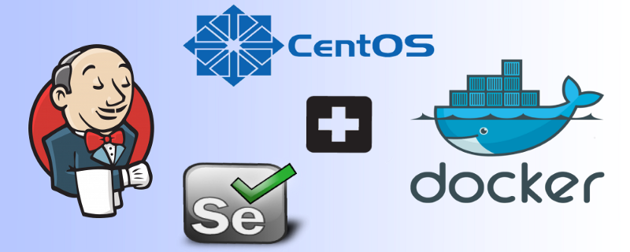
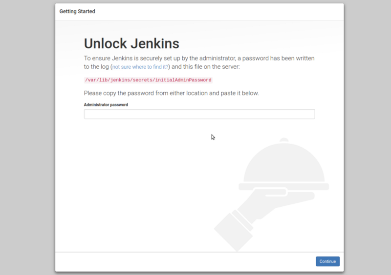
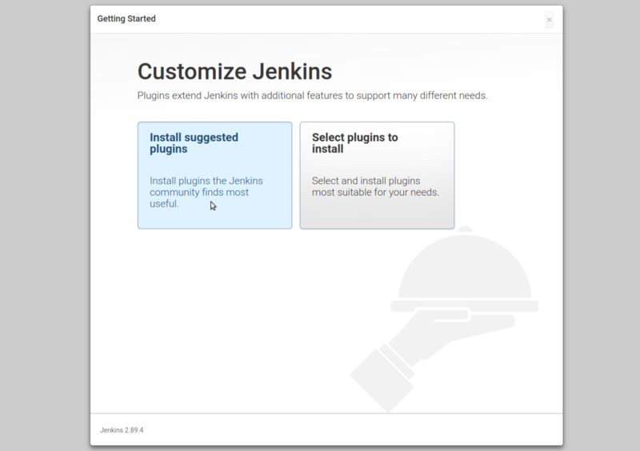
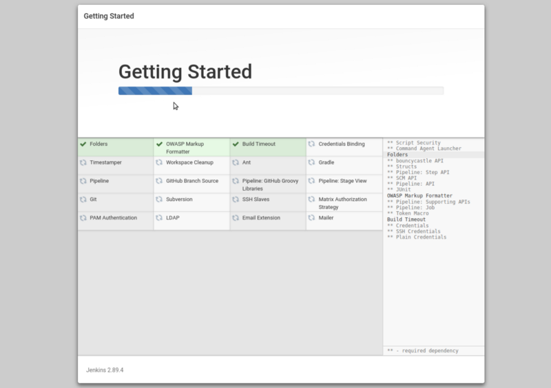
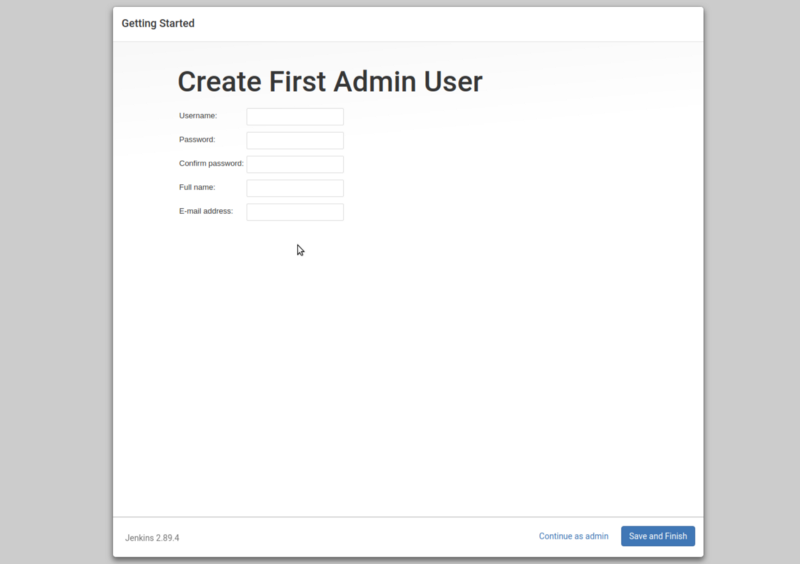
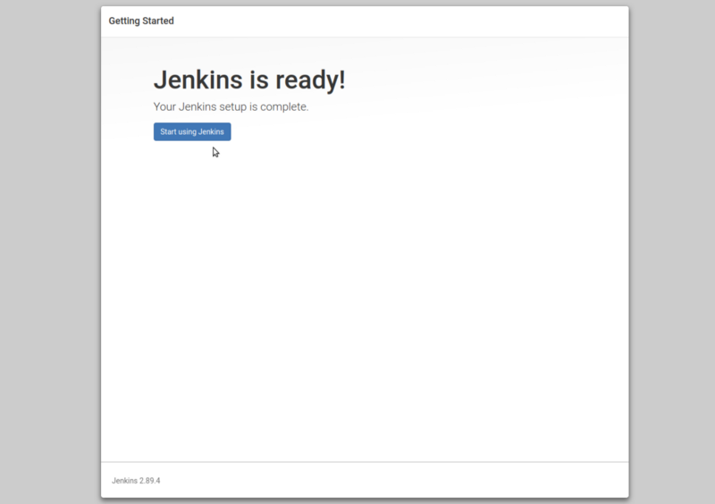
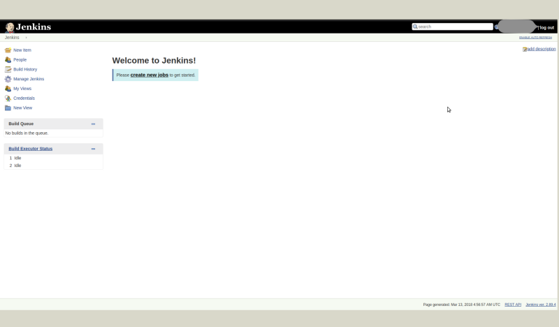

**I haven’t found any walk-through about setting up Jenkins on CentOS with Docker for Selenium, and since I got to do it and I have the steps fresh in mind, here is the process.**

#### Set up Jenkins on CentOS :

#### Step 1: Update your System.

One of the system administrators’ bast practice is keeping a system up to date.

```
$ sudo yum update
```

After installing the latest stable package reboot system.

```
$ sudo reboot
```

#### Step 2: Install JAVA

Before you can install Jenkins we need to install JAVA.

```
$ sudo yum install java-1.8.0-openjdk.x86\_64    (Install jdk 1.8.0)
```

Check your java version :

```
$ java –version
```

Set environment variable for JAVA :

```
$ sudo cp /etc/profile /etc/profile\_backup

$ echo ‘export JAVA\_HOME=/usr/lib/jvm/jre-1.8.0-openjdk’ | sudo tee -a /etc/profile

$ echo ‘export JRE\_HOME=/usr/lib/jvm/jre’ | sudo tee -a /etc/profile

$ source /etc/profile
```

Check your environment variables :

```
$ echo $JAVA\_HOME

$ echo $JRE\_HOME
```

Now we can install Jenkins in our system.

#### Step 3: Install Jenkins

```
$ cd ~

$ sudo wget -O /etc/yum.repos.d/jenkins.repo [https://pkg.jenkins.io/redhat-stable/jenkins.repo](https://pkg.jenkins.io/redhat-stable/jenkins.repo)

$ sudo rpm — import [https://pkg.jenkins.io/redhat-stable/jenkins.io.key](https://pkg.jenkins.io/redhat-stable/jenkins.io.key)

$ yum install jenkins
```

Now, we need to start Jenkins service

```
$ sudo service jenkins start               (Start jenkins service)
```

Check that Jenkins service already started or not.

```
$ sudo service jenkins status
```

Now, test Jenkins by visiting the following address from your web browser:

```
$ http://<server-IP>:8080
```

By default Jenkins runs on 8080 port but if we need to change port number then follow this :

```
$ sudo firewall-cmd — zone=public — permanent — add-port=8080/tcp

$ sudo firewall-cmd — reload
```

After that Now, test Jenkins by visiting the following address from your web browser:

```
http://<server-IP>:<Selected port>
```



For the first time you log in, you would be asked for a password so I got to display the path that is shown on the screen and get a password.

```
$ sudo cat /var/lib/jenkins/secrets/initialAdminPassword
```



Select Install suggested plugins.



After this is done, you will be asked to set up your admin user. With that done, you are ready to import a project or start a new one with Jenkins.



After filling this form, click on save and finish.



Jenkins is ready now, once you click on start using Jenkins button and you will be directed to Jenkins dashboard.



[**Configure Selenium Grid in Docker**  
_In my previous post, I went through the process of setting up Jenkins on CentOS. Today I worked through setting up…_medium.com](https://medium.com/@prashant_48386/configure-selenium-grid-in-docker-45a377ab233b "https://medium.com/@prashant_48386/configure-selenium-grid-in-docker-45a377ab233b")[](https://medium.com/@prashant_48386/configure-selenium-grid-in-docker-45a377ab233b)

_Thank you for reading, if you have anything to add please send a response or add a note!_