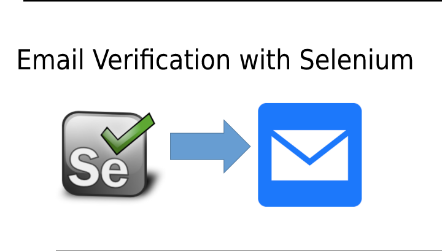
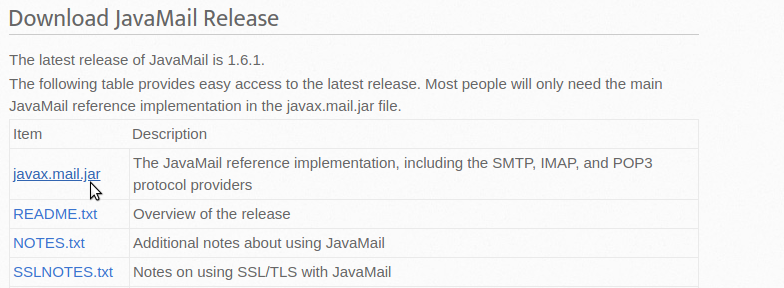

Many applications may send verification emails and get first time password from emails. Often, tests related to this are left to manual testing, instead of putting them into an automated test suite.

However, there’s no need to check emails manually: it suffers from all the same problems as another manual testing. It’s slow and expensive. There are many libraries available to interact with email through code — this post will focus on how to use them within an automated test suite.

### Getting started

The tests are automatically configured to use Gmail, with a fake testing account we have set up for display purposes.

> If using Gmail for your test email account, you may face some problems with authentication and need to allow less secure apps to access your account.

#### Scenario :

Launch Gmail using Selenium;  
Somehow search for new mail in the list of available mails;  
Somehow to click on it;  
Parse the mail message;  
Get the password;  
Follow up with the registration process

The JavaMail jar files are published to the Maven repository. The main JavaMail jar file, which is all most applications will need, can be included using this Maven dependency



We need to add maven dependencies in pom.xml file

```
<dependencies>
```

```
<dependency>
```

```
<groupId>com.sun.mail</groupId>
```

```
<artifactId>javax.mail</artifactId>
```

```
<version>1.6.1</version>
```

```
</dependency>
```

```
</dependencies>
```

That is the example of email automatically verify and get a password from it.

we have the email verification class now we need to just call in our test case so lets code for getting the password from the email account.

_Thank you for reading, if you have anything to add please send a response or add a note!_