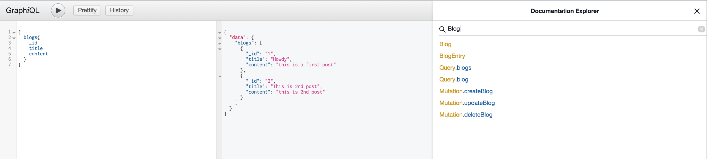
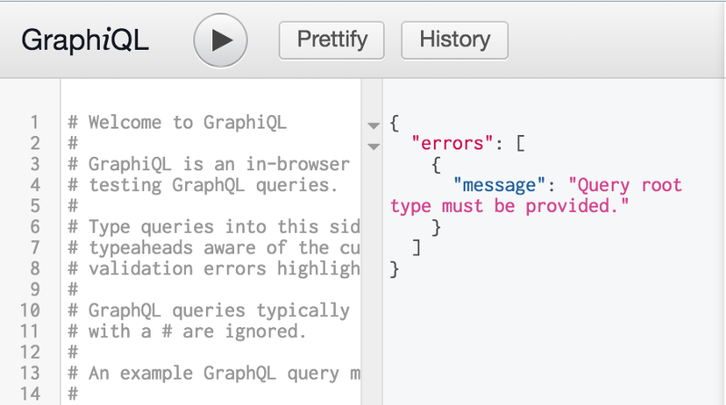
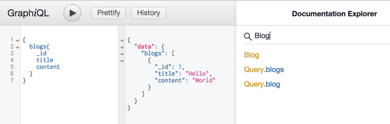
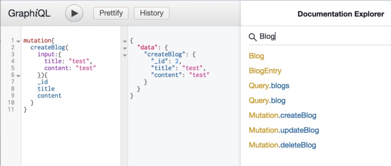
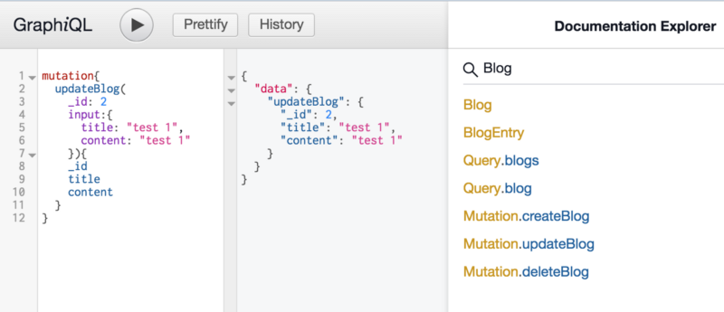
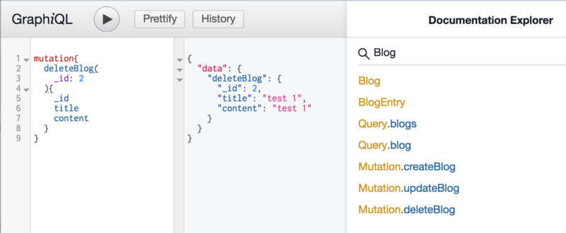

We have been working on a mid-size application primarily using Express as an API Backend, and planning to migrate a portion of endpoints to GraphQL. So I have been fiddling with the framework for quite a few days, and decided to put a two-part post to explain the process of integrating GraphQL with Node/Express application.

In this particular post I will go through the steps to integrate GraphQL with Express and create CRUD operations for a simple object type.

### Pre-requisite

I am using Node 8.x for this demo.

$ mkdir graphql-demo && cd graphql-demo  
$ npm init -y  
$ npm i -s express express-graphql  
$ npm i -D nodemon

### Initialise Express and GraphQL

First thing first is to setup a basic Node application with Express and GraphQL.

Run the code and go to `[http://localhost:3000/graphiql](http://localhost:3000/graphiql)` which should bring the `GraphiQL` UI to test the GraphQL requests. As we have not setup required things yet, it will show an error message in response.

### GraphQL Schema

Next we need to setup GraphQL schema, this is the custom type through which we will communicate with graphql server. The schema is the basic structure which will carry the data from backend to frontend, and allows the requests to ask for specific fields where ever required.

To setup the schema we have to provide the `type` definition along with the `resolvers` For example we are setting the Blog type in the following code snippet, which consists of bare minimum fields which we want to return.

When you run this the GraphiQL will display an error in the UI to provide the Query root object, which is nothing but setting up the READ requests.

Now when you run the code, the error message will change. It finds the required Schema, but couldn’t find the mandatory Query type.

### GraphQL Query

As we have the Schema setup now, we will setup a basic request to fetch data or `read` data from the backend. We have to define a `Query` type which holds all the read requests we will be accepting for the schema.

Once the Query type is defined, we then have to define the resolvers where we would be writing the actual code to fetch and deliver the required data.

In the following example, we have setup two methods, `blogs` and `blog(_id)` to get all the blogs or blog with a given ID.

The resolver function is pretty simple, similar to how we would write a normal express endpoint for GET requests. However as you can see the input parameters for the resolver functions are bit different. It provides four parameters. `root, args, context and info` which we will check in next section.

When you run this code, it will allow you to run the first query request and would look something like this. The request data is on the left, result is in middle and the right section is the default documentation provided by GraphiQL.

When you fire the above request, the actual URL would look something like this:

[http://localhost:3000/graphiql?query={](http://localhost:3000/graphiql?query=%7B)  
  blogs{  
    \_id  
    title  
    content  
  }  
}

You can run the above request in POSTMAN and should still see the same data result provided by the GraphiQL.

### Resolver parameters

root — root value provided during middleware setup

args — contains the values received in the request

context — we can pass global data via the context when we initialise the graphql middleware, which is available for each resolver function. If no context is defined, then it contains the detailed request object.

info — contains the GraphQL query specific information like Schema information, operation, fields, etc

### GraphQL Mutation

Once our GET/READ requests are working fine, its now time to perform other operations like Create, Update and Delete. For that we have to setup the Mutation definitions.

For mutation we will be setting up two things: input data type and mutation resolvers. For our Blog example, we will be taking `title` and `content` as an input object, so we will have to define an `input` type in GraphQL type definition with these two fields.

Once the input type is defined, we have to define `Mutation` object similar to `Query` to define the possible mutation methods.

In below example, we have set `createBlog`, `updateBlog`, and `deleteBlog` which takes in different input parameters and returns the defined data back.

As you can see we are receiving the data in the resolver function via the args parameter.

Testing mutation requests in GraphiQL are very simple. Let’s run a `createBlog` request. Based on our mutation definition. We have provided _title_ and _content_ value and expected a blog object back with _\_id_ field as well. Also we can now see multiple methods in the Documentation Explorer as well.

createBlog Request

Same with the updateBlog request. As you can see we are passing two parameters here: \_id and input object.

And deleteBlog request, with just \_id parameter

So far we have a working Express/GraphQL app which allows us to Create, Read, Update and Delete our Blog entries via the GraphQL way.

In the next section will be covering following things

*   Explore more about GraphQL Schema and Resolver function
*   Connect GET/POST Express endpoints with GraphQL
*   Consume the data from an Angular app