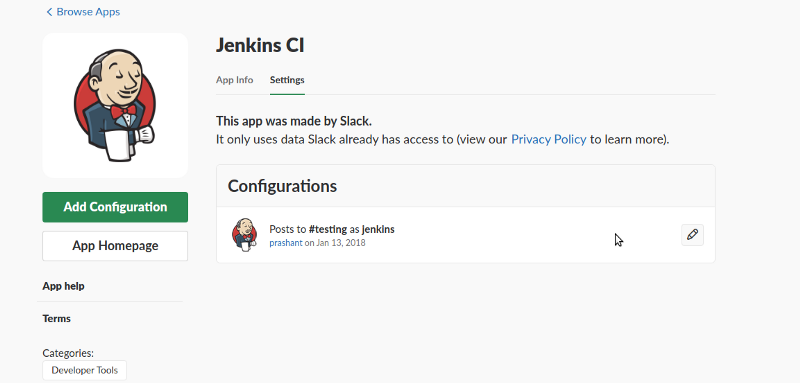
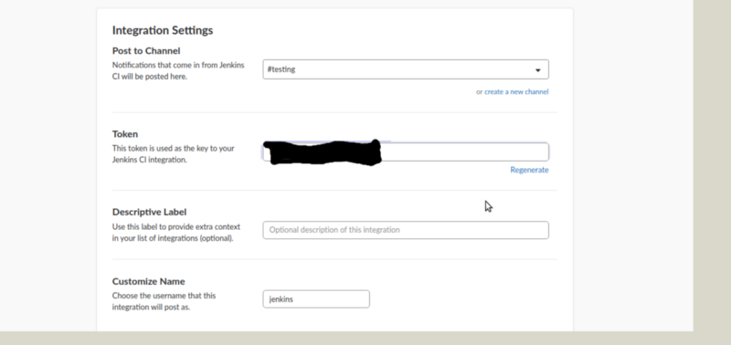
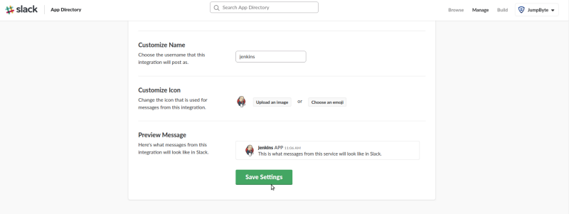
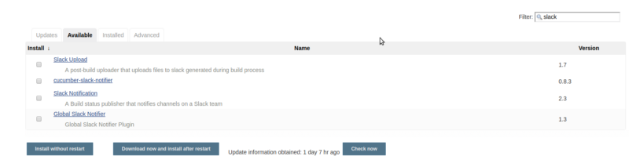
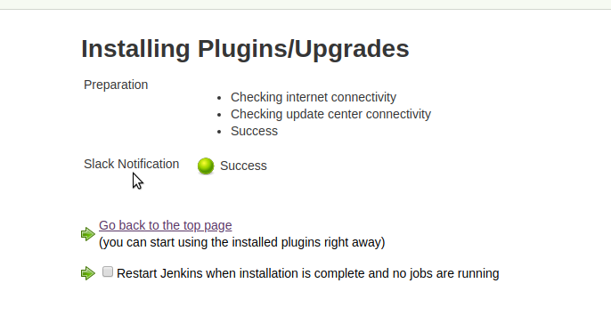
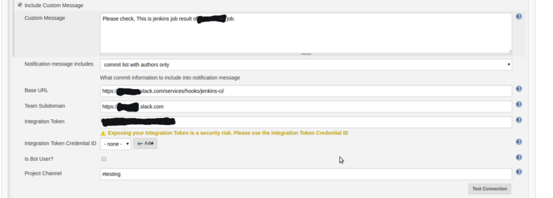
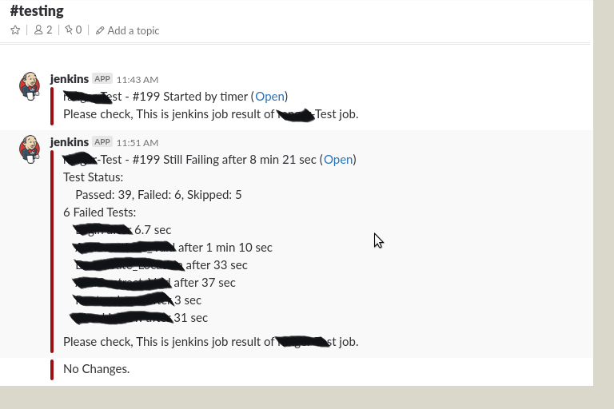

Jenkins is an open-source continuous integration software tool written in the Java programming language for testing and reporting on isolated changes in a larger code base in real-time. The software enables developers to find and solve defects in a code base rapidly and to automate testing of their builds.

So How automation build environment to run build every single push happens on the source repository we need to broadcast the status of the build to the team members will ensure code base sanity.

This blog will help you to set up a continuous integration environment using Jenkins with slack for notifications.

Here Are some steps you need to follow to set up Jenkins that we discuss in our previous blog.

[**Setup Jenkins on CentOS with Docker for Selenium**  
_I haven’t found any walk-through about setting up Jenkins on CentOS with Docker for Selenium, and since I got to do it…_medium.com](https://medium.com/appgambit/setup-jenkins-on-centos-with-docker-for-selenium-b7dba07b9ffa "https://medium.com/appgambit/setup-jenkins-on-centos-with-docker-for-selenium-b7dba07b9ffa")

#### Integration Jenkins with slack

First, we need to configure slack on our machine.

1.  Create a slack account: [https://slack.com](https://slack.com/)/
2.  configure the Jenkins integration: [https://myspace.slack.com/services/new/jenkins-ci](https://myspace.slack.com/services/new/jenkins-ci)

First, install ‘Jenkins-ci’ and then Add configuration and set channel and all thing like

Add channel name here and note Token.
Then scroll down and click on save setting button.

After that, we need to set configuration on Jenkins `[Slack Notifications plugin](https://wiki.jenkins.io/display/JENKINS/Slack+Plugin).`

For Jenkins to notify slack, we need to install in Jenkins. By now, you must know how to do this, so go ahead and install the plugin.

Select `[Slack Notifications plugin](https://wiki.jenkins.io/display/JENKINS/Slack+Plugin)` and click on `Install without restart` button.

It displays success with the plugin install successfully.

Then go to Jenkins job if you have no job then you need to create one job and go to the post-build section. Select `Slack [Notification](https://wiki.jenkins.io/display/JENKINS/Slack+Plugin)`\` and it’s display `Slack [Notification](https://wiki.jenkins.io/display/JENKINS/Slack+Plugin)`\` wizard.

Enter Base URL, Team subdomain, Integration Token that created on you slack and Project Channel and click on apply and save button.

And also for Integration Token, It’s recommended is to configure credentials for your Integration Token. Just add credentials (Secret text) and define your token.

#### Test setup

Now we can finally test our current setup. We can run the Jenkins job.

based on your build result it sends slack notifications like here.

_Thank you for reading, if you have anything to add please send a response or add a note!_