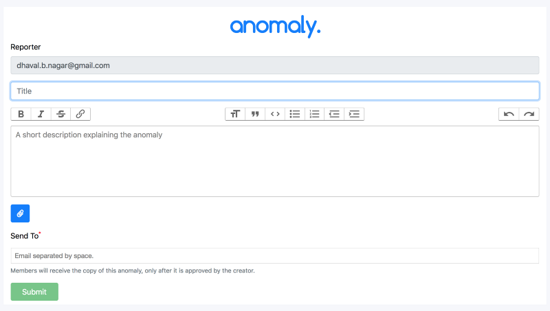
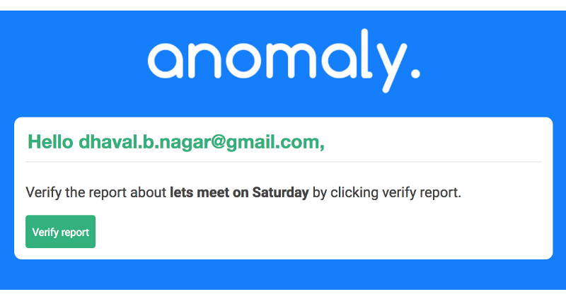

anomaly — home screen

At AppGambit we prefer to work on one side project at any given time, this way we get to learn new stuff and also try our hands on exciting new technologies.

### Some of our recent side projects

[ContentBin](https://contentbin.appgambit.com) — Anonymous Content Sharing

[InvestLoop](https://investloop.appgambit.com) — Tiny app to list investable businesses and portfolio management

[Athena](http://athena.appgambit.com/) — We are putting AWS Athena at test with a twist (this is still work in progress)

> We commonly use Node, Angular, MongoDB, AWS technologies like EC2, Lambda, API Gateway, Cognito, DynamoDB, etc.

> I am a certified **AWS Solution Architect and Developer**, and my team also works heavily into AWS and Cloud area, so we tend to use more of these technologies.

### anomaly.

We have been working on a complex enterprise task management application for past couple of years called, [CoorWorks](https://www.coorworks.com/).

**anomaly** is inspired from a small module of this app, where we allow external users to be part of the application without ever signing into the main system, and still they have all the visibilities related to the task assigned to them.

At the moment we are using **_anomaly_** internally to manage some of the tasks where at any point an external user is involved.

> Disclaimer: The reason why I gave it a name, **anomaly**, is because the original goal was to use this to report issues. Now that I use it, the name does not justify well, but I still like the name :)

### Let’s run through

Because the system has no Signup/Login process, the entire process goes through the email of the user who is initiating the task.

Enter Email to start a Task

Once the email is given, it will take the user to the actual task screen, where we can enter all the information related to the task, like title, description, attachments and most importantly whom to involve in this task.

Task Create Screen

Once all the information is given and when user submits the task, a Verification email is sent to the task creator. This is the important part of the system, where the author of the task has to confirm whether to dispatch the task detail to all the given members or not.

An email with verification link will be sent to the owner of the task

The task owner has to verify the report, so that the task will be distributed to all of its members.

Verify the Task

Once the verification is completed, the task link is sent to all the members, and they can access the task using that link.

Task Ready to use

As you can see the system is fairly simple and to the point, yes it does miss a lot of traditional things, and that was the point and so we intentionally kept it simple to meet the original goal.

We are using this as of now, but will keep adding small stuffs as we find them suitable.

**Have any feedback?** Please comment below or write me at dhaval@appgambit.com and I will be happy to answer.

We have an exiting tiny application, **timeline**, into development now, and I will surely write about it as soon as we start testing it.