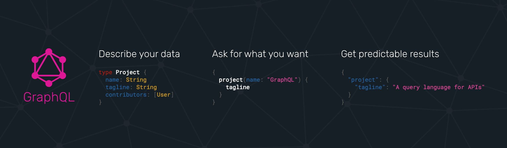
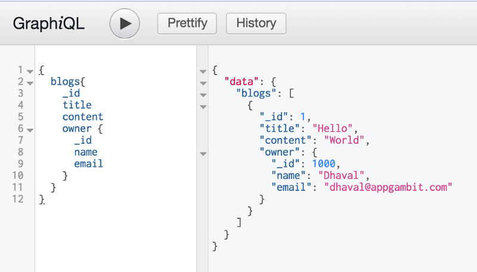
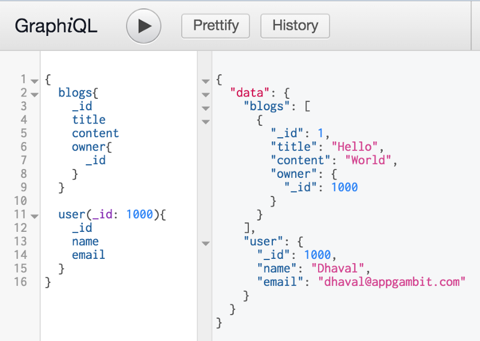

In this part we will look deeper side our previous application, and would try to make it more look like a production level implementation

If you haven’t checked Part-1 yet, you can read it from here:

[**Part 1: GraphQL with Node and Express**  
_We have been working on a mid-size application primarily using Express as an API Backend, and planning to migrate a…_medium.com](https://medium.com/appgambit/part-1-graphql-with-node-and-express-d5069c2e26e9 "https://medium.com/appgambit/part-1-graphql-with-node-and-express-d5069c2e26e9")

Topics we would cover:

*   GraphQL Schema
*   Data Validation
*   Integrate with Express

### GraphQL Schema

If you have gone through the last article, then you can see there are few obvious things which may raise few questions, like:

*   why we created a separate type instead of using the regular JSON object
*   why we have two separate head for Query and Mutation

To put it into a simple way, GraphQL provides a language neutral way to organise your data structures. We define the type, queries and mutations in rather generic way and their implementation is followed using the language of our choice. In the current case it is done using JavaScript.The basic structure of GraphQL schema is like this:

schema {  
  query: Query  
  mutation: Mutation  
}

Where **query** is mandatory, but **mutation** is optional to define. We can define multiple types, and also reference them from one another.

Now with above code example, if I query the blogs I would get the output something like this. It returns the **blog** model, with referencing **owner** model as well.

Now the obvious thing comes to our mind is that, what if the blogs returns multiple object with same owner, in which case we will be getting duplicate data. Without GraphQL we would be either re-structuring our APIs to reduce the duplicates or may make multiple API calls to get the desired information.

But with GraphQL, I can just change the query structure a bit and it would remove the duplicity.

### Data Validations

Because GraphQL works more as a typed language, when we interact it instantly invalidates the wrong data provided into the request.

So the request must match with the query set on the backend, in case of any violations in that, GraphQL raises the error and as a developer we do not need to validate the request data structure once the types and query/mutation is defined.

### Integrate with Express

While the simple example contains only GraphQL specific configuration, but all the other configurations like CORS, Middleware, JWT with Express remains same and there is not much change, which makes it pretty quick and easy to integrate.

GraphQL has much more to offer than I have mentioned in the this short tutorial. But here are few resources to get into more in-depth.

[**GraphQL: A query language for APIs.**  
_GraphQL provides a complete description of the data in your API, gives clients the power to ask for exactly what they…_graphql.org](https://graphql.org/ "https://graphql.org/")

[**GraphQL Services**  
_GraphQL provides a complete description of the data in your API, gives clients the power to ask for exactly what they…_graphql.org](https://graphql.org/code/#services "https://graphql.org/code/#services")

[**chentsulin/awesome-graphql**  
_awesome-graphql - Awesome list of GraphQL & Relay_github.com](https://github.com/chentsulin/awesome-graphql "https://github.com/chentsulin/awesome-graphql")

[**Apollo GraphQL**  
_Learn about the Apollo platform: Client, Engine, GraphQL servers, GraphQL support, and more._www.apollographql.com](https://www.apollographql.com/ "https://www.apollographql.com/")

Out of many services built on top of GraphQL, I really liked GraphCool and I will be playing around that very soon. Do check it out.

[**GraphQL Backend Development Framework**  
_Open-source framework to develop and deploy production-ready serverless GraphQL backends. Including GraphQL database…_www.graph.cool](https://www.graph.cool/ "https://www.graph.cool/")

We are working on another server-less web app, [Timeline](https://timeline.appgambit.com) (_still work in progress_), which is using AWS Amplify, it’s like a full stack to build web/mobile applications. Although it is tightly integrated with other AWS Services, but also a pretty neat way to build applications on AWS.

[**AWS Amplify**  
_A JavaScript library for application development using cloud services._aws.github.io](https://aws.github.io/aws-amplify/ "https://aws.github.io/aws-amplify/")

AWS AppSync is another service from AWS to build data-driven applications with offline capabilities, and it by default uses GraphQL as a data provider.

[**AWS AppSync - Build data driven apps with real time and offline capabilities based on GraphQL**  
_AWS AppSync automatically updates the data in web and mobile applications in real time, and updates data for offline…_aws.amazon.com](https://aws.amazon.com/appsync/product-details/ "https://aws.amazon.com/appsync/product-details/")

I think GraphQL is great for certain types of applications, and it definitely makes a difference where the API is being used by variety of clients and with varying data need.

It gives the freedom to structure the data as per the business logic and let the consumer decide what all things to ask for.