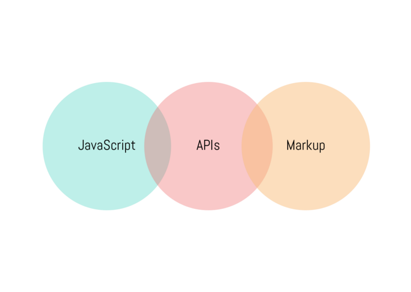

Last week I came across this interesting term, [JAMStack](https://jamstack.org/), while working on a prototype using [Gatsby](https://www.gatsbyjs.org/)/[NextJS](https://nextjs.org/)/[Netlify](https://www.netlify.com/) (all of these are uber cool and I will put some write up on them in near future).

Although I have been using JavaScript for long time, now more than ever, it’s difficult to catchup with the things.

### So what is a JAMStack

> By definition, JAMStack is a modern web development architecture based on client-side JavaScript, reusable APIs, and pre-built Markup.

To simplify the definition further:

*   Front-end is built using JavaScript, [obviously](https://insights.stackoverflow.com/survey/2018/#technology)
*   All the interaction to backend is done via APIs, whether its for authentication, data or anything else. [APIs are everywhere](https://hackernoon.com/api-is-the-gateway-drug-of-programming-9eadd24ede47), [they even has conference for APIs](http://apiworld.co/)
*   Markups/Templates are pre-built when we deploy the app. Although if the first two points are achieved, then I think we do not strictly need pre-built markup. It can be with data or without data as well.

### So what is NOT a JAMStack

As per the JAMStack definition,

> Applications which are tightly integrated with backend like Wordpress and Drupal.

This makes sense, when we talk about modern JavaScript based applications, we usually assume that front-end or UI is built in JavaScript and it uses the APIs to communicate with backend services. So all the application which are in any way tightly integrated with the backend will **NOT** be considered a JAMStack.

> _When I started programming, I knew only Java, when anyone asks what you do, I would say, I am a Java Developer whether I am writing JSP Pages, CORBA or EJBs. Now a days for JavaScript, I need to explain which particular stack I use all well._

I have been working on a MEAN stack application for past couple of years. Though everything is properly aligned, it has Angular based front-end, Node/Express back-end and all the interaction is via APIs only, **it’s still not a JAMStack app** (with some effort, it can become one).

### So why JAMStack approach !!

The points mentioned below is from their original explanation (and I have added my 2 cents).

#### Performance

If you have a JavaScript based front-end, practically you can load it from any CDN cluster. So this will load your application blazing fast, compared to a typical single-source loading applications.

At AppGambit for newer applications, we are using S3 with Static Hosting, this serves the purpose for the kind of applications that we are building.

#### Scalability

Because the front-end just a bunch of static stateless resources, it can easily be replicated to multiple servers. This allows to practically achieve the high availability for rendering part. Although for the application to function seamless across varying load, you will still need a better designed back-end.

If the back-end is designed with pure API based structure in mind, it is very well possible to structure the back-end logic to serve the increasing load.

#### Security

I would not say that JAMStack applications are having particular edge over regular applications when it comes to security. But yes, I will follow their part that, because the front-end is entirely separated out, the APIs level security can be managed differently and well.

#### Developer Experience

This is true for targeted development. Just like it is for Mobile Application development; iOS dev focuses on iOS specific things and Android dev focuses on Android specific things. Front-end developer can design/architect the app, without any dependencies over the back-end, same for the back-end.

Because of the increasing amount of options available to [build modern web applications](https://deanwampler.github.io/polyglotprogramming/), with clear separation we can achieve proper usability across both.

### Conclusion

I think in a way, most newer web applications are built using this approach only. To serve different purposes like scalability, clear separation of concerns, using best-fit technologies, etc. We have so many stacks already, so this more like a stack above all those stacks :)

### Resources

[https://jamstack.org/](https://jamstack.org/)

[https://serverless.com/](https://serverless.com/)

[https://nextjs.org/](https://nextjs.org/)

[https://www.gatsbyjs.org/](https://www.gatsbyjs.org/)

[https://www.netlify.com/](https://www.netlify.com/)