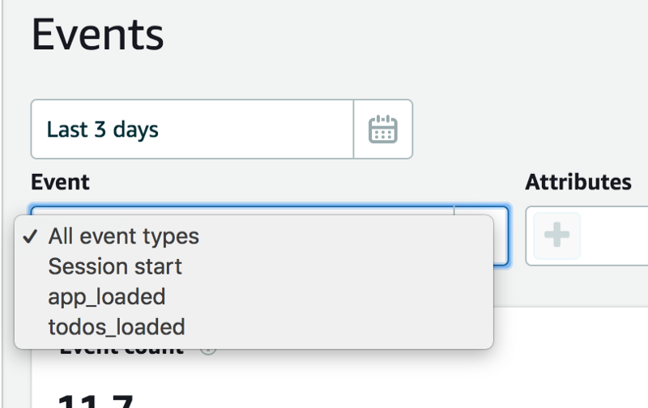

In this part we will be using the recently launched AWS service [Amplify](https://aws.github.io/aws-amplify/). At core it’s a JavaScript library which helps the front-end and mobile applications to integrate with AWS backend services easily.

These are some of the services which it supports as of now.

*   Analytics — AWS Pinpoint
*   API — API Gateway and Lambda
*   File Storage and Hosting — S3, CloudFront
*   Data Storage — DynamoDB
*   Authentication — Cognito
*   Push Notifications — AWS Pinpoint

### Services we will use in this part

We will be building a basic ToDo Web application using Angular 6 with these Amplify features.

*   S3 Hosting, CloudFront
*   Analytics
*   APIs using API Gateway and Lambda

### How Serverless!!

We will not be using any services which requires to run a machine instance. Hosting, APIs, Auth and Database, all of these will be implemented from different services which are fully managed by AWS and as a developer we do not have to install or configure any part of it.

### Let’s start

#### Create Angular 6 project

Make sure you have latest angular installed. Then create a new application `serverlesstodo` with following commands.

```
$ npm install -g @angular/cli$ ng new serverlesstodo$ cd serverlesstodo
```

#### Integrate Amplify

Next we need to integrate AWS Amplify library to our Angular app.

```
$ npm install --save aws-amplify$ npm install --save aws-amplify-angular
```

#### Install and configure AWS Mobile Hub

Amplify is a front-end library, and it is designed to provide a environment to communicate with backend cloud services like Auth, APIs, Storage, etc. For the backend it is using [AWS Mobile Hub](https://aws.amazon.com/mobile/), which allows the developer to quickly setup all the necessary services required to build variety of web and mobile applications at scale.

Make sure you have latest `awsmobile` npm installed. AWS Mobile uses `yarn` so make sure you have that installed as well.

```
$ npm install -g awsmobile-cli$ npm install -g yarn
```

Next configure the AWS access, it will create necessary configuration files to communicate with your AWS environment.

```
$ awsmobile configure
```

#### Initialise Mobile Hub Project

Once the basic things are setup, we need to create a backend application with which our front-end will communicate.

We can either create the backend-app using CLI or using the AWS Mobile Hub Console. We will create the backend using the AWS Console just for the simplicity.

Login to your AWS account and go to the Mobile Hub service, and create a new project.


Next is to select the appropriate platform, which in our case is Web. As you can see there is a little option at the bottom, which will by default use the CloudFront when we publish the application.

> Do keep in mind that each AWS services comes with different pricing option, and if you are new to AWS, you should know how pricing is calculated for different AWS services. You can estimate your AWS billing from [here](https://calculator.s3.amazonaws.com/index.html).


Once the platform is selected, AWS will create the required backend and now you can initialise the backend to your frontend project.

The integration is fairly simple in this case. Each backend project has a unique project id, and we need to use the `awsmobile` command to integrate that with the front-end application.


#### Integrate Mobile Hub project with Angular 6

Now go to your Angular project and run the given `awsmobile init` command. It will ask you basic questions on where to keep the resources for your backend integration and you can just select the default options.


#### Integrate Amplify with Angular

Once we integrate the Mobile project to our frontend, next is to start using the Amplify library to connect with the backend.

> First thing we need to do is to fix the Angular 6 specific issue by adding following code to the index.html file. The newer version of Angular is not providing shim for `global` object, which previous versions were providing. Without this your application will not start properly.

```
<script>    if (global === undefined) {        var global = window;    }</script>
```

Next go to `tsconfig.app.json` file and include node for the types in compilerOptions field.

"compilerOptions": {  
  "outDir": "../out-tsc/app",  
  "module": "es2015",  
  "types": \["node"\] // node is required   
}

Now run `ng serve` and that should fire up the Angular app at default `[http://localhost:420](http://localhost:4200)0` url. We will integrate Amplify library now, and make sure that it has initialised properly.

Go to the `src/app/app.component.ts` file and add below code:

You should now be able to see the `Amplify Initialised` in your browser’s Developer Console.

> I have included Bootstrap CSS for the basic UI. You can add any styling library you prefer.


#### Create simple API

As we have a basic Angular app working now, we will be creating a simple backend API which will pull the test ToDo data for the display.

We first need to activate the API for our Mobile Hub project, run the `awsmobile features` command and turn on the `cloud-api` feature.


Once the `cloud-api` is enabled, then we will run the `awsmobile push` command, and this will synchronise the changes we have made on local project to the Mobile Hub project on AWS.

```
$ awsmobile push
```

This will take some time, and it will initialise and deploy a basic API with name `sampleCloudApi` with endpoints like `/items/ and /items/{id}`.

Also the new Lambda will be available in the code so that we can write our logic.


Go to the `app.js` file, and replace the `/items` end point with following code, and push with `awsmobile push` now we have a working API which will return us the basic data to consume in our Angular app.

#### Integrate API with Angular

Now we have a backend API ready to consume from our front end. We will be using the Amplify library to call the API that we have just built.

With this in place, now we can see our dummy data being displayed fine.


#### Integrate Analytics

Analytics feature is by default enabled when we create a new Mobile Hub project. It is internally using AWS Pinpoint to save all the analytics related data, and from there we can customise as per our requirements.

In the above code, we are sending two custom events back to AWS, one for the `App Loaded` part and another for the `ToDos Loaded` part. When you reload the app after the above changes, you will start seeing those events inside the Pinpoint Dashboard.


List of events available

### Conclusion

Although the article is at length, but we have still covered only the basic things. Just to list out we have using following AWS services behind the scenes.

*   CloudFormation — to create the resources on backend
*   S3 and CloudFront — for Hosting the Angular App
*   API Gateway and Lambda — for API
*   Pinpoint — for Analytics

When you visit the project on your Mobile Hub console, it should show which services are enabled, and which other services can be integrated.


Mobile Hub Project View

In the next part, we will cover following:

*   Cognito — for Authentication
*   DynamoDB — for Data Storage
*   Lambda — to integrate with DynamoDB
*   Angular app changes to save user specific data via APIs