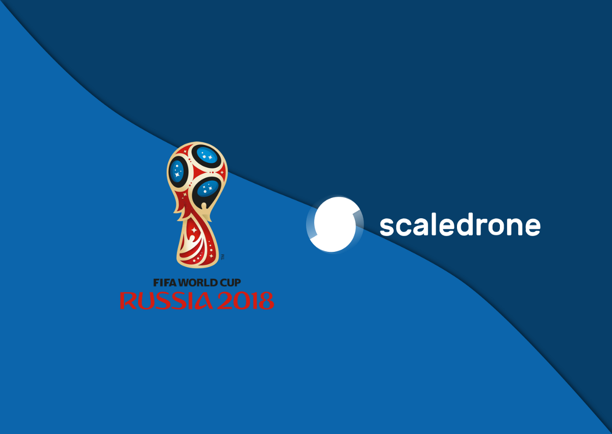
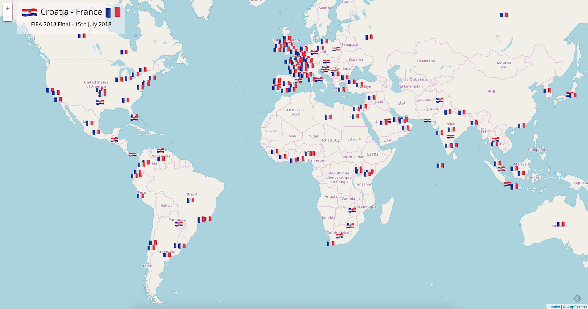

We ran a small story for [Scaledrone](https://www.scaledrone.com/) last weekend to display Twitter fan support on Map.

The application uses Twitter Data Stream, [Leaflet JS](http://leafletjs.com/), and [Scaledrone](https://www.scaledrone.com/).

You can check the live application from [here](http://fifa2018.appgambit.com) and can read the full article from [here](https://www.scaledrone.com/blog/fifa-2018-world-cup-live-map-using-twitter-and-scaledrone/).

### France won the FIFA 2018 World Cup Russia 🎉 🙌 🙌 🎉

