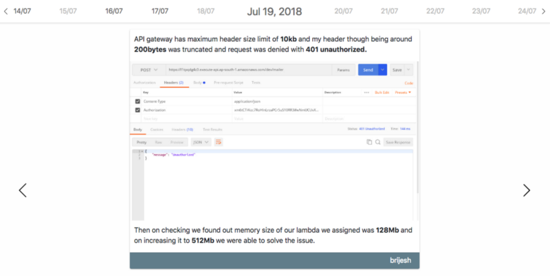
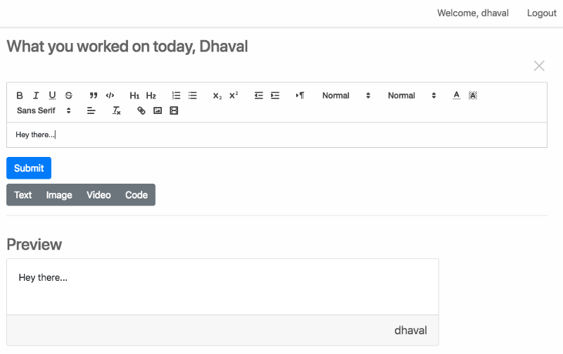
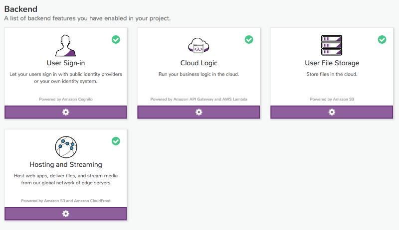

[**Timeline — AppGambit**  
https://timeline.appgambit.com](https://timeline.appgambit.com "https://timeline.appgambit.com")

We recently built a tiny application to keep publishing a log of things that we work on daily basis at AppGambit.

> The application is built using Angular 6, AWS Amplify, S3 Static Hosting, AWS Lambda, and MongoLab.

The purpose of the application is very simple. Being a development company, we work on a variety of stuff on a daily basis, but at times we are not able to list out the things that we have worked on over the period of time. So we decided to build a small time-based utility app, where we put simple things that we worked on, on a given day, for example:

*   Migrated an old Node 0.10.32 based application to Node 8.x (it was easy)
*   Putting AWS AppSync on spin
*   Writing a new article on building a [Serverless](https://www.scaledrone.com/blog/fifa-2018-world-cup-live-map-using-twitter-and-scaledrone/) application
*   How we streamed thousands of records from DynamoDB to ElasticSearch

### Application Structure

The application is using AWS Amplify, which helps to kickstart the web part quick and easy. The application has two parts: Viewer and Writer. Viewer is accessible by any one and it just shows the activities entered by user on given date. Writer part is authenticated, and only AppGambit employees with specific username and password can access and post their content.

### Why Serverless

> The more you try the better you get at it.

There was no particular reason to do this with the serverless stack. We have been getting some queries on advising the types of applications that can be made using the serverless stack. Now just explaining about API Gateway and Lambda would be easy, but still may not be enough. So I decided to put a fully working app which includes Hosting, Database, Authentication, File Storage, etc.

### Authentication

The app has two parts, Viewer and Writer. The Viewer part is a simple read-only interface where anyone can land and see the recent activity. The Writer part is authenticated and it internally uses the AWS Cognito to allow the AppGambit staff to log-in and record their activities.

### Storage

The application is using S3 to save all the Media files, and all the data entries go into MongoLab.

### Frontend

Angular 6 for the Frontend 🍻🍻 The application has two views, Public view for the entries and Writer view for the AppGambit staff to put their entries up.

Timeline Reader View

The writer view is pretty simple as well, it allows the user to build the whole story based on the fixed blocks like _Text_, _Image_,_Video_ and _Code Blocks_.

### Backend

The application is using the AWS Amplify to integrate a set of backend services.

AWS Services in use

### Now what…

Although we are not updating it daily, very honestly we are not working on “exciting” things daily, not all days are the same right 😅😃