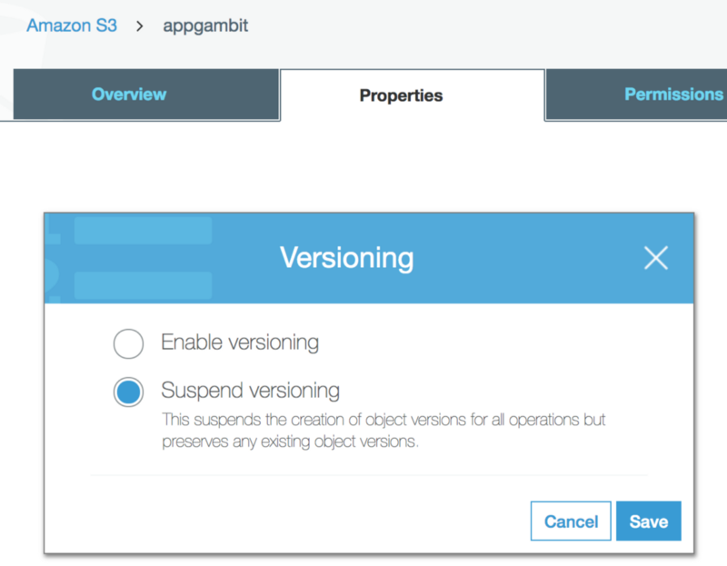
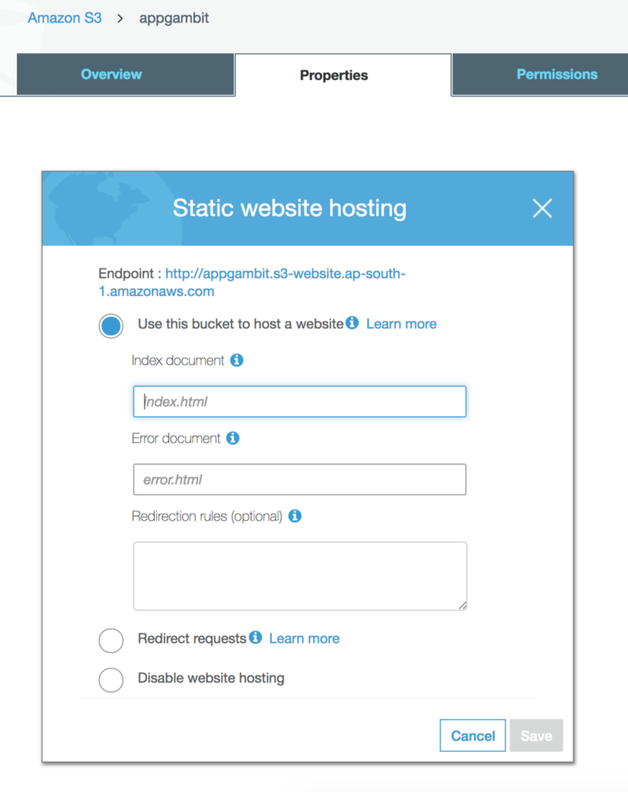
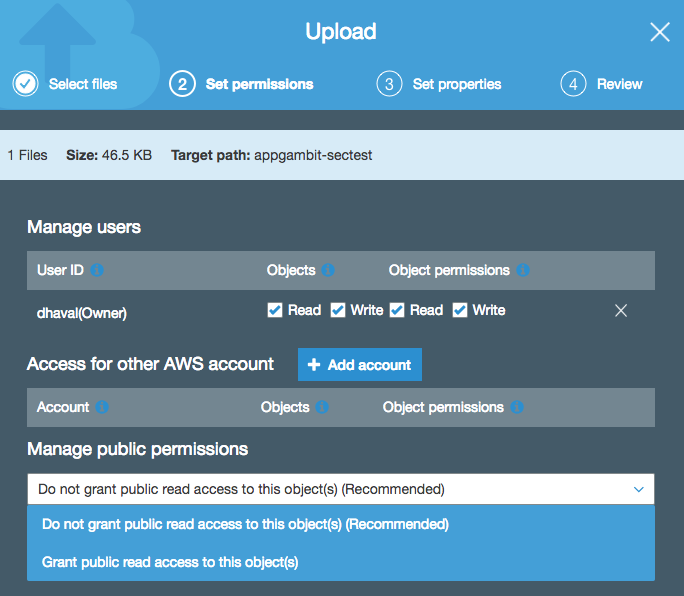

AWS Simple Storage Service (S3) can do a lot of things besides storing the data. I used the term data instead of files because at core the AWS S3 is an Object Store and not a File Store, I will explain this more in the later section.

AWS S3 is an amazing service from Amazon, no doubt about that. It contains many many features, which even a regular user might miss. AWS keeps adding new features to S3 from time to time, and I am going to list out most of them (if not all) in this post.

### Let’s Start

We will explore different sections of S3 one by one, from storage to security and how organizations use S3 for different use cases.

### Storage

S3 offers total four class storage solutions, with unlimited data storage capacity:

*   S3 Standard
*   S3 Standard Infrequent Access (otherwise known as S3 IA)
*   S3 One Zoned Infrequent Access
*   Glacier

#### Amazon S3 Standard

S3 Standard offers high durability, availability, and performance object storage for frequently accessed data. Because it delivers low latency and high throughput. It is perfect for a wide variety of use cases including cloud applications, dynamic websites, content distribution, mobile and gaming applications, and Big Data analytics.

> For example, a mobile application collecting user photo uploads. With unlimited storage, there will never be a disk size issue. S3 can also eliminate unsuccessful uploads, one less thing to worry about cleanup.

#### S3 Infrequent Access (IA)

S3 IA is designed for data that is accessed less frequently but requires rapid access when needed. S3 Standard-IA offers the high durability, high throughput, and low latency of S3 Standard, with a low per GB storage price and per GB retrieval fee. This combination of low cost and high performance make S3 Standard-IA ideal for long-term storage, backups, and as a data store for disaster recovery.

> For example, a mobile application for collecting user photo uploads on daily basis, soon some of those photos will go out of access need like there will be less demand to see 6-month-old photos. With IA we can move the objects to different storage class without affecting their durability. Changing the storage class from Standard to IA is a simple configuration, and can be done easily with Lifecycle Management.

#### S3 One Zoned-IA

S3 One Zoned-IA is designed for data that is accessed less frequently but requires rapid access when needed. Unlike other storage classes, which store data in a minimum of three Availability Zones (data centers), S3 One Zone-IA stores data in a single AZ. Because of this, storing data in S3 One Zone-IA costs 20% less than storing it in S3 Standard-IA. It’s a good choice, for example, for storing secondary backup copies of on-premises data or easily re-creatable data.

#### S3 Reduced Redundancy Storage

Reduced Redundancy Storage (RRS) is an Amazon S3 storage option that enables customers to store noncritical, reproducible data at lower levels of redundancy than Amazon S3’s standard storage.

#### Amazon Glacier

Amazon Glacier is a secure, durable, and extremely low-cost storage service for data archiving. Customers can store data for as little as $0.004 per gigabyte per month. To keep costs low yet suitable for varying retrieval needs, Amazon Glacier provides different options for access to archives, from a few minutes to several hours.

### Availability and Durability

When we look for any service to integrate into our application, the major thing we look for is the reliability (and durability) of the service? How frequently the service goes down and what happens to our data if something goes wrong? To keep those things in mind, I am going to list out S3 availability and durability standards first, before we dive into the other features.

*   S3 Standard offers 99.99% availability and 99.999999999% durability (Yes, that many 9s)
*   S3 IA offers 99.9% availability and 99.99% durability
*   S3 One Zoned-IA offers 99.5% availability and 99.999999999% durability, but data will be lost in the event of Availability Zone destruction (data center site failure)
*   Glacier offers 99.99% availability and 99.999999999% durability
*   S3 RRS is designed to provide 99.99% durability and 99.99% availability

### Object Store

Amazon S3 is a simple key, value store designed to store as many objects as you want. You store these objects in one or more buckets. An object consists of the following:

*   **Key** — The name that you assign to an object. You use the object key to retrieve the object.
*   **Version ID** — Within a bucket, a key and version ID uniquely identify an object
*   **Value** — The content that we are storing
*   **Metadata** — A set of name-value pairs with which you can store information regarding the object.
*   **Subresources** — Amazon S3 uses the subresource mechanism to store object-specific additional information.
*   **Access Control Information** — We can control access to the objects in Amazon S3.

### Data Bucket

Before we store any data into S3, we first have to create a Bucket. A bucket is similar to how we create a folder on the local system, but with a catch that the bucket name has to be unique across all of the AWS accounts. So for example, if someone has created a S3 bucket, `my-backup-files`, then no other AWS account can create the S3 bucket with similar name.

Inside the bucket, we can have folders or files. There is no limit on how much of data that we can store inside a bucket.

Amazon S3 creates buckets in a region we specify. To optimize latency, minimize costs, or address regulatory requirements, we can choose any AWS Region that is geographically close to our requirement. For example, if we reside in Europe, then we should create buckets in the EU (Ireland) or EU (Frankfurt) regions.

> By default, you can create up to 100 buckets in each of your AWS accounts. If you need additional buckets, you can increase your bucket limit by submitting a service limit increase.

S3 Bucket is HTTP(s) enabled, so we can access the objects stored inside them with a unique URL. For example, if the object named `image/logo.jpg` is stored in the `appgambit` bucket, then it is addressable using the URL`http://appgambit.s3.amazonaws.com/images/logo.jpg`. However, the file is only accessible if it has `public-read` permission.

### Version Control

Versioning allows us to preserve, retrieve, and restore every version of every object stored inside an Amazon S3 bucket. Once you enable Versioning for a bucket, Amazon S3 preserves existing objects anytime you perform a PUT, POST, COPY, or DELETE operation on them.

Versioning option for a bucket

By default, GET requests will retrieve the latest written version object. Older versions of an overwritten or deleted object can be retrieved by specifying a version in the request.

Versioning also gives an additional layer of protection to avoid accidental deletion of objects. When a user performs a DELETE operation on an object, subsequent simple (un-versioned) requests will no longer retrieve the object. However, all versions of that object will continue to be preserved in your Amazon S3 bucket and can be retrieved or restored. **Only the owner of an Amazon S3 bucket can permanently delete a version**.

> Once the Versioning is enabled, it can only be suspended but cannot be disabled. **S3 considers each version of the object as a separate object for billing**, so make sure you are enabling the Versioning for a particular reason.

### Static Web Hosting

Static Web Hosting is one of the most powerful features of the AWS S3. Single Page Applications or Pure JavaScript Applications are in trend nowadays and with AWS S3 we can easily deploy an application and start using immediately without setting up any machine anywhere.

This is one of the important building blocks for developing **Serverless Web Application**.

Enable Static Web Hosting for a bucket

Once the Static Web Hosting is enabled, it will generate a URL which we can use to start accessing our application.

Because AWS S3 buckets are placed regionally, by default Web Site will also be serving from the same region. If you are deploying the application for a specific region, then make sure the S3 bucket is created in that region.

If you are deploying the application globally, then you can serve AWS S3 content with AWS CloudFront which works as a CDN to distribute the files on AWS Edge Locations network. This will make sure application is taking minimum latency for loading anywhere in the world.

### Backup & Recovery

By default, the AWS S3 provides the same level of durability and availability across all the regions. But then also the things can go wrong, so most organisations when they use Cloud to host their data, would like to have backup and recovery in their plan.

AWS S3 provides a simple mechanism to create a backup for data, Cross Region Replication. Cross-region Replication enables automatic and asynchronous copying of objects across buckets in different AWS regions. This is useful in case we want to fast access our data in different regions or create a general backup of the data.

> Cross Region Replication requires Versioning enabled, so this will have an impact on your AWS billing amount as well. The CRR includes Versioning cost as well as the Data Transfer cost.

### Security

Amazon takes security very seriously. Being in Cloud and serving to the thousands of organizations using these services means an exceptional level of security is required. AWS provides multiple levels of security, let’s go through them one by one to understand in detail.

Let’s divide the overall security part into two: Data Access Security and Data Storage Security.

#### Data Access Security

By default when you create a new bucket, only you have access to Amazon S3 resources they create. You can use access control mechanisms such as bucket policies and Access Control Lists (ACLs) to selectively grant permissions to users and groups of users. Customers may use four mechanisms for controlling access to Amazon S3 resources.

#### Identity and Access Management (IAM) policies

IAM policies are applicable to specific principles like User, Group, and Role. The policy is a JSON document, which mentions what the principle can or can not do.

An example IAM policy will look like this. Any IAM entity (user, role, group) having below policy can access the `appgambit-s3access-test` bucket and objects inside that.

{  
  "Version": "2012-10-17",  
  "Statement":\[{  
    "Effect": "Allow",  
    "Action": "s3:\*",  
    "Resource": \["arn:aws:s3:::appgambit-s3access-test",  
                 "arn:aws:s3:::appgambit-s3access-test/\*"\]  
    }  
  \]  
}

#### **Bucket policies**

Bucket policy uses JSON based access policy language to manage advanced permissions. If you want to make all the objects inside a bucket publicly accessible, then following simple JSON will do that. Bucket policies are only applicable to S3 buckets.

{  
    "Version": "2012-10-17",  
    "Statement": \[  
        {  
            "Sid": "MakeBucketPublic",  
            "Effect": "Allow",  
            "Principal": "\*",  
            "Action": "s3:GetObject",  
            "Resource": "arn:aws:s3:::appgambit-s3access-test/\*"  
        }  
    \]  
}

Bucket policies are very versatile and has lot of configuration options. Let’s say the bucket is service web assets and it should only serve content to request originated from a specific domain.

{  
  "Version":"2012-10-17",  
  "Id":"Allow Website Access",  
  "Statement":\[  
    {  
      "Sid":"Allow Access to only appgambit.com",  
      "Effect":"Allow",  
      "Principal":"\*",  
      "Action":"s3:GetObject",  
      "Resource":"arn:aws:s3:::appgambit-s3access-test/\*",  
      "Condition":{  
        "StringLike":{  
            "aws:Referer":\[  
                "[https://www.appgambit.com/\*](http://www.example.com/*)",  
                "[https://appgambit.com/\*](http://example.com/*)"  
            \]  
        }  
      }  
    }  
  \]  
}

#### Access Control Lists (ACLs)

ACL is a legacy access policy option to grant basic read/write permissions to other AWS account.

#### Query String Authentication

Imagine you have private content which you want to share with your authenticated users out of your application, like sending the content link via Email which only that user can access.

AWS S3 allows you to create a specialised URL which contains information to access the object. This method is also known as a Pre-Signed URL.

You can get more detail about generating pre-signed URLs from [here](https://docs.aws.amazon.com/AmazonS3/latest/API/sigv4-query-string-auth.html).

#### Uploading from UI

Permissions UI while uploading new object in S3

Each object in the bucket carries their own permission, so if the bucket is set to private, you can still add publicly accessible files inside that bucket.

If you have set the Bucket Policy to make every object publicly accessible, then even the object uploaded with private or no permission, it will still be accessible.

#### Data Storage Security

Besides Data Access Security, AWS S3 provides Storage level security as well, alternatively known as data-at-rest, while it is stored on disks in Amazon S3 data centers. There are two options for protecting data at rest in AWS S3.

#### Server-side Encryption

In Server-side encryption, Amazon S3 encrypts your data at the object level as it writes it to disks in its data centers and decrypts it for you when you access it. As long as you authenticate your request and you have access permissions, there is no difference in the way you access encrypted or unencrypted objects.

The entire process is handled by the AWS S3, and the user does not have to do anything with regards to encryption. You can use one of the three available options to encrypt your data.

#### S3-Managed Keys (SSE-S3)

With S3 managed keys, each object is encrypted with a unique key employing strong multi-factor encryption. As an additional safeguard, it encrypts the key itself with a master key that it regularly rotates. The AES-256 algorithm is used to encrypt all the data.

#### AWS KMS-Managed Keys (SSE-KMS)

AWS Key Management Service is similar to SSE-S3, but with some additional benefits. It provides centralised access to create and control the encryption keys used to encrypt your data. Most importantly AWS KMS is integrated with [AWS CloudTrail](https://docs.aws.amazon.com/awscloudtrail/latest/userguide/) to provide encryption key usage logs to help meet your auditing, regulatory and compliance needs.

[Here](https://docs.aws.amazon.com/kms/latest/developerguide/overview.html) is a comprehensive list of things AWS KMS can manage for you.

#### Customer-Provided Keys (SSE-C)

With customer provided keys, we can upload our own keys and the S3 will use that for encryption/decryption.

#### Client-side Encryption

Client-side encryption is the standard way of encrypting data before sending it to Amazon S3. Similar to how we use that in a Non-Cloud environment where we encrypt the data first and then send to storage, and fetch data from storage and then decrypt before we use it.

### Events

Most of the AWS services are designed in a way to integrate with other AWS services and create a flow channel. AWS S3 has Events, imagine you want to run a piece of code when a new file is Added, Updated or Removed. It can be easily done using Events.

S3 Events Configuration

We can configure things like Events to identify an operation, Prefix/Suffix for object targeting and event target with Send To. As of now, S3 can publish an event to SNS Topic, SQS Queue or invoke a Lambda function.

> The common use case for S3 Events is to upload a media file, and does the transformation for different devices like Desktop, Mobile or Tablet to consume or create Thumbnail images.

### BitTorrent Support

BitTorrent is an open, peer-to-peer protocol for distributing files. You can use the BitTorrent protocol to retrieve any publicly-accessible object in Amazon S3. Amazon S3 supports the BitTorrent protocol so that developers can save costs when distributing content at high scale.

Every anonymously readable object stored in Amazon S3 is automatically available for download using BitTorrent. To download any file using the BitTorrent protocol, just add `?torrent` at the end of the URL request. This either generate the .torrent file for the object or will serve an existing .torrent file.

> It is possible to disable the BitTorrent based access by disabling the anonymous access however, we can not prevent the usage of the objects downloaded previously using BitTorrent as they can be served from a peer-to-peer network without the need of the AWS S3.

### Pricing

AWS S3 like the other AWS services offers the pay-per-use model. The pricing slightly differs from a region to another region and storage class.

Here is a sample calculation for 1TB of storage with 100K Read and 100K write requests. As you can see on the top right, the usage will cost you around **$23.40 / per month**.

Sample Usage Calculation

You can use the AWS cost calculator from [here](http://calculator.s3.amazonaws.com/index.html).

### And Many Other Things…

AWS S3 has a lot more features to offer besides the things I mentioned above.

#### S3 Lifecycle Management

S3 Lifecycle management provides the ability to define the lifecycle of your object with a predefined policy and reduce your cost of storage. You can set a lifecycle transition policy to automatically migrate objects stored in the S3 Standard storage class to the S3 Standard-IA, S3 One Zone-IA, and/or Amazon Glacier storage classes based on the age of the data.

#### S3 Transfer Acceleration

Amazon S3 Transfer Acceleration enables fast, easy, and secure transfers of files over long distances between your client and your Amazon S3 bucket. Imagine you have a Video sharing application and you are collecting videos from all around the world and saving into your S3 bucket. If you have a single server collecting the data it would take different latency to different users instead, the AWS S3 Transfer Acceleration helps you to use the AWS Edge Locations to upload the content to user’s nearest data center and then sync back to original bucket via the internal link.

#### S3 Select

You can use S3 Select to retrieve a subset of data using SQL clauses, like SELECT and WHERE, from delimited text files and JSON objects in Amazon S3

#### Amazon Athena

Amazon Athena is an interactive query service that makes it easy to [analyze data in Amazon S3 using standard SQL queries](https://aws.amazon.com/athena/)

#### Amazon Redshift Spectrum

Amazon Redshift Spectrum is a feature of [Amazon Redshift](https://aws.amazon.com/redshift/) that enables you to [run queries against exabytes of unstructured data in Amazon S3](https://aws.amazon.com/redshift/spectrum/) with no loading or ETL required.

### References and Use cases

[**Cloud Object Storage | Store & Retrieve Data Anywhere | Amazon Simple Storage Service**  
_Looking for highly-scalable cloud object storage? Amazon S3 can help you with Backup, Archive, Big Data Analytics…_aws.amazon.com](https://aws.amazon.com/s3/ "https://aws.amazon.com/s3/")

[**Amazon CloudFront Case Studies - AWS**  
_Explore the case studies for Amazon CloudFront. Find out why customers such as Hulu, Spotify, PBS, MLB, Instacart…_aws.amazon.com](https://aws.amazon.com/cloudfront/case-studies/ "https://aws.amazon.com/cloudfront/case-studies/")

[**Who's Using Amazon Web Services?**  
_Who are the major AWS users, and what kind of workloads are they using AWS for? Here's a spoiler: If you're looking at…_www.contino.io](https://www.contino.io/insights/whos-using-aws "https://www.contino.io/insights/whos-using-aws")

### **Werner Vogels -** CTO, Amazon.com

> At AWS, we don’t mark many anniversaries. But every year when March 14th comes around, it’s a good reminder that Amazon S3 originally launched on Pi Day, [March 14, 2006](http://phx.corporate-ir.net/phoenix.zhtml?c=176060&amp;p=irol-newsArticle&amp;ID=830816). The Amazon S3 team still celebrate with homemade pies!

[**Looking back at 10 years of compartmentalization at AWS**  
_At AWS, we don't mark many anniversaries. But every year when March 14th comes around, it's a good reminder that Amazon…_www.allthingsdistributed.com](https://www.allthingsdistributed.com/2018/03/ten-years-of-aws-compartimentalization.html "https://www.allthingsdistributed.com/2018/03/ten-years-of-aws-compartimentalization.html")