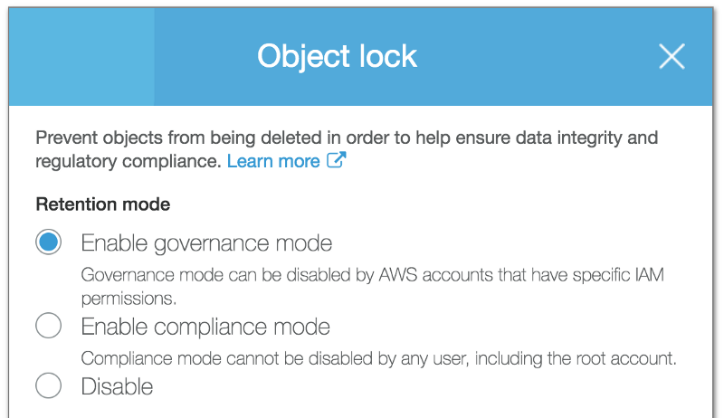
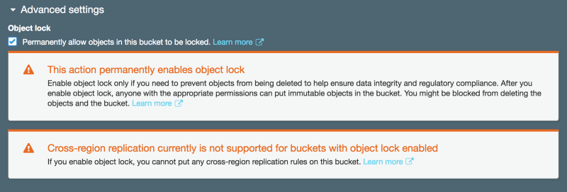
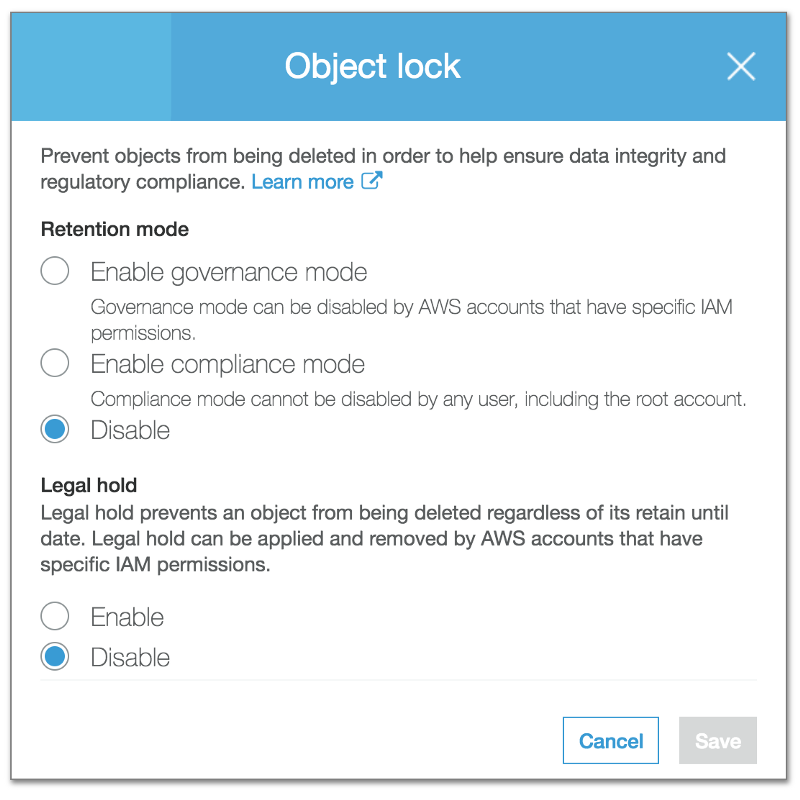
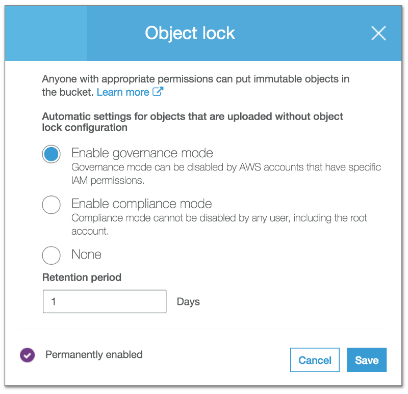

AWS recently introduced a new feature in S3: Object Locking. With this now we can make the S3 object immutable either till a given date or until the legal hold is released.

### Enable Object Lock

> Currently, the Object Lock is supported only at the time of creating a new bucket. To enable Object Lock for new bucket, Versioning needs to be enabled as well.

We need to enable Object Lock feature at the time of creating a new bucket.

Enable Object Lock while creating a new bucket

Once the Object Lock is enabled for a bucket we can upload objects and configure Object Lock on them.

### Apply Object Lock

For objects uploaded via the AWS Console, the Object Lock is a feature we need to enable and set from the console UI.

Configure Object Lock

S3 Object Lock provides two ways to manage object retention: **retention periods** and **legal holds**. You can have both of them enabled, any one of them or neither.

> Object Lock is applied to an individual object. So if you have enabled the lock on one object and you overwrite that with update object without a lock, then the new object will not have the locking but the previous version will still be under the lock.

### Retention Mode

Retention mode allows setting a _retain-until-date_ to the selected object. Once configured the object will not be allowed to delete depending on the Retention mode selected.

There are two supported modes: **Governance Mode and Compliance Mode**

The only difference between the two is in the case of Governance Mode it is possible to delete the object with special permissions, whereas in case of Compliance Mode is it not possible to delete the object from any user including the Root account user.

So Governance Mode is used to test the retention policies before Compliance Mode is applied in the production environment.

> Once a retention period is applied, it is possible to configure a future retention period for the same object version. So if current retention date is still 29th Nov 2018, then it is possible to apply any new retention date after 29th Nov.

### Legal Holds

Legal Hold works as an infinite retention period. Once applied it is not possible to delete any object until the hold is released manually. The hold can only be removed by the user having special permissions.

### Default Object Lock

It is possible to configure default object lock at the bucket level.

Bucket level retention configuration

Only retention mode is supported at bucket level and instead of setting a date, it would be the number of days from the object upload date.

More documentation can be found here:

[**Introduction to Amazon S3 Object Lock - Amazon Simple Storage Service**  
_How to Use Amazon S3 Object Lock_docs.aws.amazon.com](https://docs.aws.amazon.com/AmazonS3/latest/dev/object-lock.html "https://docs.aws.amazon.com/AmazonS3/latest/dev/object-lock.html")