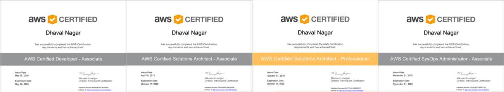

I recently cleared two more AWS certifications and took the tally to total 4 out of 5 main certifications in last 6 months.

There was no plan to do either of them, but I figured it would be helpful and I will learn something new along the way.

### How to Prepare

If you are planning to appear for any of the certifications whether its Solution Architect of SysOps/DevOps, I would highly recommend doing Hands-On Practical Exercises, instead of only reading through the whitepapers and finding easy dumps over the Internet.

By practicing and implementing the services on your own will give you a lot of idea over their internal workings.

Whitepapers and Practice Exams are equally important, so do not miss them. I read a lot of whitepapers from AWS and it added a lot to my learnings and overall experience. You will be definitely blown away by the magic AWS pulls in the background for some of the services.

I have been using AWS since mid-2015, initially for just Lambda and API Gateway to build serverless microservices, but it has become an integral part of any application I have worked on since then.

### Resources

[**A Cloud Guru - AWS Certification Courses**  
_A Cloud Guru leads the world in cloud computing training with Amazon, Google, and Azure. Start your free trial to join…_acloud.guru](https://acloud.guru/ "https://acloud.guru/")

[**Whitepapers - Amazon Web Services (AWS)**  
_AWS Whitepapers features a comprehensive list of technical AWS whitepapers, covering topics such as architecture…_aws.amazon.com](https://aws.amazon.com/whitepapers/ "https://aws.amazon.com/whitepapers/")

For Practice Tests, I would recommend either [Linux Academy](https://linuxacademy.com/amazon-web-services/courses) or [Whizlabs](https://www.whizlabs.com/aws-certifications/)

Besides these all, do a lot of practice, as the AWS keep on adding tons of new features regularly, the practice would definitely help you keep in line with those.