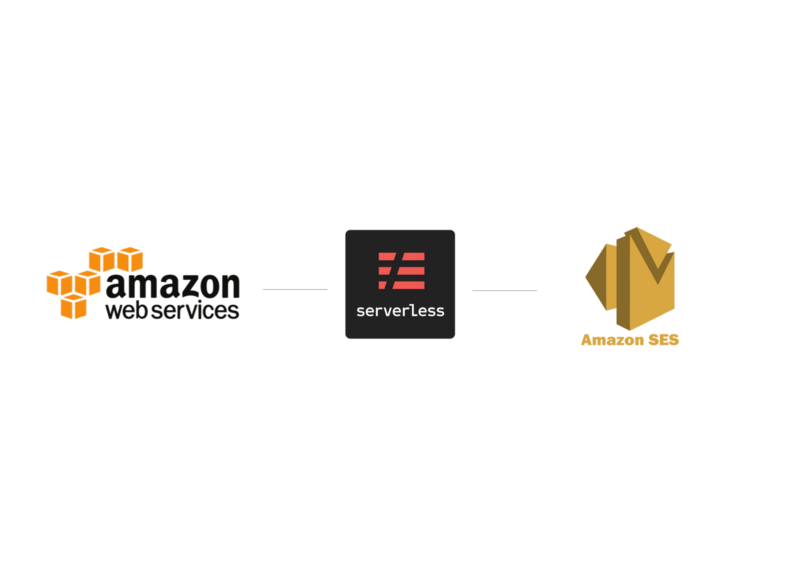

In this tutorial, we will build a simple web service using **Serverless Framework** to create a set of SES Templates and send out emails using those templates.

### AWS Configuration

While the Serverless Framework supports multiple cloud providers like AWS, Google and Azure. We will be using the AWS as our preferred cloud in the current example.

Here is the guide you can follow to configure the AWS on your local environment.

[**Serverless Framework - AWS Lambda Guide - Credentials**  
_Edit on github The Serverless Framework needs access to your cloud provider's account so that it can create and manage…_serverless.com](https://serverless.com/framework/docs/providers/aws/guide/credentials/ "https://serverless.com/framework/docs/providers/aws/guide/credentials/")

Before you can start using AWS SES to sending out emails, you need to configure the SES with valid identities, either a domain or an email.

[**Verifying Identities in Amazon SES - Amazon Simple Email Service**  
_Verify an email address or domain by using Amazon SES to prove that you own it._docs.aws.amazon.com](https://docs.aws.amazon.com/ses/latest/DeveloperGuide/verify-addresses-and-domains.html "https://docs.aws.amazon.com/ses/latest/DeveloperGuide/verify-addresses-and-domains.html")

### Setup Serverless

The service is using the [Serverless Framework](http://serverless.com), so if it’s not already setup then you have to set it up first.

> Use this IAM Policy to create the user instead of one provided by the serverless documentation.

> [Serverless Agent IAM Policy](https://gist.github.com/dhavaln/27a688f99169166398795c6b9adaa427)

[**Serverless Framework - AWS Lambda Guide - Quick Start**  
_Edit on github Node.js v6.5.0 or later. Serverless CLI v1.9.0 or later. You can runnpm install -g serverless to install…_serverless.com](https://serverless.com/framework/docs/providers/aws/guide/quick-start/ "https://serverless.com/framework/docs/providers/aws/guide/quick-start/")

Once the serverless is set up, we will create the project and initialize the basic dependencies.

$> serverless create --template aws-nodejs --path email-service  
$> cd email-service

$> mv handler.js index.js

$> npm init  
$> npm install --save express serverless-http body-parser  
$> npm install --save-dev aws-sdk serverless-offline

We will be using the Express for this particular example, as it will be easier for the people coming from Node/Express to quickly understand the Serverless structure.

The template project creates two files `handler.js` and `serverless.yml` We have renamed handler.js with index.js just to keep it aligned with normal NodeJS app structure.

Replace the content of both the files with these:

The above code will start a basic Express server as a service. Let’s run it locally and see if that works or not.

$> sls offline start

Serverless: Starting Offline: dev/us-east-1.

Serverless: Routes for app:

Serverless: ANY /

Serverless: ANY /{proxy\*}

Serverless: Offline listening on http://localhost:3000

You can test the service using curl:

$> curl [http://localhost:3000](http://localhost:3000)

**AWS SES - Email Webservice**

Now that we have the basic service running we will add the code for the AWS SES.

### Template and Email Service

Sending emails using the AWS SES is fairly easy and a no-brainer, so instead of sending plain emails we will be using the SES Templates through which we can send customized emails to targets very easily, without managing all the email content in the source system.

AWS SES supports both Text and HTML type templates, we will be using the HTML type templates in this example.

The below snippet adds a POST endpoint to support Creating a New Template on the SES side.

> As of now, there is no way to create Templates directly from the AWS Console. So you can either create it using AWS CLI or AWS APIs only.

Let’s test and see if the endpoint works as expected or not.

$> sls offline start

$> curl -X POST http://localhost:3000/template -H "Content-Type: application/json" -d '{"templateName":"myapp\_test", "subject":"Hello", "body": "Hello" }'

**OK**

So if all goes well, the above curl request will return success for the Create Template API. This means the AWS has created a new Template in the SES and we can now use it to send out actual emails.

The above endpoint will take the Template ID and Sender Input to send out email using the SES Template.

$> sls offline start

$> curl -X POST http://localhost:3000/send-email -H "Content-Type: application/json" -d '{"templateName":"myapp\_test", "sendTo": "dhaval@my-email.com" }'

**OK**

By this point, we have created a template into AWS SES and also sent email using that. Now as you can see, we are using a vanilla template, and there is not much use case of it. A real-world template uses custom variables in that which will be sent by the application at the time of calling the service.

So we will be updating the service to create send a personalized template.

$> curl -X POST http://localhost:3000/template -H "Content-Type: application/json" -d '{"templateName":"myapp\_test1", "subject":"Hello {{short\_name}}", "body": "<h1>Hello {{full\_name}}</h1>" }'

**OK**

We have now created another template `myapp_test1` which has two variables used inside it: 1) in the subject and 2) in the body itself.

$> curl -X POST http://localhost:3000/send-email -H "Content-Type: application/json" -d '{"templateName":"myapp\_test1", "sendTo": "dhaval@my-email.com", "data": {"short\_name": "Dhaval", "full\_name": "Dhaval Nagar"} }'

**OK**

In the above request, we are passing the variable data using the `data` in the body, which is nothing but a JSON structure. The recieved email should have the placeholders replaced with the given dataset.

### Protecting the Service

So at this point, our service works as expected. We created a couple of templates and tested by sending different emails. But as you can think, we have not yet deployed the service to AWS infrastructure yet. It is using the AWS services from local, but the service is not yet deployed.

> Amazon Web Service considers Security at a paramount level. Almost any AWS service you take, and you will find a top-notch industry level security service is given along with that.

Before you deploy this service to the AWS, you may ask yourself that the service uses the internal AWS resources and you are getting billed based on the usage. So to avoid any misuse you need to make sure that the above service is fully protected and can only be used by the authorized client endpoints.

We will configure the service to make sure it only works by giving a proper Security Key in the request header.

In the above snippet, we have added a couple of sections to utilize the AWS API Gateway’s API Keys and Usage Plan feature. The serverless framework internally configures those based on the configs from the YML file.

Now if you start the server, it will generate the keys to be utilized for the requests.

> Because we are using the serverless variables in the yml file, we have to start the service with an additional parameter to provide the stage value.

$> sls offline start --stage dev

Serverless: Starting Offline: dev/us-east-1.

**Serverless: Key with token: d41d8cd98f00b204e9800998ecf8427e**

Serverless: Remember to use x-api-key on the request headers

Serverless: Routes for app:

Serverless: ANY /

Serverless: ANY /{proxy\*}

Serverless: Offline listening on http://localhost:3000

You will see an additional logline in the service start. The `token` will be required to make calls to the service APIs.

curl -X POST http://localhost:3000/send-email -H "Content-Type: application/json" -d '{"templateName":"myapp\_test1", "sendTo": "dhaval@my-email.com", "data": {"short\_name": "Dhaval", "full\_name": "Dhaval Nagar"} }'

**{"message":"Forbidden"}**

If you call the service as we did before, it will return with **Forbidden** message. To make it work, you will have to call the service with token generated in the request.

$> curl -X POST http://localhost:3000/send-email -H "Content-Type: application/json" -H "x-api-key: d41d8cd98f00b204e9800998ecf8427e" -d '{"templateName":"myapp\_test1", "sendTo": "dhaval@my-email.com", "data": {"short\_name": "Dhaval", "full\_name": "Dhaval Nagar"} }'

**OK**

The service works as expected if we pass the correct key in the request header. This adds the required security in our current service, making sure only clients having the correct key can access the service.

### Deploy to the AWS

So far our service has been working locally and we have tested it to make sure it works as expected. Now it’s time to move this service from local to the AWS so that we can start using it from any client.

$> sls deploy --stage dev

Serverless: Stack update finished...

Service Information

service: email-service

stage: dev

region: us-east-1

**api keys:**

dev-emailkeys: XCFQzsmsoP8KVcZgTCYDV5CFIEG6zkxB5tsLKaeN

emailkeys: u85yziphfXXHr0vpkvDU34IXdWrgatk86ePiLnhj

**endpoints:**

ANY - https://8mqpsme7k8.execute-api.us-east-1.amazonaws.com/dev

ANY - https://8mqpsme7k8.execute-api.us-east-1.amazonaws.com/dev/{proxy+}

functions:

app: email-service-dev-app

Once the deployment is successfully completed, you will see the above response with some key values, like **api keys** and **endpoints**. You can start consuming your service with the given values.

You can download the full source code from here.

[**AppGambitStudio/serverless-email-service**  
_Serverless Email Service using AWS SES Templates. Contribute to AppGambitStudio/serverless-email-service development by…_github.com](https://github.com/AppGambitStudio/serverless-email-service "https://github.com/AppGambitStudio/serverless-email-service")