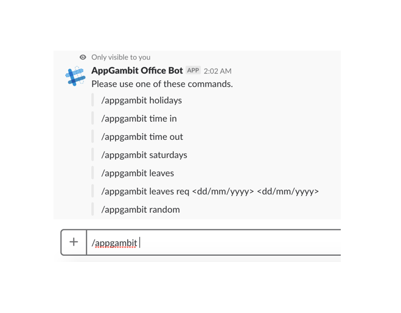
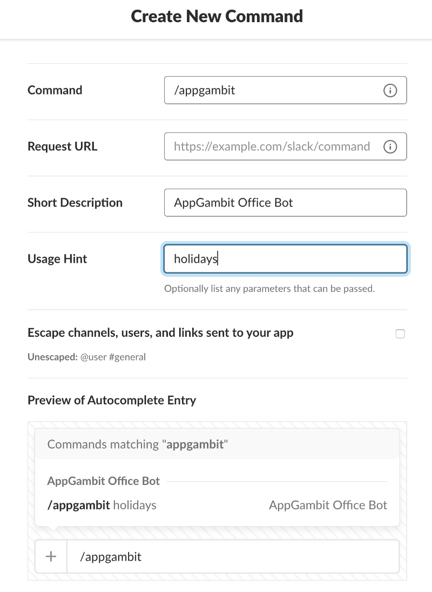
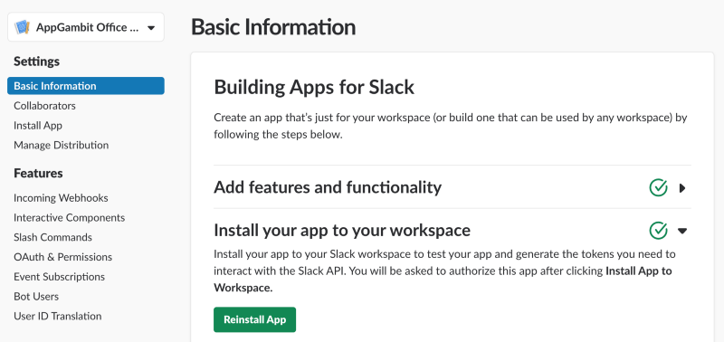

Running a small dev house means we can use tons of options to customize our internal processes. We had been using an HR application for over a year until they raised their price and became very costly for the features we were only using. So we moved to a combination of Google Sheets and Jibble Slack Bot for the Time Tracking.

But now, after getting some free time, we have started consolidating all of our internal processes over Slack and building our own Slack Bot and Slash commands.

While the final service is bit complex, but in this tutorial, I will show how we created a simple command interface in just a few minutes.

### /appgambit holidays

> While working at AppGambit is fun but every once in a while, we have that question…

> **“When is the next holiday!!”**

So we will build the first command which will return the list of holidays for 2019.

### Create Slack App

To create a Slack Slash Command you have to create a [Slack App first](https://api.slack.com/apps). Once the app is created, you can copy the **Signing Secret** from the app info page and keep it on the side for later use. This key will be later used to Validate Slack requests to our service.

### Serverless Service Setup

The current service is quite simple. If the user does not provide any command then we will return the list of possible commands and if the user provides `holidays` command then we will return the Indian Holidays for 2019.

We will be using [Serverless Framework](https://serverless.com/), obviously as it is blazing fast to build service in that. Make sure Serverless is installed and configured.

Next create an empty directory and copy these two files and initialize the project with `npm install`

After initializing the project, next is to add the actual code. Create `index.js` and paste below code to create a basic service.

The code is pretty basic and self-explanatory. If the user provides no command then we will return the list of commands and if he does, then we will return that command output.

You can test the service locally using the `sls offline start —-stage dev`and sending out post commands.

$> curl -X POST [http://localhost:3000](http://localhost:3000)

**{  
  "response\_type": "ephemeral",  
  "text": "Please use one of these commands."  
  "attachments": \[   
    { "text": "/appgambit holidays" },  
    { "text": "/appgambit time in" },  
    { "text": "/appgambit time out" },  
    { "text": "/appgambit saturdays" },  
    { "text": "/appgambit leaves"},  
    { "text": "/appgambit leaves req <dd/mm/yyyy> <dd/mm/yyyy>"},  
    { "text": "/appgambit random" }  
  \]  
}**

So the command works fine. Now it’s time to deploy the service and use the actual URL to create Slack Slash Command.

$> sls deploy --stage dev

**COPY THE URL RETURNED BY THE SERVICE AND KEEP ON SIDE**

### Slash Command Configuration

Once you create a Slack App and the service it’s now time to create a command which we can use inside our Slack Workspace.

Goto your Slack Application and select Slash Command from the left menu. Use the service URL copied from deploy here at Request URL option.

Once we create the command we have to install the command into our workspace.

Once you install the app the command will be available to use inside your workspace and we will give it a quick test.

### Validating Slack Request

Now you may have noticed that we have created a public API which anyone can call so we will be a little **Slack Request Validation** logic in place to make sure only requests coming from Slack will be executed.

The **Signing Secret** we copied earlier from the Slack App page will be copied inside the `/config/dev.json` file and we will attach a middleware to validate the Slack Header Signature by validating the Request Body.

After making the above changes, you will have to deploy the service again, but you will not feel any difference in your Slack command output if the secret is copied properly.

You can download the fully working source from here.

[**AppGambitStudio/serverless-appgambit-slack-bot**  
_Serverless Slack Bot for AppGambit Staff. Contribute to AppGambitStudio/serverless-appgambit-slack-bot development by…_github.com](https://github.com/AppGambitStudio/serverless-appgambit-slack-bot "https://github.com/AppGambitStudio/serverless-appgambit-slack-bot")