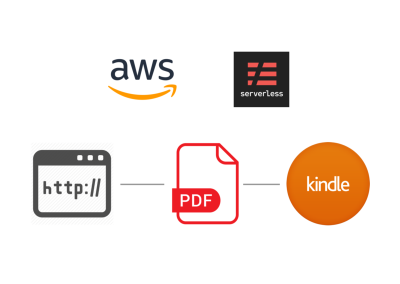
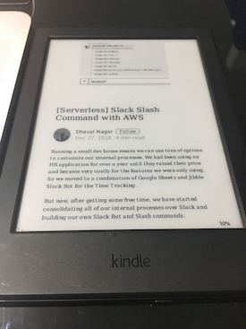

I love Kindle ❤️ 📚 ❤️

It’s not mine, it belongs to a friend of mine but I have been using it for months now and he is fine with that (he is not going to read this blog, so I will be able to keep it for some more time).

Kindle has a cool feature where you can send files of supported types to a kindle email as attachments and those documents will be delivered to your Kindle device.

We will build a simple service to convert a Blog URL into a PDF file and send to a Kindle email.

> But instead of making it very simple, like write all the code at one place and be done with it, we will instead build an `action-trigger-action` kind of service, with following steps:

*   Accept API request with Blog URL
*   Send an SQS message with Blog URL as a payload
*   SQS Lambda trigger to convert URL into a PDF and save to S3
*   S3 Object Trigger to send PDF to Kindle email

Fully working source can be downloaded from here:

[**AppGambitStudio/serverless-url-pdf-to-kindle**  
_Serverless Convert a Blog URL to PDF and send to a Kindle email - AppGambitStudio/serverless-url-pdf-to-kindle_github.com](https://github.com/AppGambitStudio/serverless-url-pdf-to-kindle "https://github.com/AppGambitStudio/serverless-url-pdf-to-kindle")

> The service is tested with the blog sources like

> Medium blogs 🙌 , Quora, Finance Blogs like Abnormal Returns and Safal Niveshak and Startup News sites like The Hustle Co.

> Note: the Github Gist blocks below are not complete and please refer to the full source for the detail code.

### Service Setup

If you have gone through my previous blogs, the setup process will be similar to that only. We will create a new Serverless project and create a basic web service to accept the URLs. And YES, we will make this a Private service.

Please refer to the configuration file inside the `config/` folder and create one based on the sample provided.

### Serverless Permissions

We have specified a bunch of permissions inside the serverless.yml file as the target AWS Lambda Role will inherit those and our functions will have adequate permissions to connect to various services that we are using internally.

### Web request to SQS

Our first function is using the Serverless HTTP to create an Express server inside the AWS Lambda. We are accepting the Blog URL and Title parameter in POST request and using them as a body parameter for an SQS message.

### Configure SQS Trigger

AWS Lambda recently announced support to integrate with AWS SQS so now messages from SQS queue can trigger a lambda easily. The following yml configuration configures the trigger:

I have used the `serverless-pseudo-parameters` npm to use the AccountId and Region inside the yml file.

AWS Lambda will receive the message in the event parameter and from then on it will be like regular processing.

### PhantomJS in Lambda

I have used the PhantomJS to convert the HTML content into a PDF. The code is pretty simple and PhantomJS is widely popular for the same, however, they have suspended all the further development due to [lack of active contribution](https://github.com/ariya/phantomjs/issues/15344).

> AWS Lambda is like a little Linux machine underneath, so if you are using the Windows or Mac for the development, you will have to use the PhantomJS Pre-built libraries which can run on compatible linux platform. You can download the binaries from here, I have used the `phantomjs-2.1.1-linux-x86_64` for this example.

> [https://bitbucket.org/ariya/phantomjs/downloads/](https://bitbucket.org/ariya/phantomjs/downloads/)

### Configure S3 Trigger

So far we have downloaded and created a PDF and saved to S3 as well, but yet to send out to the Kindle device.

This function configures the S3 ObjectCreated trigger, which invokes another lambda whenever we add a new PDF to the bucket.

The target lambda will receive the S3 Object in the event and we will download the file and will send it out as an attachment to the given Kindle device email.