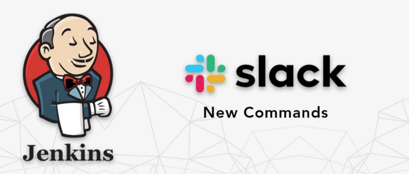
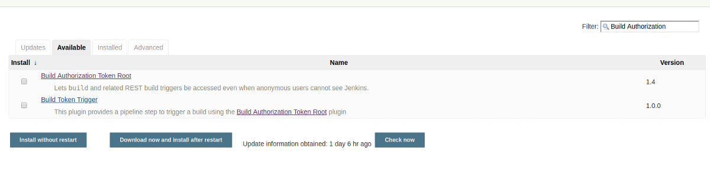
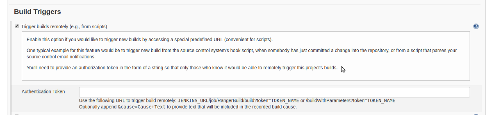
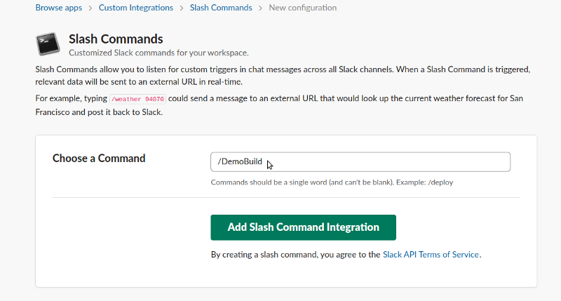
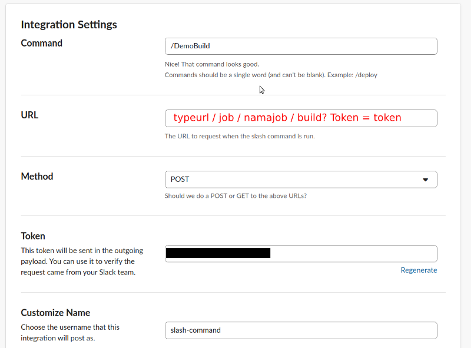
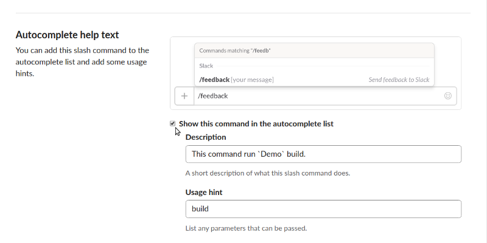
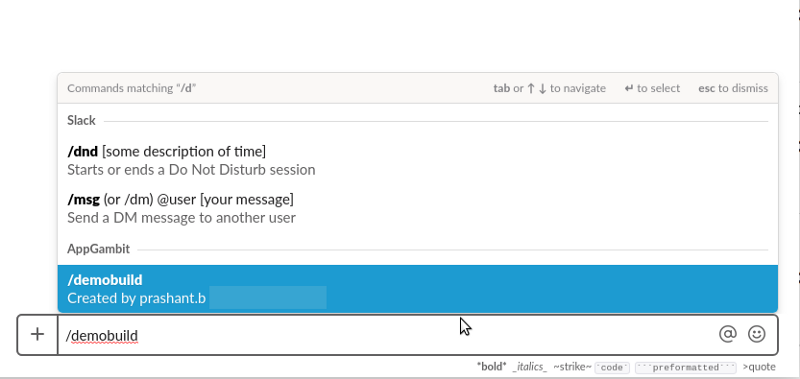

In my previous blog, I talked about how can we Integrate Jenkins with Slack Notifications.

[**Integrating Jenkins with Slack Notifications**  
_Jenkins is an open-source continuous integration software tool written in the Java programming language for testing and…_medium.com](https://medium.com/appgambit/integrating-jenkins-with-slack-notifications-4f14d1ce9c7a "https://medium.com/appgambit/integrating-jenkins-with-slack-notifications-4f14d1ce9c7a")

In this article, I talk about how can we trigger Jenkins Job from slack.

As we all know, Slack is one of the most popular communication open-source tools.

Slack provides many custom Apps support But we are going to use one of the most used custom app called **Slash Commands**.

The **Slash Commands** allows us to create a custom command that can “hit” a URL / rest-fire with the GET / POST method. Well, with this feature we can create a **/** command that will access our Jenkins Job URL and will run a build on that job.

before that, On Jenkins side, we had to install the \`Build Authorization Token Root\` Plugin.

Build Authorization Token Root plugin will generate a URL (rest) along with a token that becomes the access key for our job URL.

Now we move to Jenkins and try to configure the **_Build Authorization Token Root_** plugin.

### TRIGGER JENKINS JOB FROM SLACK

1.  Install Build Authorization Token Root Plugin on Jenkins.

For that, we need to Go on **Manage Jenkins > Plugin Manager** > search “[Build Authorization Token Root](https://plugins.jenkins.io/build-token-root)”

After installation On the job configuration screen, It will display **Trigger builds remotely (e.g., from scripts)** option under **Build Triggers.**

Well, the plugin will provide a URL (rest) which will be hit by the slack command.

Add a token (you can generate random token [here](https://www.random.org/strings/)) like “6081437572aGd6081437572”

**_Now it will trigger the following URL:_**

**_JENKINS\_URL/job/DemoJob/build?token=TOKEN\_NAME_** _OR_ **_/buildWithParameters?token=TOKEN\_NAME_****_Optionally append &cause=Cause+Text to provide text that will be included in the recorded build cause._**

Next, we move to slack.

Login to slack, then go to apps menu> manage apps> search “**slash commands**” and click add.

After that click on **add configuration** button.

Here I set my command name as “**/DemoBuild”** but you can set any preferable name for your command and click on the “Add Slask Command Integration” button.

The most important thing you must select this **Autocomplete help text** so the user can get the suggestion for your command.

Usage hint: Using this you can pass extra parameters like &Action=Build\_Job1 OR &Action=Build\_job2.

Using this we can run multiple jobs with the same token by the specify the extra parameter.

🎊 🎉🤖🎊 🎉Wow! Now you can use your command and fire your Jenkins job remotely.

Goto slack and try to run your command **/DemoBuild.**

Now your command is displayed in suggestion also and once you send this command your Jenkins job is up and running on Jenkins.

_Thank you for reading, if you have anything to add please send a response or add a note!_