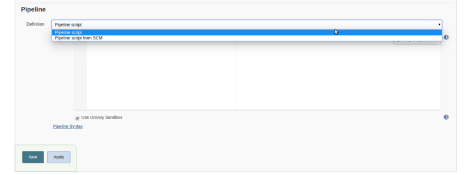

As we all know Jenkins is a well-known open-source continuous integration and continuous development automation tool, I talked a lot about Jenkins and today also I’m talking about Jenkins.

In this article, we are talking about Jenkins **Pipeline**. What, why and how we can use Jenkins pipeline as a code.

### What is the Jenkins Pipeline?

In simple words, **Jenkins Pipeline** is a combination of plugins that support the integration and implementation of continuous delivery pipelines  using **Jenkins**.

The **pipeline as Code** describes a set of features that allow **Jenkins** users to define pipelined job processes with **code**, stored and versioned in a source repository. … To use **Pipeline as Code**, projects must contain a file named **Jenkinsfile** in the repository root, which contains a “**Pipeline** script.”

We can create a simple or complex delivery Pipeline as code via **Pipeline** DSL (Domain-specific Language).

Jenkins Pipeline  allows you to define an entire application life cycle as a code.

**Jenkinsfile** is a text file that stores the entire workflow as the code that can be written in two  syntax — **Declarative** and **Scripted.**

The difference between **Declarative** and **Scripted is both files constructed fundamentally different.**

**Declarative** Pipeline is a more recent feature of **Jenkins Pipeline** which provides richer syntactical features over Scripted **Pipeline** syntax.

**Here are the reasons why you should use Jenkins pipeline:**

*   Jenkins Pipeline is robust. suppose your server undergoes an unforeseen restart, the pipeline will be automatically resumed.
*   We can able to give input and run the input base pipeline.
*   You can run multiple jobs and also we can use pipeline in the loop.
*   Jenkins Pipeline supports nicely **Big** or **Medium** size projects.
*   Jenkins pipeline is implemented as a code that allows multiple users to edit and execute the pipeline process.

We are enough talked about Jenkins job now we see how can we define **Jenkins Pipeline.**

#### Let’s Move on Jenkins now

If you are new with Jenkins I recommend checking my previous blog in which I talked about how to configure Jenkins.

[**Setup Jenkins on CentOS with Docker for Selenium**  
_I haven’t found any walk-through about setting up Jenkins on CentOS with Docker for Selenium, and since I got to do it…_medium.com](https://medium.com/appgambit/setup-jenkins-on-centos-with-docker-for-selenium-b7dba07b9ffa "https://medium.com/appgambit/setup-jenkins-on-centos-with-docker-for-selenium-b7dba07b9ffa")

After installation of Jenkins now we are good to move further 🎊 🎉🎊 🎉

**Step 1)** For Jenkins Pipeline we need to install the **Pipeline** plugin.

Goto **Manage Jenkins > Manage Plugins >Available** section**\>** search **Pipeline.**

If you are already installed **Pipeline** It will display in **Installed** section.

Now we can create a new project with **Pipeline.**

**Step 2)** Goto Jenkins Home > New Item > Create Project with Pipeline.

After creating Pipeline Project it will display this view

This is the Pipeline view Here you can write your pipeline.

There are two options here :

> Pipeline Script: We can write the Pipeline Directory on Jenkins.

> Pipeline Script from SCM: We can write Jenkinsfile and upload it on Github and connect it using Pipeline Script from SCM option.

This is the demo pipeline script. you can copy demo script and paste it on Jenkins or you can create jenkinsfile and upload it on Github.

Here we go, Now we create our first Jenkins Pipeline.

When we run our Jenkins Pipeline job we can see this type of layout

In my next article, we can see how we can build a **Scripted Pipeline** and **Declarative Pipeline.**

_Thank you for reading, if you have anything to add please send a response or add a note!_