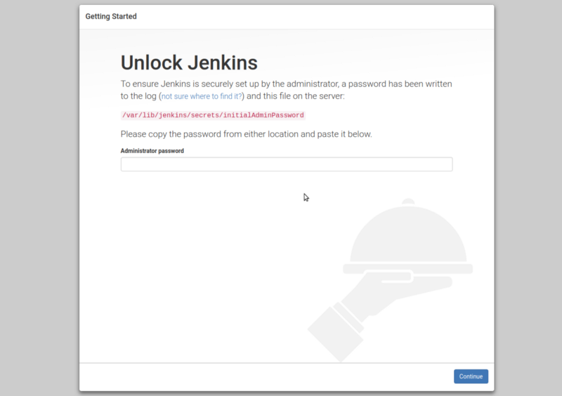

Today we will gonna talk about How to configure Jenkins with the help of Ansible.


#### What is Ansible?

**Ansible** is an open-source software provisioning, configuration management, and application deployment tool. Ansible can help you with configuration management, application deployment, task automation. we can run tasks in sequence and create a chain of events which is run on several servers once at a time.

It was written by Michael DeHaan and acquired by **Red Hat** in 2015, It includes its declarative language to describe system configuration.

Ansible is **Agentless** — temporarily connecting remotely via **SSH** or remote **PowerShell** to do its tasks.

#### Install Ansible

$ sudo apt-get update  
_$ sudo apt-add-repository ppa:ansible/ansible  
$ sudo apt-get install ansible  
$ ansible --version_


For more info please refer this link:

[**Installation Guide — Ansible Documentation**  
_Ansible is easy to run from a checkout — root permissions are not required to use it and there is no software to…_docs.ansible.com](https://docs.ansible.com/ansible/latest/installation_guide/intro_installation.html "https://docs.ansible.com/ansible/latest/installation_guide/intro_installation.html")[](https://docs.ansible.com/ansible/latest/installation_guide/intro_installation.html)

🎊 🎉🤖🎊 🎉 Ansible is installed, now we can run all ansible command using the command line using the following formate.

```
ansible <server/hosts> -m <module_name> -a arguments
```

To try an Ansible command without any additional setup,

```
ansible all -i testserver.com -m ping
```

If you set ansible properly then it gives success result like

```
testserver.com | success >> {    "changed": false,    "ping": "pong"}
```

Now, We have a basic understanding of ansible Next we move to write an ansible-playbook.

#### Ansible Playbook :

**Playbooks** in Ansible define a series of actions to run and address particular sets of servers. A playbook is like a recipe or an instructions manual which tells Ansible what to do when it connects to each machine.

Playbooks are written in YAML, which simplistically could be viewed as XML but human-readable. When I started using Ansible I’d never looked at YAML, but within hours I was able to write powerful playbooks.

👉 👉 👉Here some great [examples](https://github.com/ansible/ansible-examples) that help you to write powerful playbooks.

This is the example of ansible-playbook to configure Jenkins.

we create one inventory file that defines the list of hosts and authentication settings for each server.

The inventory file can be in one of many formats, depending on the inventory plugins you have.

\[SampleApp-Server\]  
192.168.46.131 ansible\_ssh\_user=root ansible-ssh-pass=reverse   
                        
                        -----OR-----  
\---  
SampleApp-Server**:**  
  hosts**:**  
    192.168.46.131**:**

Now we have to create a playbook file that defines a set of tasks or instructions that perform step by step and install all components that we need to install with Jenkins.

The above code is demo code do some change as per your need and try to set up your new tools according to your requirement.

Run this command to execute your playbook,

ansible-playbook -i hosts -vvv Playbook-jenkins.yml

Yur can user `-v` or `-vvv`or `-vvvvv` according to your log requirement, it just for logging purposes.

At the end of the playbook, it displays Admin password like this


Copy this password \`stdout\_lines\` paste on Jenkins administrator password field.

When it returns Success goto your web browser and enter the URL

```
http://<server-IP>:<Selected port>(Here default port is 8080)
```

#In my case   
http://192.168.46.131:8080

It will redirect to this screen.



For more detail please follow my previous article in which I explain Jenkins installation guide.

[**Setup Jenkins on CentOS with Docker for Selenium**  
_I haven’t found any walk-through about setting up Jenkins on CentOS with Docker for Selenium, and since I got to do it…_medium.com](https://medium.com/appgambit/setup-jenkins-on-centos-with-docker-for-selenium-b7dba07b9ffa "https://medium.com/appgambit/setup-jenkins-on-centos-with-docker-for-selenium-b7dba07b9ffa")[](https://medium.com/appgambit/setup-jenkins-on-centos-with-docker-for-selenium-b7dba07b9ffa)

_Thank you for reading, if you have anything to add please send a response or add a note!_