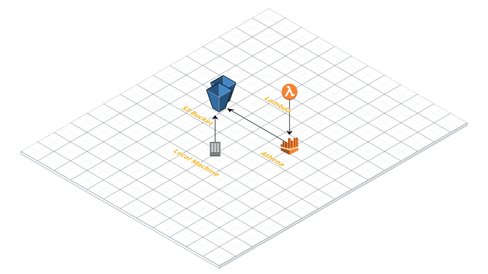
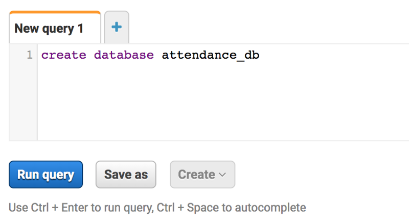
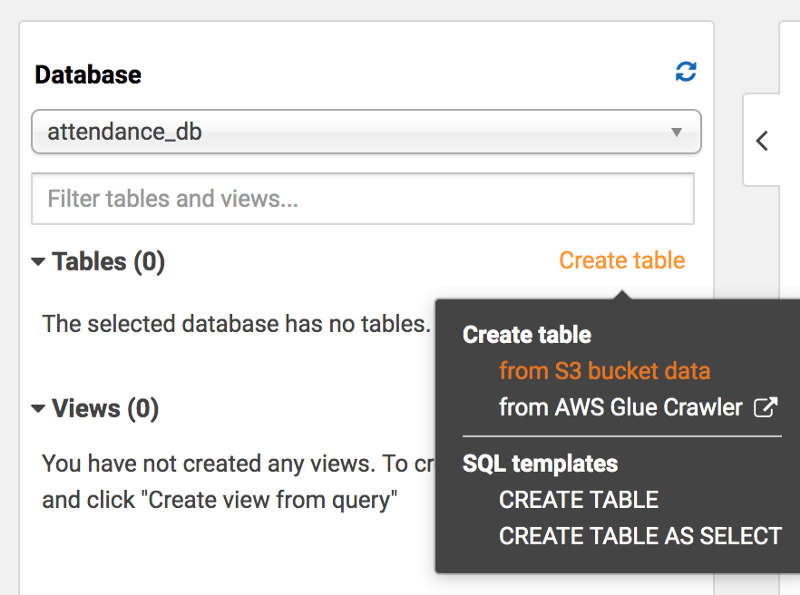
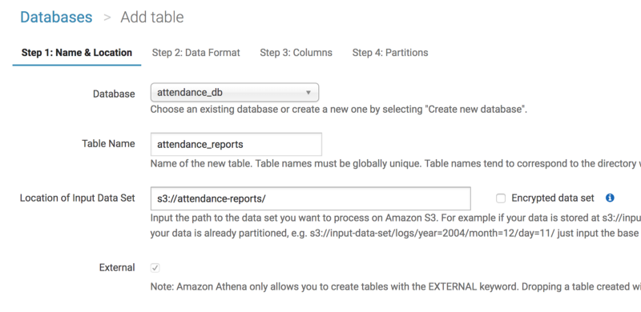
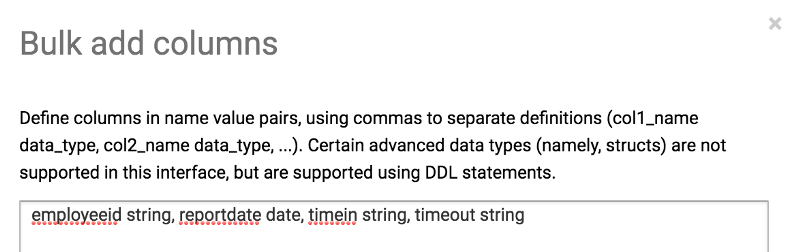
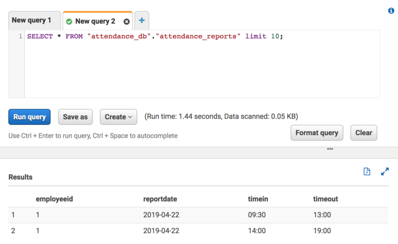

For this example, we will take a very simple use case. Let’s say we have a biometric attendance system installed at our premise, the biometric system generates a CSV file each day and then updates all the In/Out in that file. We are building an internal Alexa skill to which we can ask business queries and we would like to include the attendance data in that as well. A simple question like this:

> Alexa… how many members are available today?

To access the CSV data via the Alexa skill, our simple option would be to transfer the CSV files to S3 and access it from there directly. Two main steps in this part are:

*   Migrate the CSV to S3 periodically
*   Load the CSV files to Lambda, read and fetch the required data

### Migrate CSV files to S3

We will use the `s3 sync` command to transfer files from the local machine to the S3. Sync will make it easier to upload the newly created files to the local folder without writing any specific code or script.

### Read CSV files

Once the CSV files are uploaded to S3, we can easily access them from the Lambda. However, to read the CSV file in the Lambda we will need to download the file to the Lambda and then parse it to get the required data. The other option is to use the Amazon Athena, which is a serverless query service to query the data stored in S3 using Standard SQL.

### What is Amazon Athena

AWS Athena is an excellent addition to the AWS BigData stack. It allows you to query the files stored in S3 directly without pre-loading them in any database. To some extent, this is similar to Google’s BigQuery with Federated tables. Some of the key points related to Athena:

*   All the tables in Athena are EXTERNAL only
*   Athena uses Apache Hive to define databases, tables and uses the Presto for Standard SQL queries
*   When we run an Athena query, it uses the schema-on-read approach, which means the schema is projected onto the data source of the table
*   Athena DOES NOT modify your data stored in S3, it is only used to query those data
*   For better performance use the Partition or may switch over to Columnar file format, whichever is best suitable for your use case

### Athena Pricing

With Amazon Athena, you only pay for the queries that you run. You are charged based on the amount of data scanned by each query. You can get significant cost savings and performance gains by compressing, partitioning, or converting your data to a columnar format because each of those operations reduces the amount of data that Athena needs to scan to execute a query. So with that, the query pricing is currently set to this:

> $5.00 per TB of data scanned

### Configuring Athena for Query

Configuring the Athena is pretty simple. Create a database and a table which can match the schema format of the CSV file and point the table to the S3 folder which hosts all the files. Once we do this, we are ready to fire the SQL queries directly on the files.

Creating a database in Athena

Now we will create a table which matches our CSV file format.

Creating a table from S3 bucket data
Selecting the S3 Bucket as a data source
Use the bulk option to add all the columns together

Once completed, our table is ready and we can start querying now.

A simple SELECT query to fetch records

By this time, we have set up our data store in S3, created a virtual database and a table pointing to the S3 bucket and can query the data as well. Both S3 and Athena are managed-services and serverless so we will pay only for what we use and not otherwise.

### Integrate with Lambda

We will be using the `athena-express` npm library in our sample code. We can use the `aws-sdk` npm package as well but that would require to fire some boilerplate code which we can avoid using this library.

[**ghdna/athena-express**  
_athena-express makes it easier to execute SQL queries on Amazon Athena by chaining together a bunch of methods in the…_github.com](https://github.com/ghdna/athena-express "https://github.com/ghdna/athena-express")

For the code to run properly we will need a couple of IAM permissions like `athena:*` and `Glue:GetTable`

### Conclusion

Although Athena may not be suitable in all the cases and not all the cases will be this simple (partition and columnar format are most likely needed to reduce the query overhead and compressed data to reduce the size). But this still gives a very good platform to analyze data stored right inside the S3 without pre-loading them anywhere and manage those additional resources.