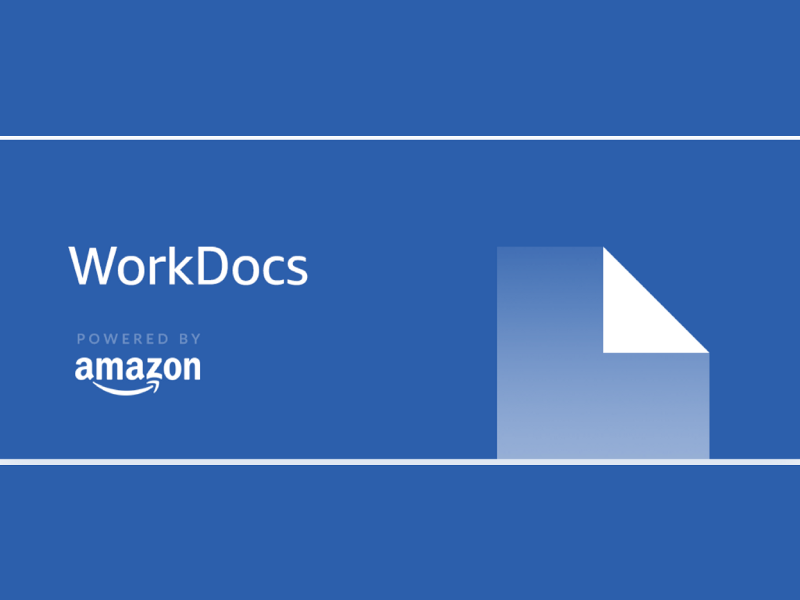

We recently had a request to develop a cloud-ready application to share private files. The use-case had a bunch of requirements which were quite tailored to their business requirements:

*   Store the private files in organizational structure
*   Have an application to download and use the file offline
*   Share the files with other users with password
*   Share the files for a specific time duration (this was not in the original spec, but they had an offshore contractor and needed to share some files with compliance reasons)
*   Standard file support like Docs, Words, and images, usually not very big in size

Now the expectation was to build an application from scratch and they wanted to use S3 for the file storage because they have been using the S3 already for some of their existing applications and familiar with the cost structure of the storage service.

Now instead of developing a Document Management System from the ground up, I decided to use a ready solution which can fit the spec. There are many services already available but they needed a service which can be hosted in their existing environment so we had to eliminate the Dropbox, Google Drive, etc.

I had some experience with AWS services for a work environment like Workspaces, Chime, etc.

### What is WorkDocs

> Amazon WorkDocs is a fully managed, secure content creation, storage, and collaboration service. With Amazon WorkDocs, you can easily create, edit, and share content, and because it’s stored centrally on AWS, access it from anywhere on any device.

WorkDocs provides tons of features which is needed by any Document Management System within the enterprise. Most notably are User Management, Sharing, Editing, Encryption, Workflow, Feedback, Compliances, etc. You can get the full features of WorkDocs from here.

[**Amazon WorkDocs features**  
_You can store virtually any type of file on Amazon WorkDocs. Each individual user account on Amazon WorkDocs includes 1…_aws.amazon.com](https://aws.amazon.com/workdocs/features/ "https://aws.amazon.com/workdocs/features/")

Out of the many workflows supported by the WorkDocs, this one was closely related to my use case:

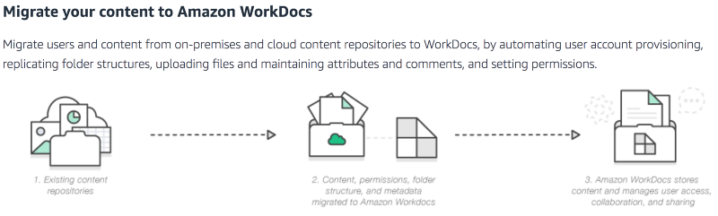
One of the workflows supported by WorkDocs

### WorkDocs Pricing

In most regions, WorkDocs costs **$5 per user per month** and includes **1 TB of storage for each user**. WorkDocs provides a 30-day free trial with 1 TB of storage per user for up to 50 users.

[**Amazon WorkDocs pricing**  
_Looking for file collaboration and management pricing? In most regions, WorkDocs costs $5 per user per month and…_aws.amazon.com](https://aws.amazon.com/workdocs/pricing/ "https://aws.amazon.com/workdocs/pricing/")

Except for a few cases, (and discounting the fear of lockin), it might be very easy to calculate the ROI. (AWS) Cloud-ready, highly available, secure, AD integration, sharing, collaboration, encryption and client apps just to name a few important features.

### WorkDocs Setup

WorkDocs setup is quite simple. You need to create a site, where you can either connect to your existing Active Directory service or it will set up one for you.

> As of this writing, AWS WorkDocs is only supported in a few regions.

There are two options to start with, Quick Setup and Standard. In Quick Setup the WorkDocs will create a SimpleAD for you and in the Standard option, you have the option to select your existing Active Directory service via the AD Connector.

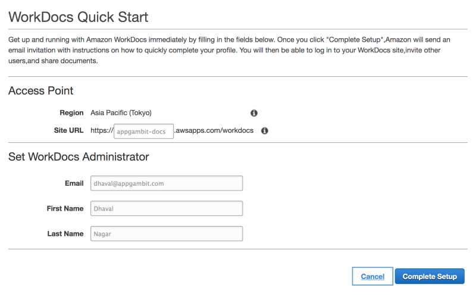
WorkDocs Quick Setup

Once the setup is complete, you can access your newly created Docs site with the given Site URL.

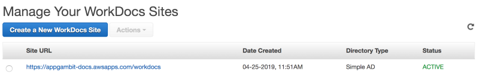

Along with the WorkDocs site, AWS has also created a SimpleAD in the Directory Service. You can go to the Directory Service and manage the new directory.

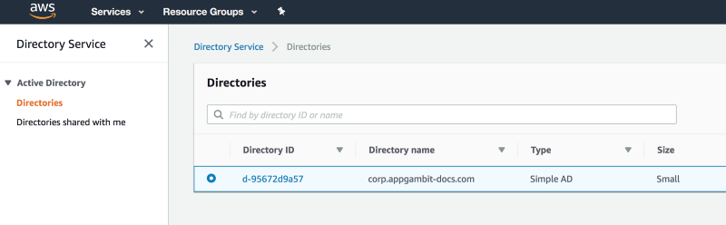

Now you can log in with your administrator user and it will be all set.

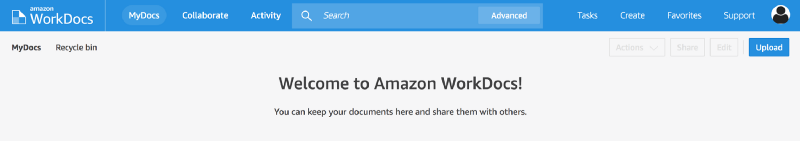

Because I have started with simple active directory, it will be empty and I will have to set up everything to create my required organizational structure. You can invite new users from the Admin Control Panel to your site and set up their role and size limit.

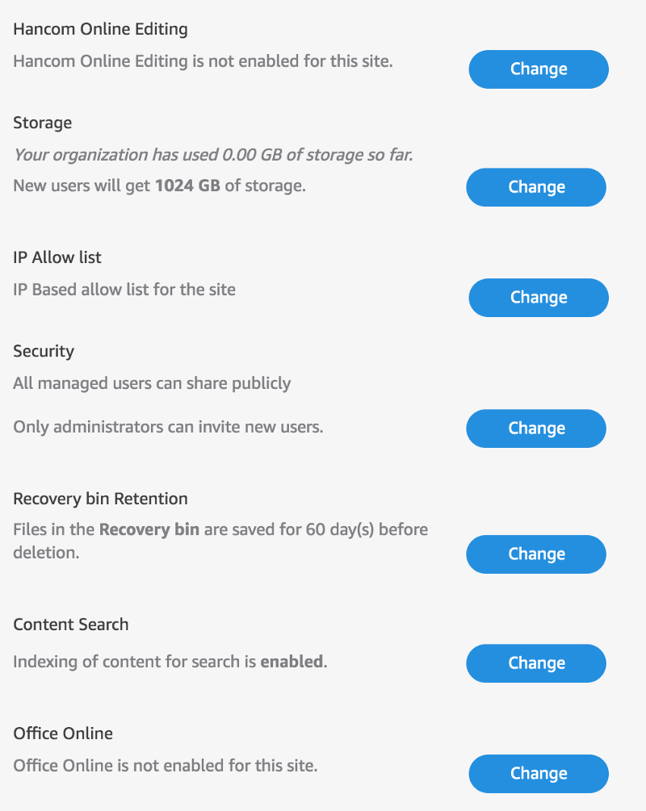
Admin options to configure the site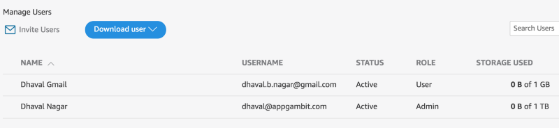
Invite new users from the control panel

Now I can start uploading files and share with either user of the site or share a link.

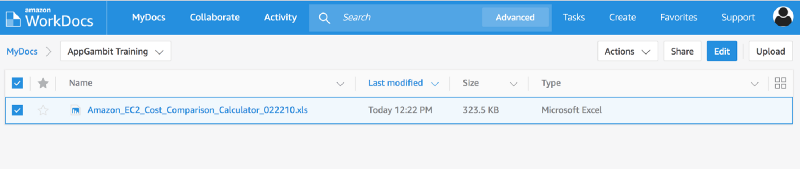
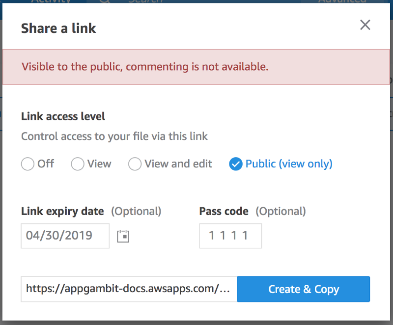
Public Link Share with Expiry Date and Passcode

An administrator can see all the activities from the Activity tab related to the site.

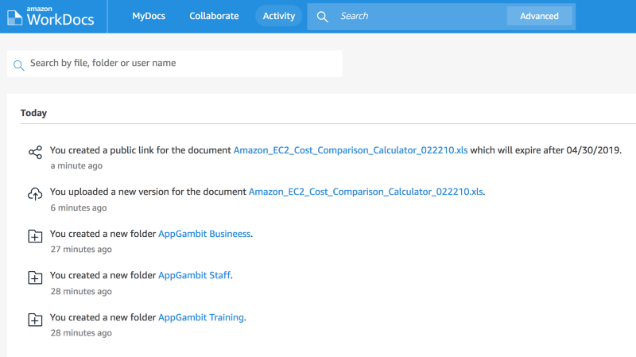

### WorkDocs Apps

WorkDocs provides some standard companion applications through which users can access the files offline, edit or share them from their devices.

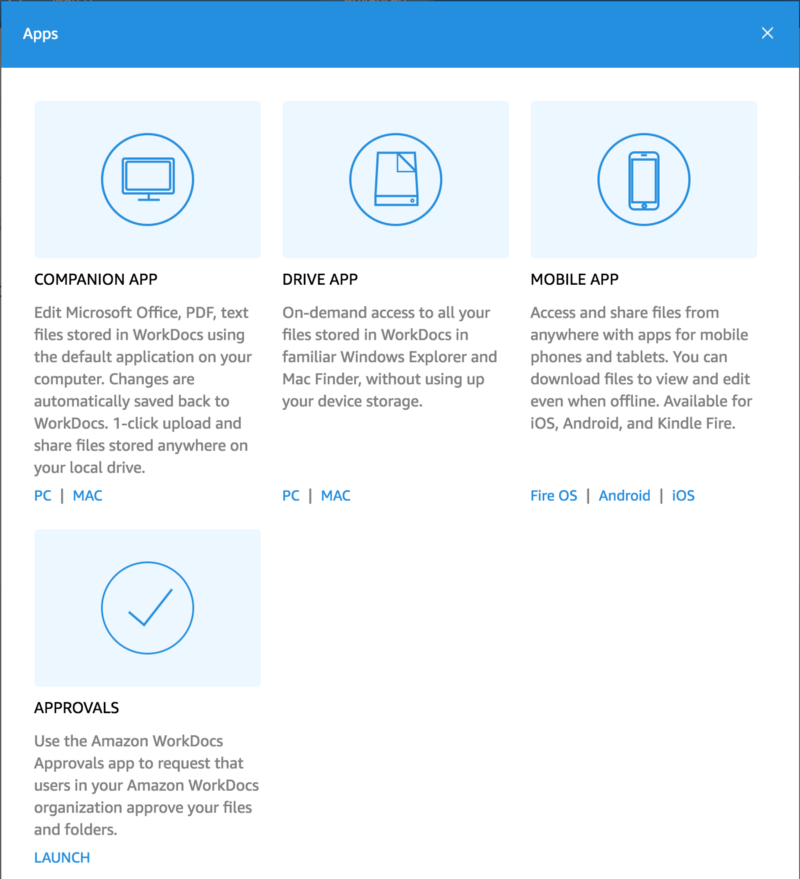

[**Amazon WorkDocs Client Downloads**  
_Amazon WorkDocs is a fully managed, secure enterprise storage and sharing service with strong administrative controls…_amazonworkdocs.com](https://amazonworkdocs.com/apps.html "https://amazonworkdocs.com/apps.html")

### WorkDocs SDK

So far all features are manually configured and there is no automation or external service involved. But we can extend WorkDocs with SDK provided by the AWS. Here are some of the use cases we can configure by using the SDK.

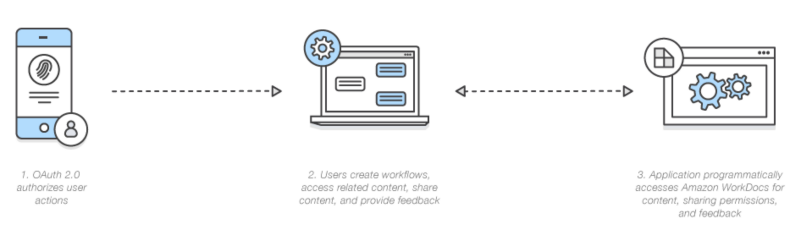
Build a process management application with Amazon WorkDocs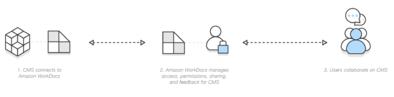
Build collaboration capabilities into your existing content management system

[**Amazon WorkDocs SDK - build file collaboration and management apps**  
_Need to build file collaboration and management capabilities into your app? The WorkDocs SDK is part of the AWS SDK…_aws.amazon.com](https://aws.amazon.com/workdocs/sdk/ "https://aws.amazon.com/workdocs/sdk/")

[**Class: AWS.WorkDocs - AWS SDK for JavaScript**  
_All Amazon WorkDocs API actions are Amazon authenticated and certificate-signed. They not only require the use of the…_docs.aws.amazon.com](https://docs.aws.amazon.com/AWSJavaScriptSDK/latest/AWS/WorkDocs.html "https://docs.aws.amazon.com/AWSJavaScriptSDK/latest/AWS/WorkDocs.html")

### What Next!!!

AWS is adding tons of new services regularly and also expanding the existing services with new features. We at [AppGambit](https://appgambit.com) can help you design the best of the cloud architecture depending on your use-case.

Post a comment if you have any queries or suggestions.