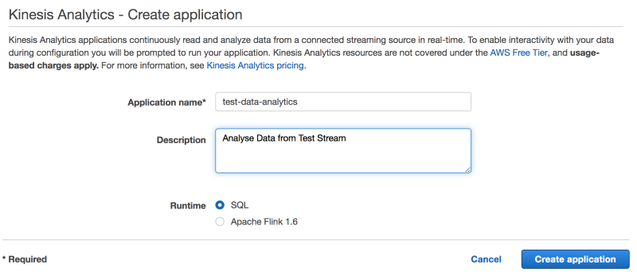

I recently had a conversation with a colleague regarding various AWS services for BigData and I gave an example of how Kinesis can be used to ingest real-time data with analytics capabilities. Through the conversation, I realized that though it is easy to explain conceptually, it is slightly difficult to understand put things together when you start using it.

> Before you start using any of the AWS services, make sure you go through the service price model. AWS has done a good job explaining pricing, however, it is possible that a use case can be solved using multiple services and pricing can be one of the decisive factors.

### What is AWS Kinesis

AWS Kinesis is a popular service for real-time data ingestion, analysis, and delivery. Kinesis has multiple services under its name, like Data Streams, Firehose, Analytics, and Video Streams. We will only look at the Data Streams and Analytics service in this post.

> Kinesis is massively scalable and durable real-time data streaming service. KDS can continuously capture gigabytes of data per second from hundreds of thousands of sources such as website clickstreams, database event streams, financial transactions, social media feeds, IT logs, and location-tracking events.

[**Amazon Kinesis Data Streams - AWS**  
_Process and load data streams into AWS data stores and analytics tools. Learn more here._aws.amazon.com](https://aws.amazon.com/kinesis/data-streams/ "https://aws.amazon.com/kinesis/data-streams/")

### How is this Serverless!!

> I will start putting this section in every post, just to explain why the solution fits into the serverless category.

Throughout this example, we will be doing a number of things like consuming data, filtering the required data and finally sending those data to a Lambda function for further processing. But we will not be starting any instances or running any code in a continuous environment.

### Create a Kinesis Data Stream

Creating a Kinesis Stream is pretty simple and straightforward. We just need to give a name and number of shards that we want to start up. Because our case is pretty simple, we will start with one shard, but keep in mind that the shard can quickly become a bottleneck if your application demands a particular read/write capacity.

### Injecting Test Data

To test and set up the Analytics, I am going to run this script which will keep feeding a static data record to out Kinesis Stream.

> For simplicity, we are putting data in the comma-separated format here. But you can use stringified JSON as well.

while true; do aws kinesis put-record --stream-name test-stream --partition-key main --data 'dhaval,100\\n'; sleep <interval\_in\_seconds>; done

Make sure your AWS CLI is properly configured with permissions and if you are creating resources in a different region then will have to pass the `region` parameter in command as well.

### Create a Kinesis Analytics Application

Once our Stream and test data is ready, we can quickly create a Kinesis Analytics application which can consume and process data.

Creating the Kinesis Analytics is also pretty easy. We just need to provide the application name to start with and the runtime for the analytics. For the runtime, we have an option of SQL and Apache Flink, which allows developers to use Java for the data processing. We will be using SQL for this post.

[**Apache Flink: Stateful Computations over Data Streams**  
_Apache Flink® - Stateful Computations over Data Streams_flink.apache.org](https://flink.apache.org/ "https://flink.apache.org/")

Once we create the application, we have to connect the data source with it. We can either select an existing source or create a new stream. In our case, as we already have the stream, we will select the existing source and use our previously created stream.

After connecting the source, we will have an option to Auto Detect Schema. This will be used to create Analytics Queries for data filtration.

Make sure you are running the data ingestion script that I have provided in the earlier section. That will help Kinesis Analytics to identify the data format and will show raw data. Once we have the data records visible, you can provide the columns required.

In our case, we have two columns so I am setting the schema type accordingly:

NAME VARCHAR(10)  
TOTAL INT

Once we have our data format defined, we can save and check the updated stream data.

With this, we can verify that the data is properly parsed and we have the columns that we need to build the analytics query in the next section.

Now, select the `Go to SQL editor` option to start writing the analytics query and filter our incoming data.

By default, it will show the source data that we are already receiving in the schema format. With the SQL Query option at the top, we can create the Analytics Table with the formatted data that we need.

Here we are writing a pretty simple query to only looking for records having `TOTAL > 500` value. If you look closely, we are creating a new Schema `DESTINATION_SQL_STREAM` which will hold the filtered records.

Once you `Save and run SQL`, it will generate the new schema and start showing the sample records.

You can see the new schema is listed under `In-application streams` and you can create multiple streams as well.

Now that we have out Source and Filtered streams ready, we can connect this to one of the supported Destinations.

As of now, there are 3 options available to connect the output to destinations like another Kinesis Stream, Kinesis Firehose or a Lambda function.

We can connect to a new Lambda function and can continue the further processing of the records that we have filtered.

### AWS Kinesis Pricing

> Kinesis Data Streams Pricing is based on two core dimensions — Shard Hour and PUT Payload Unit

Kinesis Data Stream pricing is different per region and there are many add-on features which will be charged as per the usage. US Virginia has the cheapest pricing while writing this, but you can check the most up to date pricing from here.

[**Amazon Kinesis Data Streams Pricing**  
_Capture, process, and store streaming data for real-time analytics. Find pricing information here._aws.amazon.com](https://aws.amazon.com/kinesis/data-streams/pricing/ "https://aws.amazon.com/kinesis/data-streams/pricing/")

### What Next!!!

Kinesis might not be suitable for all the use cases. Make sure your requirements are aligned and also keep the costing part in check. Without proper analysis, Kinesis might turn out to be very costly.