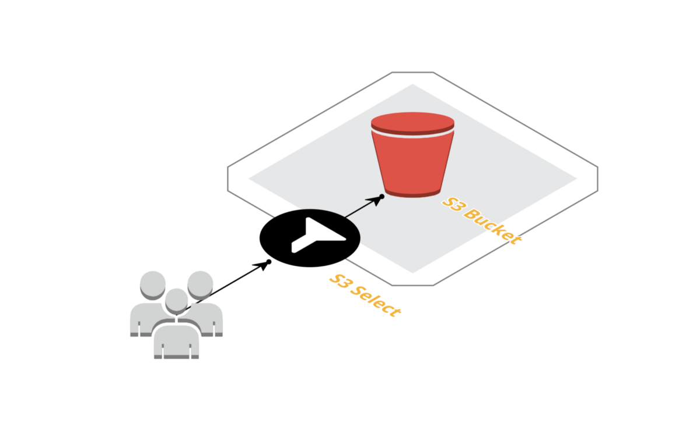
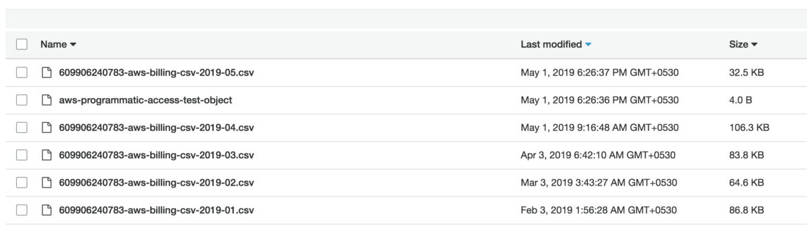
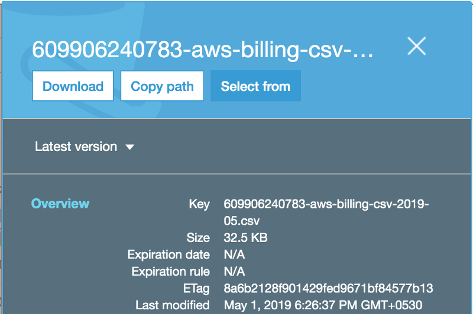
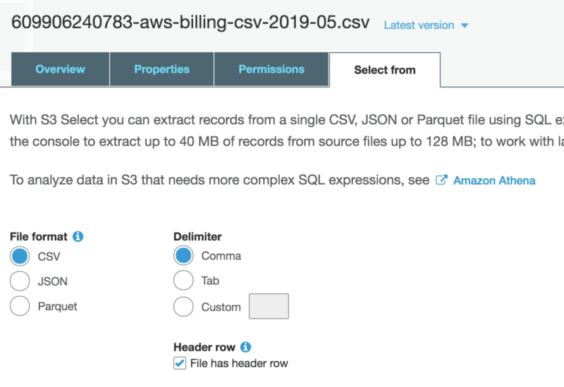
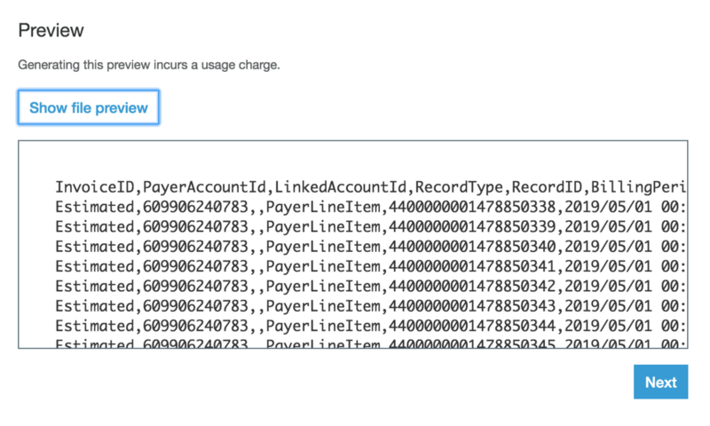
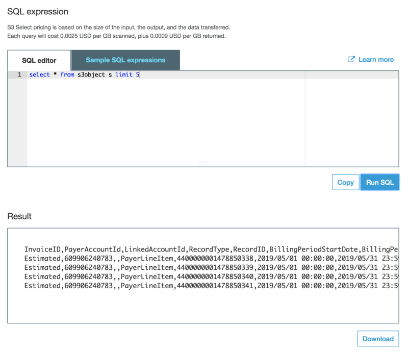
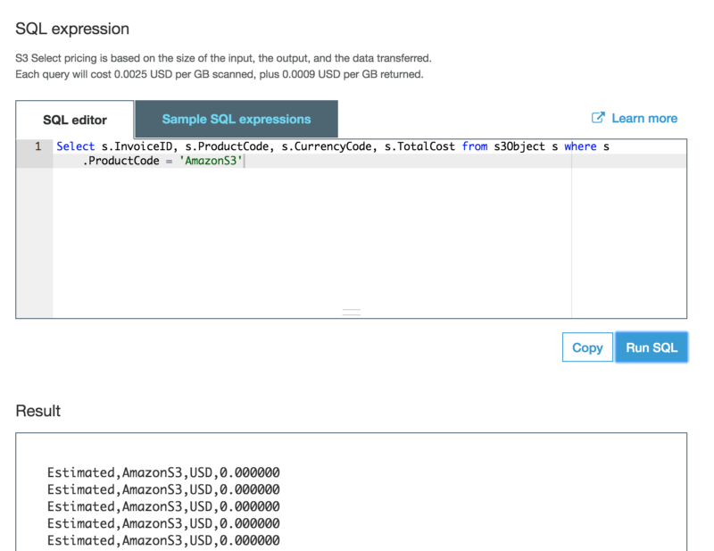

S3 Select provides capabilities to query a JSON, CSV or Apache Parquet file directly without downloading the file first. You can think this as a limited version of Amazon Athena, which allows you to query multiple files in a bucket.

[**S3 Select and Glacier Select - Retrieving Subsets of Objects | Amazon Web Services**  
_stores data for millions of applications used by market leaders in every industry. Many of these customers also use for…_aws.amazon.com](https://aws.amazon.com/blogs/aws/s3-glacier-select/ "https://aws.amazon.com/blogs/aws/s3-glacier-select/")

### How is this Serverless!!

We have all the data stored on S3 which is a fully managed storage service. S3 Select is part of the S3 service only, and we do not need to provision anything additionally to run in-place-queries. We can call the queries either from the S3 Console of using AWS SDK.

### Setup

In this example, we will be querying a CSV file stored in an S3 Bucket and returning a CSV output as a result.

We have an internal iOS application which I use to monitor our AWS Account usage, which is using this bucket to load the monthly data. I will be using the same bucket and the same file which is generated by the AWS Billing Service.

### S3 Select from S3 Console

Before we do some coding, S3 Select is already available in the S3 Console and you can easily and quickly query the supported files directly from the UI if needed.

Once you select a supported file, in our case a CSV file, you will see this pop up on the right side of the S3 console. There you will see this additional option `Select from`

Selecting that will open up the full-screen options to initiate the query process.

Now in our case, the file format is CSV, the delimiter is a Comma and there is a Header row.

Using the default settings, and `Show file preview` you will see the limited file data being displayed. Now you can further refine this with an SQL query with `Next` option.

Here you can write an SQL query and filter the data which you actually need. Let’s say I need only a few columns and limited records so I will write a custom SQL instead.

Here we are requesting only records matching the `ProductCode = “AmazonS3”` from our invoice file.

### S3 Select Query using JavaScript

Although the S3 Select in general availability since 2018, it’s still difficult to grab it out of the documentation.

This is a pretty simple S3 Select call from NodeJS function. Our data input and output are both CSV. Once the query is processed the response is a read stream, which we can continue reading and create our own buffer.

### S3 Select Pricing

Although it is unlikely that we might be using S3 Select for very complex processing; but for the simple use cases, we still need to consider the pricing effect of using S3 Select.

If we do not use S3 Select the typical process would be to retrieve the file from S3 and store it locally so that we can read and process the data. In which case, only the retrieval fees will be charged.

In the case of S3 Select, we will be charged on two factors.

*   Data Returned by S3 Select
*   Data Scanned by S3 Select

> Data Scanned is the amount of S3 data that needs to be read in order to find the S3 query result. Data Returned is the size of data returned to the caller, i.e. the query result.

The pricing will vary from region to region, but we need to consider the Data Scanned factor while running our queries.

> Example: you have an S3 Select query that causes 10GB data scanned by S3 and 1GB returned by S3 Select.

> The cost for US-EAST-1 Region (Ohio), Standard Storage would be:

Data Scanned by S3 SELECT : $0.002 / GB \* 10 = $0.02  
Data Returned by S3 SELECT : $0.0007 / GB \* 1 = $0.0007

**Total = $0.0207 per S3 SELECT Query**