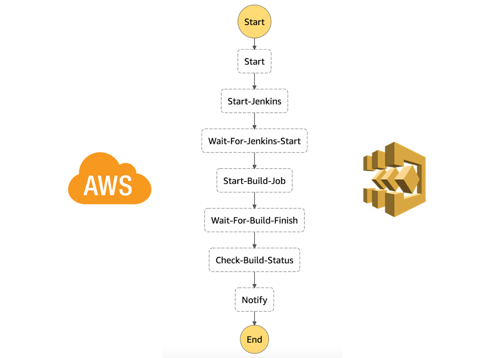
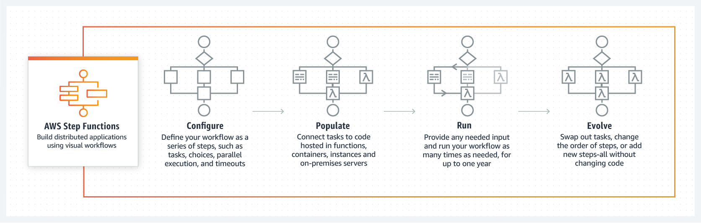
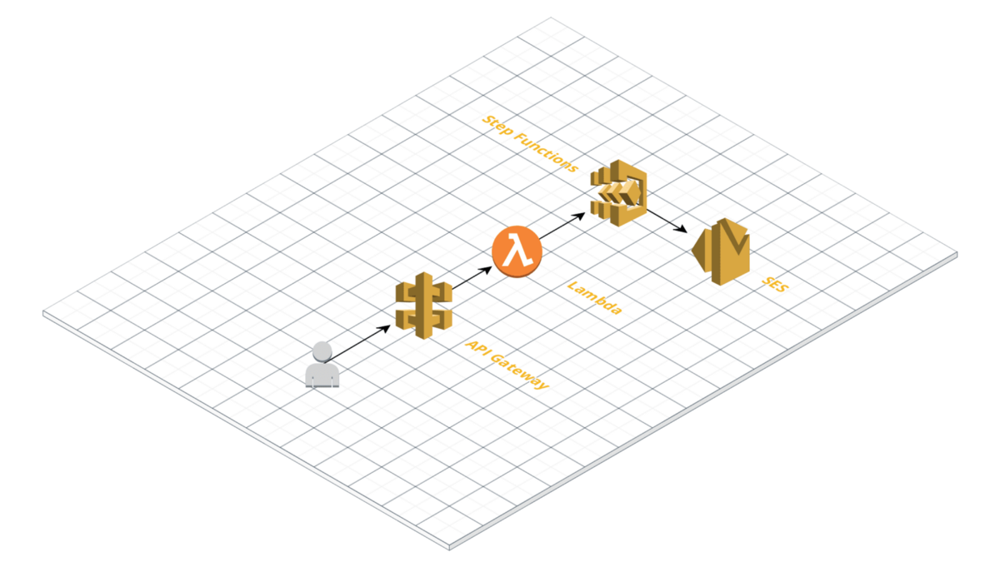
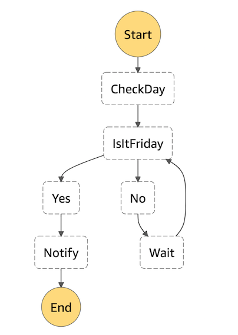
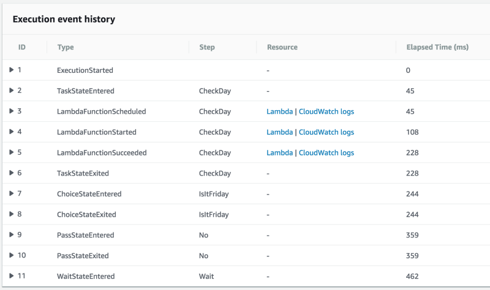
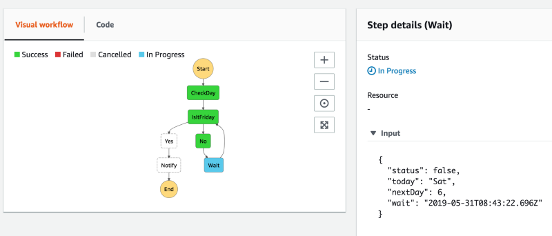

This is NOT how we build right now. We just type /build\_XXX in our Slack and somehow it manages to build the app magically :) :)

We recently build a full-serverless video/media distribution application for one of our clients. The app uses a combination of Serverless Framework, AWS S3, Lambda, API Gateway, X-Ray, Lambda Layers, Pinpoint, AppSync and a bunch of other services.

Now that it has been running we started adding more features for analytics and customer engagement like sending periodic push notifications and reminders.

Previous we had done the same using CloudWatch Events, where we schedule a bunch of Lambdas for different tasks and send out emails, notifications in a pipeline. However, that means more than a few moving parts, we need to manage CloudWatch Events, Lambdas which pulls data for every user, and not to mention the Timezone issue as we needed to send notifications at Hour X for each user.

> **Note:** We can invoke a Step Functions from CloudWatch Events as well. So while in our case we will be invoking this from other Lambda functions, but in future this can be invoked from different sources.

So for this application, we decided to move to a personalized logic which can be executed independently and allow us to control things in a structured manner. And we were still looking for a Serverless option.

### What is (are) AWS Step Functions

> AWS Step Functions lets you coordinate multiple AWS services into serverless workflows so you can build and update apps quickly. Using Step Functions, you can design and run workflows that stitch together services such as AWS Lambda and Amazon ECS into feature-rich applications. Workflows are made up of a series of steps, with the output of one step acting as input into the next.

> Because our entire application is already build up using a bunch of Lambdas, this was a fair choice.

### How is this Serverless!!

Step Functions allows us to create a workflow, assign resources for each step, executes the flow, and maintains execution flow durably for a year. None of these activities require any dedicated resources to run continuously. So as far as the service is concerned it falls into Serverless category.

### Step Functions Pricing

> The Step Functions free tier includes 4,000 free state transitions per month. After that, _$0.025 per 1,000 state transitions. The pricing varies from Region to Region, so please check the pricing table for your target region._

For example, you create a simple Step Functions in the US East region with 2 transitions. Start -> Hello World -> End, and you run this flow for 1000 times per day, 30 days per month.

> 2 Transitions \* 1000 Times \* 30 Days = 60000 Transitions Per month

> 60000 Monthly Transitions - 4000 Transitions Free Per Month = 56000

> **56000 Payable Transitions \* $0.000025 = $1.4 Per Month Cost**

Note: This is just the Step Functions cost and does not include the cost incurred for any other AWS services.

### Use Case

We will take a simple use case for this post. It was Thursday when I decided to write this, so we will build a simple service for “Is it Friday Yet!!”.

Our API Gateway service will call a Lambda to check if it’s Friday today or not. If it is it will return Success, otherwise, it will invoke the Step Functions to schedule a reminder when it reaches to Friday.

### Steps

A simple flow looks like this. We are starting with a checker function, to check if it’s Friday or not. If it is, we will move to the next function to send a notification, otherwise will wait until it hit Friday.

The visual flow looks like this. Pretty easy to understand and we can keep the simple labeling as well.

### Functions

Let’s build the function now. We will need two functions for this service. 1) To Check the Current Day and 2) to Send a Notification. Here is how I am doing it to keep it simple.

> Note: As you can see, this code is not timezone friendly.

When you run this, it returns a JSON as output. The function checks for the current day and if it is not the Friday then generates necessary variables to wait till the next Friday.

{  
  "status": false,  
  "today": "Sat",  
  "nextDay": 1,  
  "wait": "2019-05-31T08:41:58.642Z"  
}

### Steps and Functions Together

When you execute the Step Function, you can see an individual execution state from the console.

Our Lambda function which is responsible for checking the day as well as generating the wait timestamp in case if it's not the Friday today.

In the Step Functions console, you can check the progress of individual execution. When you click on one of the steps, you can also see what is the input, output or exception for that step.

### What next!!!

This is probably an extremely simple example, but we can do beautiful things with this.

[**AWS Step Functions - Use Cases**  
_You can use Step Functions to make decisions about how best to process data, for example, to do post processing of…_aws.amazon.com](https://aws.amazon.com/step-functions/use-cases/ "https://aws.amazon.com/step-functions/use-cases/")