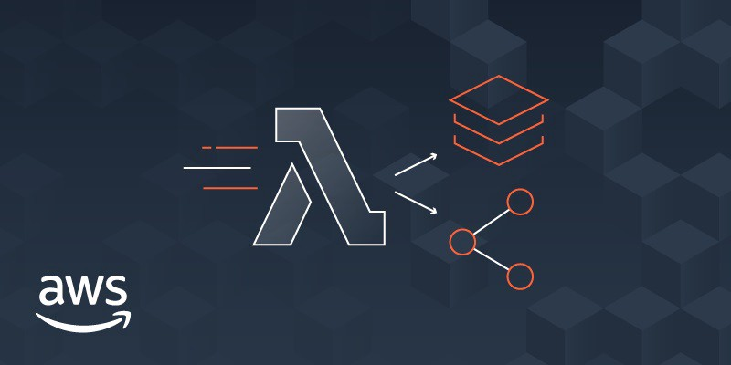
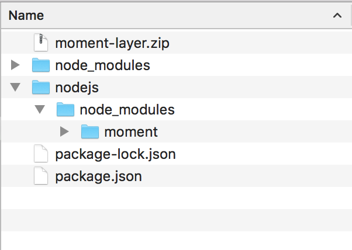
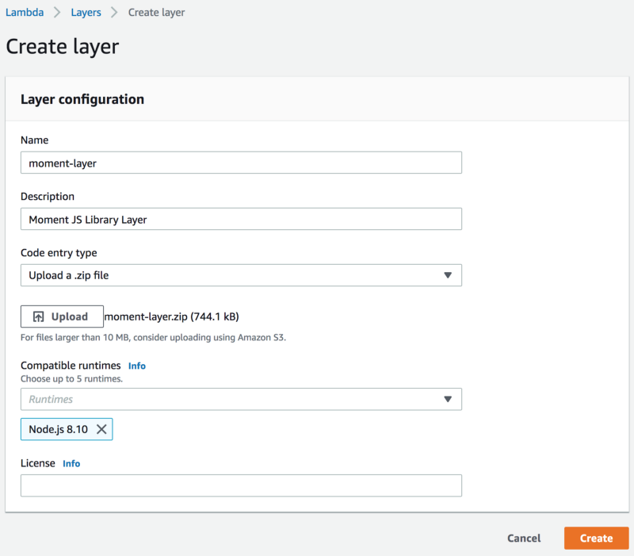
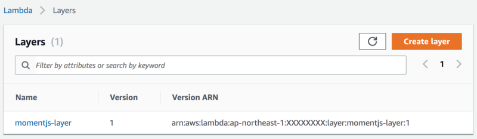
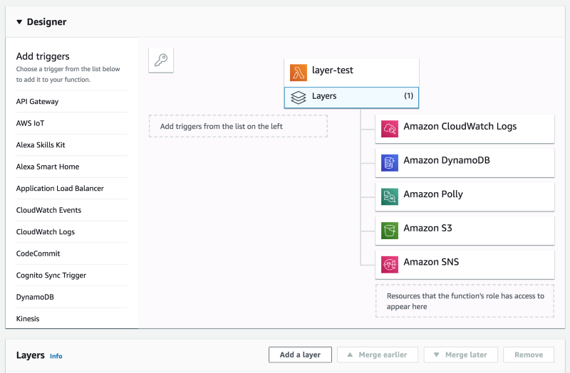
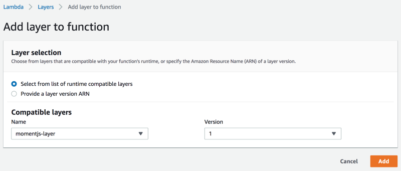
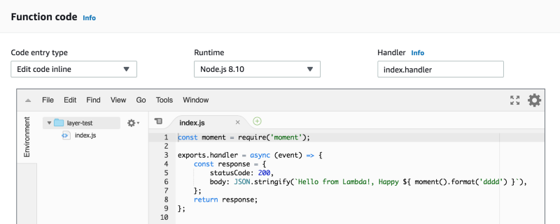

> This article only shows how to use Layers manually, and not suitable for the production grade.

> In Part-2, I will cover how we can use this along with Serverless Framework for production grade application.

If you are writing AWS Lambda-based services frequently and haven’t yet used the Layers, spare couple of hours and give it a try now.

At first, Lambda Layers may look complicated to start with. But it’s very simple to integrate. Let’s take a simple example: You have written a simple Node.js application which made up of 5 lambda functions, each of these functions uses MomentJS for Date calculations. When you deploy these functions, the dependency of MomentJS has to be included in each function so that it can import and use the library. The library will be included in all of the functions, taking up the same space and making each function occupy a little more storage space and take little extra time while deploying.

Layers simply allow you to extract those common dependencies out and use as an add-on service while running your functions. So instead of bundling MomentJS in each function, you would just create the MomentJS Layer and configure that layer in each of your application functions.

Let’s do in a simple manual way and then we will do it via SAM Template.

> A function can use up to 5 layers at a time. The total unzipped size of the function and all layers can’t exceed the unzipped deployment package size limit of 250 MB.

> So make sure you dependencies are structured accordingly. Instead of creating layer for each library, you can create layers for collection of libraries like CoreLib, DbModels, CoreServices, etc.

### Layer Setup

Setting up a Layer for MementJS is very simple. Just create a directory with `package.json` and install the moment.js library.

$ mkdir momentjs-layer && cd momentjs-layer  
$ npm init -y  
$ npm install --save moment

Now that you have the layer setup ready, we will have to create a bundle which we can upload as a Layer source. This is a small script which can help to create a Layer bundle from the `npm scripts` configuration.

> Note: For the NodeJS platform, Lambda Layer expects the dependencies inside the `/nodejs` folder.

"scripts": {  
    "build": "npm install && mkdir -p nodejs && cp -r node\_modules nodejs/ && zip -r moment-layer.zip nodejs"  
}

Once you run the `npm run build` it will create the Layer bundle and create the zip file which we can upload to AWS Console.

### Create Lambda Layer

Now that we have the Zip file ready to use. We can go to the AWS Lambda Console and create a new layer with this zip.

Once we provide all the detail, our Layer is now ready to use with the compatible Lambda functions.

### Integrating Layer in Lambda Function

Create a Lambda function and select the Layers configuration. It will show the additional section to integrate one of the available Layers.

`Add a layer` option will show compatible layers based on your Lambda runtime. In our case, it will only show NodeJS compatible layers.

Now that we have layer integrated, we can start using the MomentJS directly into our function without installing any dependencies. My function code in the below example is pretty simple and as you can see there are no node\_modules available in the left pane.

When I execute this function, it will have the `momentjs` library available to use, and the function will return the expected output.

{  
  "statusCode": 200,  
  "body": "\\"Hello from Lambda!, Happy Tuesday\\""  
}