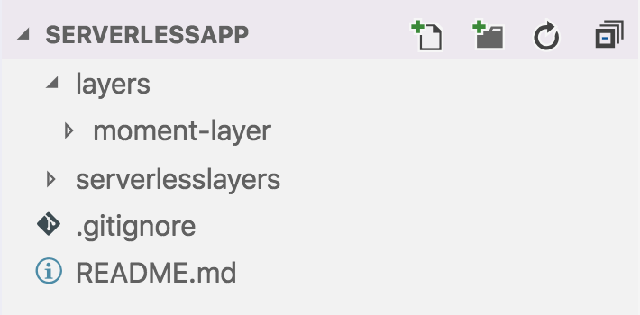

In this part, we will use the Lambda Layers along with the popular [Serverless Framework](https://serverless.com). Serverless Framework is a good option to write production level serverless applications for multiple cloud providers. You can manage your code pretty well and can manage the deployment cycle easily too.

[**AppGambitStudio/serverless-lambda-layers**  
_Lambda Layers with Serverless Framework. Contribute to AppGambitStudio/serverless-lambda-layers development by creating…_github.com](https://github.com/AppGambitStudio/serverless-lambda-layers "https://github.com/AppGambitStudio/serverless-lambda-layers")

The above repo has the full working application with Serverless Framework and Lambda Layers.

Let’s get started.

### Create a Serverless App

We will be using a simple hello-world app along with `moment` as our layer.

$ sls create --template aws-nodejs --path serverlesslayers

To start with our `handler.js` file is very simple and we are not adding any piece of new code until we finish the Layer setup.

### Create a Layer

We will be adding a parallel directory `layers` to create the Moment Library layer and together it will look something like this.

In the `layers` directory, create a new source directory for the moment layer. The `moment-layer` library is pretty simple. It just has one `package.json` file with `momentjs` dependency.

$ npm install --save moment

Now we have our Moment Layer set to integrate with the serverless application.

### Integrate the Layer with Serverless App

Now that we have our App and Layer ready, we can integrate the two together via the `serverless.yml` configuration file.

We have added 3 different configurations here.

*   NODE\_PATH to look for libraries in `/opt/node_modules` folder. Lambda Layer by default copies the dependencies into the `/opt` folder at runtime. So we are adding this to fetch our layers.
*   `layers` section with the relative path of our layer code and compatible runtime, `nodejs8.10` in our case
*   Reference to our layer in the `functions` section via the CloudFormation `Ref` variable

> Although we have defined our layer name as **moment** only but as you see Serverless Framework expects a formatted name like this for the Ref variable

> **{Capitalize Layer Name}LambdaLayer**

Now that we have the layer integrated, let’s change our code to use the Moment as a dependency.

Now it’s time to deploy the service on the AWS and test.

### Deployment

Deploying the serverless app to AWS is pretty easy. I assume you already have the `serverless` command set on your machine.

I use this command for all of my deployments.

$ sls deploy --aws-profile {profile} --region {region} --stage {stage}

Once you run the deployment, you should see this output on your console.

You can use the GET URL in your browser and test. If everything is configured correctly, you should see this as an output.

{ "message": "Today is Sat" }

### Testing Locally with serverless-offline plugin

So far we have developed and tested our Serverless function along with Lambda Layer directly on the AWS environment, but we will not deploy to AWS every time we make any changes and instead would like to use the `serverless-offline` plugin for the local testing.

Follow this tutorial to add the serverless-offline capability into your application.

[**serverless-offline**  
_Emulate AWS λ and API Gateway locally when developing your Serverless project_www.npmjs.com](https://www.npmjs.com/package/serverless-offline#installation "https://www.npmjs.com/package/serverless-offline#installation")

After integrating the offline plugin when you run the app locally with `sls offline`, it will throw the `Missing Module` error.

> This is because we have integrated the Moment library via the Layer dependency and it is not available locally in the node\_modules lookup path.

To circumvent this we will follow the default settings for Serverless Framework. By default, Serverless Framework ignores the `dev-dependencies` while packaging/deploying the functions to the AWS environment. So we will install the moment library into our main service with dev dependency.

$ cd serverlesslayers  
$ npm install --save-dev moment

Now when you run the app locally with `sls offline` it will find the moment library and you will get the output without any error.

However, when you package or deploy the function now with `sls deploy` the API Gateway response will fail. This is because the Serverless Framework will by default exclude the `moment` library even though it is part of the layers package.

To fix this we can use the explicit include directive in the layer’s package section.

With this, the layer bundle will always include the `node_modules` attached with itself, but the `momentjs` library which we installed inside the service will be ignored in the final deployment.

Now you can test your application both offline and on AWS without any manual configurations to maintain.

Serverless Framework has a lot of plugins and different applications can follow a slightly different structure. Do let me know in the comments section if you have any suggestions or queries.