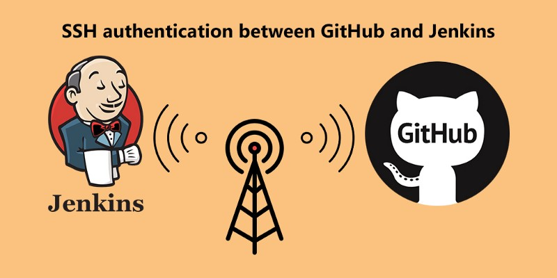
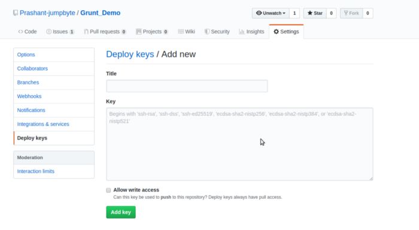
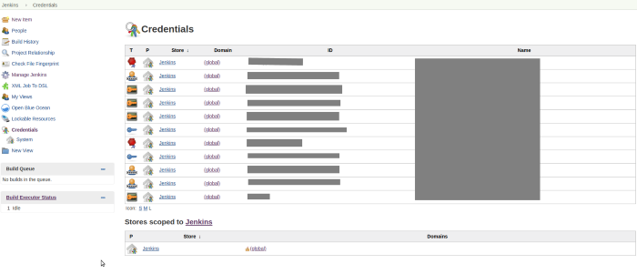
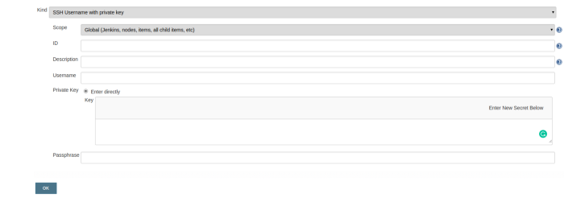
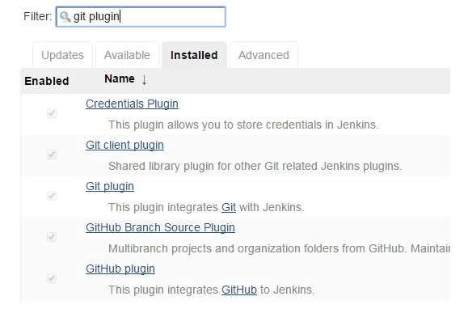
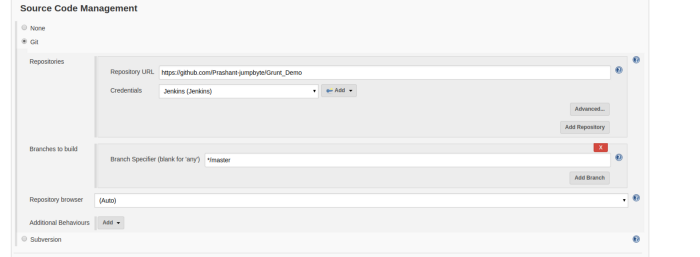

In my previous article, we discussed how to setup Jenkins

[**Setup Jenkins on CentOS with Docker for Selenium**  
_I haven’t found any walk-through about setting up Jenkins on CentOS with Docker for Selenium, and since I got to do it…_medium.com](https://medium.com/appgambit/setup-jenkins-on-centos-with-docker-for-selenium-b7dba07b9ffa "https://medium.com/appgambit/setup-jenkins-on-centos-with-docker-for-selenium-b7dba07b9ffa")

In this article, I talk about how can we configure SSH authentication between Github and Jenkins so let’s start the discussion.

### Generate SSH Key on Jenkins Server

First, we create a directory named `Github`on the Jenkins server and hidden directory ssh under that:

\-bash-4.2$ mkdir Github  
\-bash-4.2$ cd Github/  
\-bash-4.2$ mkdir .ssh  
\-bash-4.2$ ls -al  
total 4  
drwxrwxr-x. 3 jenkins jenkins 19 Aug 22 23:33 .  
drwxr-xr-x. 30 jenkins jenkins 4096 Aug 22 23:33 ..  
drwxrwxr-x. 2 jenkins jenkins 8 Aug 22 23:33 .ssh

After this, we’ll generate an ssh key pair and give the new location to save keys:

ssh-keygen -t rsa

We’ll leave the passphrase empty. Below is a sample run:

\-bash-4.2$ ssh-keygen -t rsa  
Generating public/private rsa key pair.  
Enter file in which to save the key (/var/lib/jenkins/.ssh/id\_rsa): /var/lib/jenkins/Github/.ssh/id\_rsa  
Enter passphrase (empty for no passphrase):  
Enter same passphrase again:  
Your identification has been saved in /var/lib/jenkins/Github/.ssh/id\_rsa.  
Your public key has been saved in /var/lib/jenkins/Github/.ssh/id\_rsa.pub.  
The key fingerprint is:  
62:08:8a:20:fg:g5:36:pn:36:cf:a8:cv:s0:r1:f1:65 jenkins@localhost.localdomain  
The key's randomart image is:  
+--\[ RSA 2048\]----+  
| . =. |  
| oo Oo |  
| o=o= |  
| . .o + |  
| S . = |  
| . . = . E|  
| \* o |  
| . o |  
| |  
+-----------------+  
\-bash-4.2$ ^C

After that, we can get the public key from id\_rsa.pub:

\-bash-4.2$ cat id\_rsa.pub  
ssh-rsa AAAAB3NzaC1yc2EAAAADAQABAAABAQCtyO9WjepA/vbU/0m+e2QCibi6NbyugsfARKo3EWWXHU2pitK8hzl034X0BhqHpXOLkEhyM5Thjd5XoNY8YJW+l45SZ5KrchH6W9eM1TpbvxohCxxR3ziWJctvJrvmowteW9ss/Xy+71xxx/J8k1A24z2Rs0CFMopK1PQV8SYWpegfDGyBmHPQNfLvyGV7fe44BTD5KT6mvfF+ImJDHx/jhMI4w+FvPskqJLy25B5/IGVgseB8U6rLptLKqz7zC7Eh2yD6ou33ezEpRHVA2od4+NCbxSeKyEmMB5OtHiNoPH9CaHGWrgdKQp5iOBDGC1LtkCIaGr9AuoBNee3GALJ5 jenkins@localhost.localdomain

We need to copy this value.

### Configure SSH Key for GitHub Project

Once logged in to GitHub, you need to go to the sample repository on which you have access. Go to repository settings -> Deploy keys -> Add deploy key:

Give a name such as ‘Jenkins User’ and add the key. You may select ‘allow write access’ as well. Since we are using Jenkins only to pull repository, we’ll leave this checkbox unchecked.

### Install Credentials Plugin for Jenkins

We now need to add a plugin called `Credentials Plugin` inside Jenkins, if it’s not already added. For this, login to Jenkins.

Manage Jenkins -> Manage Plugins -> Available and search for `credentials plugin` and install it:

### Add SSH Key inside Jenkins

Now go to Credentials from left pane inside Jenkins console and then click global:

Then Go to add new credentials.

This will open a new form for us. In the

*   Kind dropdown, select ‘SSH username with private key’.
*   Scope dropdown, select Global (Default selection).
*   ID, give an appropriate ID.
*   Description, If you want to add some description here.
*   Username, add user name for added ssh credential.

After that, click ok to save the credentials.

### Install Git on Jenkins Server

If git is not installed on your Jenkins Please install the following plugins.

Manage Plugins > Available and search > install all plugins.

Go to Jenkins job in reference, under source code management section, select the saved credentials title name as we added no above Steps:

Once you have added it, click apply and save. It’s time now to go ahead and build our job. It runs successfully.

Wohoooo, we successfully configure SSH authentication between Github and Jenkins 🎊 🎉🤖🎊 🎉

_Thank you for reading, if you have anything to add please send a response or add a note!_