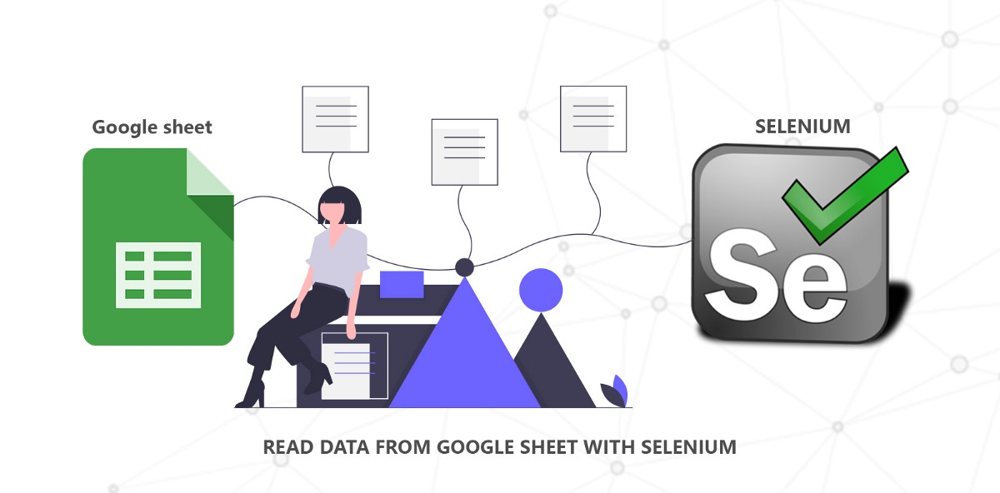
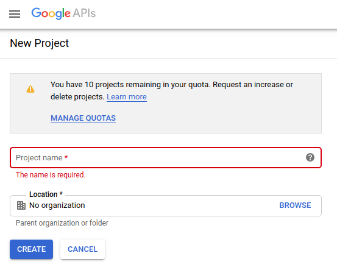
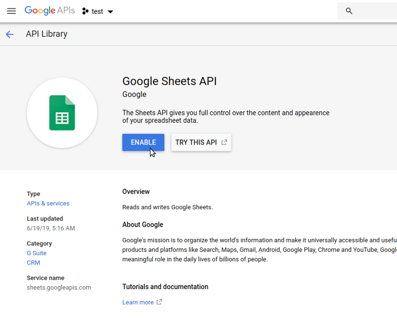
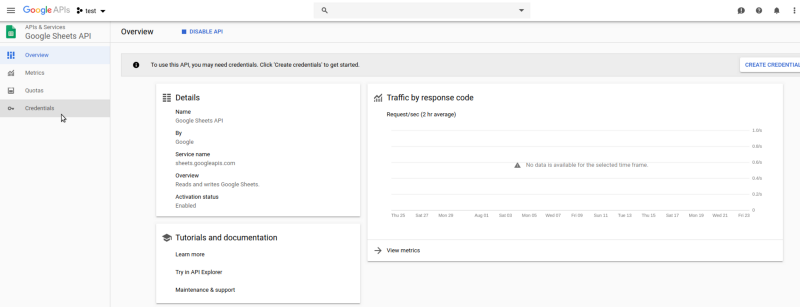
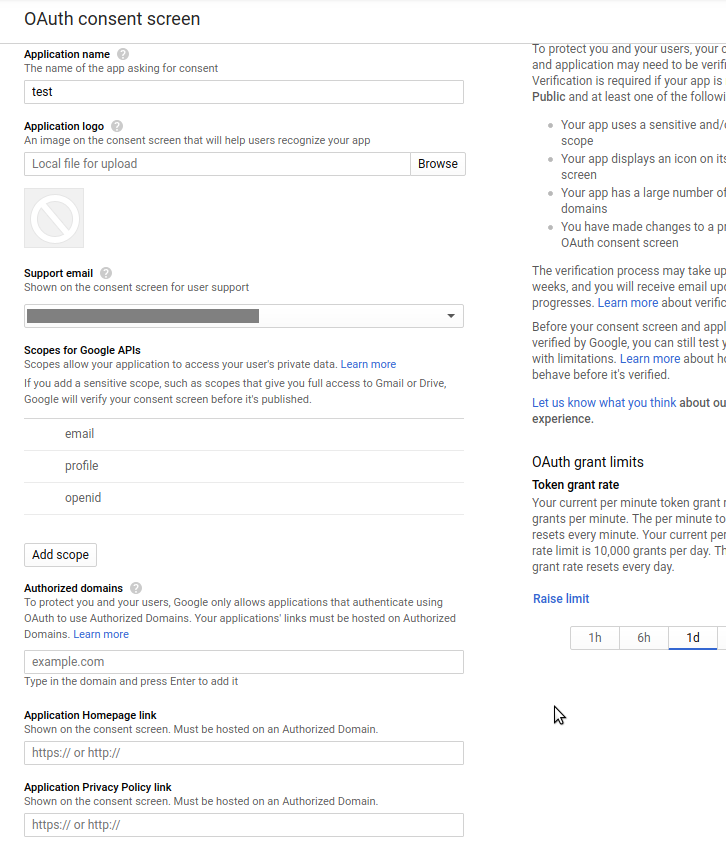
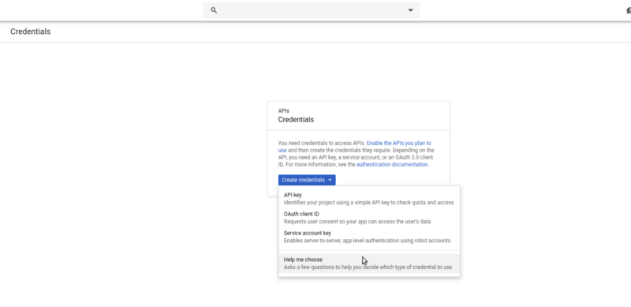
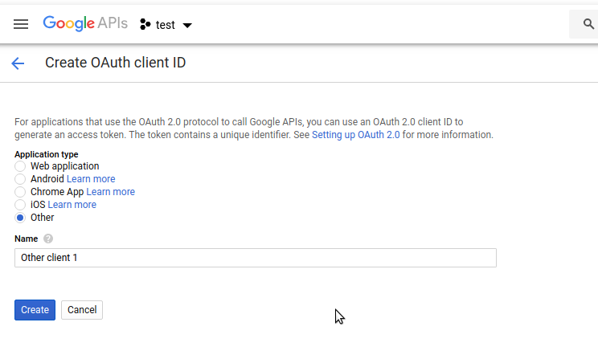
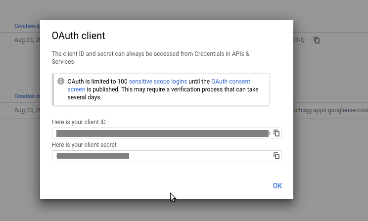

I haven’t found any walk-through about setting up Google sheet as a test data source, and since I got to do it and I have the steps fresh in mind, here is the process.

So Let go Now we are going to read data from **google sheet with selenium JAVA.**

Here we are going to use **Google API Client** Library that enables you to work with **Google** APIs such as Google+, Drive, or YouTube on your server. These **client** libraries are officially supported by **Google.**

> **_Prerequisites :_**

> _1\. Jave 1.7 or greater.  
> 2\. Maven  
> 3\. Google account_

### Step 1: Turn on the Google Sheets API

*   [Google Developers Console](https://console.developers.google.com/start/api?id=sheets.googleapis.com) wizard to create or select a project and automatically turn on the API Then Add All details of your project.


Enter the Name of your project and Select Any Organization.

*   Then after we need to enable google sheets API library.

Click on library > search ‘Google sheets API’ > Click and enable.


Enable Google Sheets API

*   If google sheets API enable successfully its display dashboard screen like


This is Google sheets API dashboard

*   Now we are ready to configure OAuth, select the OAuth consent screen tab. Enter an Application name, Select an Email address, enter your Site URL if you want to restrict domain name and click the Save button.


Enter the Application Name and Email ID

*   Select the Credentials tab, click the Create credentials button and select OAuth client ID.


Select OAuth client ID.

*   Select the application type Other, enter the name “Google Sheets API for Selenium” and click the Create button.


Select your application type and give an appropriate OAuth client ID name.

*   After creating OAuth key it will display the `Client ID` and `Client Secre` Click the OK button. Then after the download the JSON file (Download JSON) button to the right of the client ID.


Copy Client ID and Client Secret

*   Move this file to your working directory and rename it `client_secret.json`.

After completion of the above Step. Now time to move on our Code editor.

Let go 👉 👉 👉 👉

### Step 2: We need to install the following maven dependencies.

Add following maven dependencies in `**pom.xml**` file.

```
<?xml
```

```
<modelVersion>4.0.0</modelVersion><groupId>groupId</groupId><artifactId>Sample</artifactId><version>1.0-SNAPSHOT</version><dependencies>
```

```
<!-- https://mvnrepository.com/artifact/com.google.api-client/google-api-client --><dependency><groupId>com.google.api-client</groupId><artifactId>google-api-client</artifactId><version>1.22.0</version></dependency>
```

```
<!-- https://mvnrepository.com/artifact/com.google.oauth-client/google-oauth-client-jetty --><dependency><groupId>com.google.oauth-client</groupId><artifactId>google-oauth-client-jetty</artifactId><version>1.22.0</version></dependency>
```

```
<!-- https://mvnrepository.com/artifact/com.google.apis/google-api-services-sheets --><dependency><groupId>com.google.apis</groupId><artifactId>google-api-services-sheets</artifactId><version>v4-rev456-1.22.0</version></dependency>
```

```
</dependencies></project>
```

### Step 3: Create a class file to read data from the Google Sheet.

### Step 3: Create a class file to read data from the Google Sheet.

In the above code,

*   You have to give the path of `client_secret.json` that we downloaded in the above step.
*   You have to give google sheet ID in getData().

> Open your google sheet and its URL is like this \`https://docs.google.com/spreadsheets/d/1zL4ccOlmAdSdsa5sSa87MpJEW3VM8uhjbGjhjGHFGDMDQo/edit#gid=0\`

> In which \`1zL4ccOlmAdSdsa5sSa87MpJEW3VM8uhjbGjhjGHFGDMDQo\` this is your sheet ID.we need to pass this ID as a sheet ID.

*   getCredentials(): This method first validates our request and creates a connection between google sheets API library.
*   getData(): This method finds google sheet by given sheet ID and read google sheet and return data.

Congratulations now we are successfully setting up google sheet as a data source of our test case project.

_Thank you for reading, if you have anything to add please send a response or add a note!_