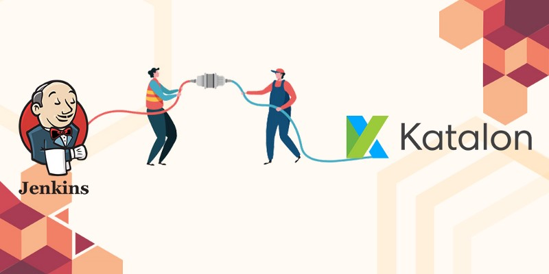
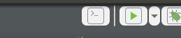
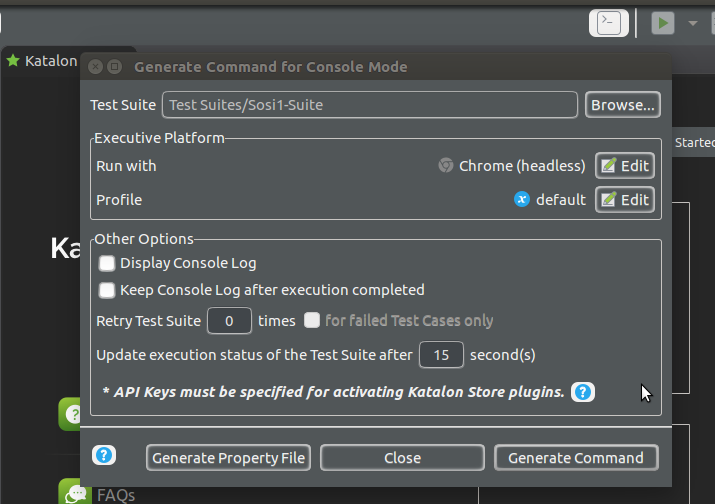
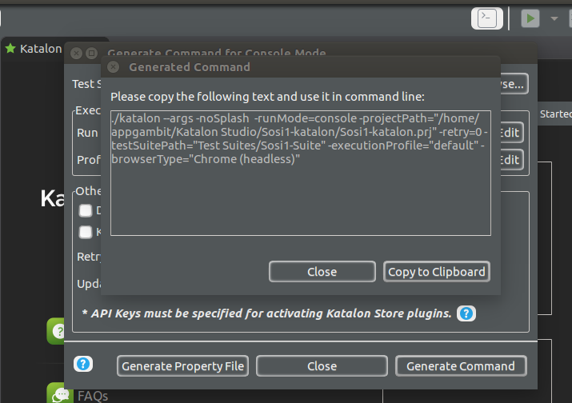
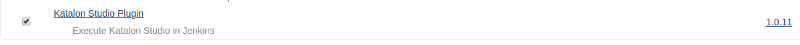
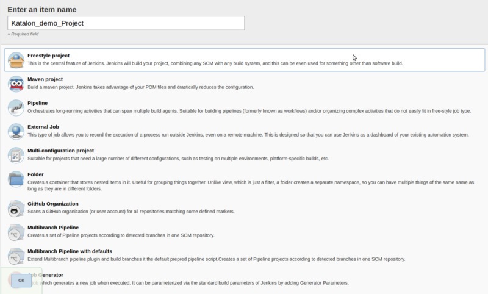
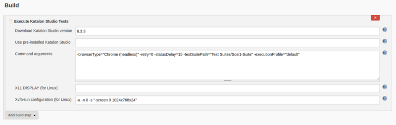

**Katalon Studio** is a powerful automation toolset for web and mobile app testing. It is a free yet feature-packed solution that can be applied to overcome common challenges such as wait-time, pop-up, and iframe in web UI test automation.

**Katalon Studio** brings more intelligence to the entire test automation process testers can now test better, test faster and launch high-quality software through this user-friendly, versatile solution.

We talked about **Katalon studio** Now we see what is **Jenkins** and how can we integrate Katalon studio with **Jenkins**.

**Jenkins** is an open-source continuous integration software tool written in the Java programming language for testing and reporting on isolated changes in a larger code base in real-time. The software enables developers to find and solve defects in a code base rapidly and to automate testing of their builds.

[**Setup Jenkins on CentOS with Docker for Selenium**  
_I haven’t found any walk-through about setting up Jenkins on CentOS with Docker for Selenium, and since I got to do it…_medium.com](https://medium.com/appgambit/setup-jenkins-on-centos-with-docker-for-selenium-b7dba07b9ffa "https://medium.com/appgambit/setup-jenkins-on-centos-with-docker-for-selenium-b7dba07b9ffa")

> **Prerequisites :**

> 1. **Katalon Studio** Should be installed in your machine.

> 2\. Create Demo project in **Katalon Studio.**

> 3\. Jenkins should be installed in your machine

Here is the tool that we are gonna use.

1.  **Build CMD** option: It will generate the CMD command to execute your Katalon project.
2.  **Katalon Studio plugin:** This plugin is for Jenkins to create **katalon studio** build.

So Here we Go to **Integrating Jenkins with Katalon Studio.**

#### 1\. Generate Build execution command for or project.

So for build execution command, we need to Click on **Build CMD.**

It will open **Build CMD** modal in which you need to select the following thigs.

1.  Select your test suite.
2.  Select the Browser that you need to execute your test suite.
3.  Select the profile if you are working with multiple profiles.
4.  If you need to see console logs or create a log file for your script execution then you need to select **Display Console Log** and **Keep console log after execution completed** checkbox.
5.  Now click on the **Generate Command** button and it will display generated command for your script.

6\. Copy generated command.

Now we move to our Jenkins Lets integrate our Katalon test suite with Jenkins build.

> There is two way to integrate **Katalon Studio** with **Jenkins.**

> 1\. Using **Katalon Studio plugin**

> 2\. Using **Execute Windows batch command/Execute shell**

#### First, we check how to integrate Katalon Studio with Katalon Studio plugin On Jenkins.

1.  Now we gonna install **Katalon Studio plugin**

Go to Manage Jenkins -> Manage Plugins -> Available and search for `**Katalon Studio plugin**` and install it:

2\. Create a New Freestyle project for **Katalon integration**.

3\. Once we install **Katalon Studio plugin** It will display **Execute Katalon Studio test** option in the **Build section.**

Now, Select Katalon Studio version here we are using the latest version of **Katalon Studio 6.3.3** Or user needs to user pre-installed Katalon studio add the valid path of **Katalon Studio.**

After that, you need to add Command arguments like

\-browserType=”Chrome (headless)” -retry=0 -statusDelay=15 -testSuitePath=”Test Suites/Sosi1-Suite” -executionProfile=”default”

*   **\-browserType**: give a browser name like Chrome, Firefox, Safari, Chrome (headless) or Firefox (headless)
*   **\-retry**: After execution fail how many time its need to retry.
*   **\-statusDelay**: Set Timeout of that script.
*   **\-testSuitePath:** Give your test suite path here(absolute or relative)
*   **\-executionProfile:** Give  your profile name here if you are working with multiple profiles.

At the and of this we need to specify **Xvfb-run configuration (for Linux)** mean add your browser screen resolution as we added here

`Xvfb-run configuration (for Linux):-a -n 0 -s “-screen 0 1024x768x24”`

Now, we are able to run Katalon script on Jenkins using **Katalon Studio plugin.**