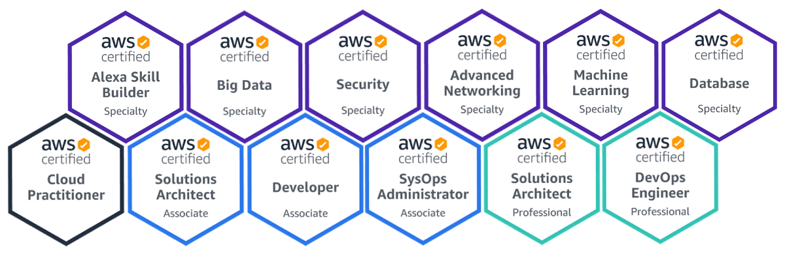
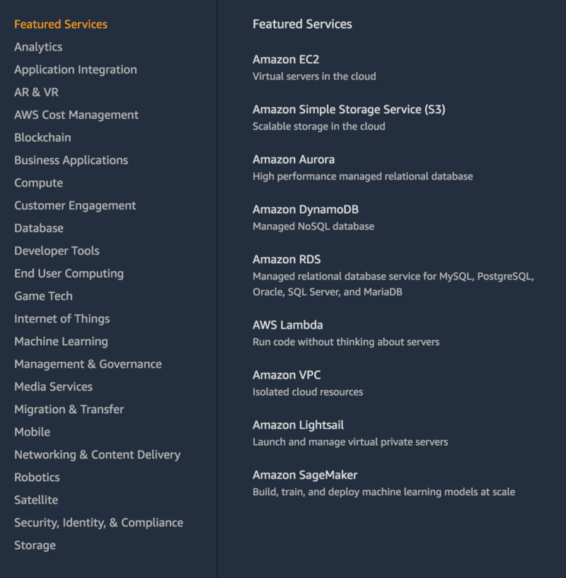

> Note: I sat for the Database Specialty Beta Exam in Jan 2020 and cleared it.

Yes, it took me a long time to “pass” all of them, never planned to do ALL but it turned out to be a good learning journey.

> We are what we repeatedly do.

### Usual questions that I get over Email/LinkedIn

*   How did you prepare for X certification, and Y certification?
*   Did you get any benefits by clearing the X certification?
*   Hey bro, I want to clear AWS certifications, help me pls.
*   I want to take X certification, but don’t know where/how to start!
*   Will I get this job if I pass X certification?
*   These certifications are very costly, did your employer paid for it?

And many more around the same lines…

Hopefully, the following sections will help answer most of the above and understand the real benefits.

### A brief about myself

I am a father of a one-and-half-year old son, I run a [Cloud Development/Consulting](https://appgambit.com) firm based in India with a growing team of over a dozen AWSome colleagues, managing a handful of great customers who trusted us with their challenging problems. And a fair share of all the usual work and life hustle-bustle.

> If I can do it, anyone can do it. You just need to find right reasons to do it.

### Updates for 2020

3 months in 2020 and the landscape and expectations are changing rapidly. Our customers are demanding more from our cloud services. Irrespective of whether we are building a Web application, Mobile-backend, Architecture Validation or anything in-between.

Knowing a few cloud services is not enough anymore. The customers want a fully cloud-native solution and many of them have done their homework quite well. Usually, the discussion happens around these topics.

*   Serverless or Containers or Both
*   Security of the environment at both Infrastructure and Operational level
*   Cost Validation and Optimization of the resources
*   Automation at both the Infrastructure and Operational level
*   Full visibility of the system

Many of these things are not part of certification exams directly, but certifications definitely help you make the best out of your knowledge, you will undoubtedly learn a million new things along the way.

### Why I decided to appear for AWS exams!

I started my AWS usage directly with Lambda in around mid-2015, while working for a startup. It was a fascinating experience. The Serverless helped me learning a lot of things and then eventually I decided to finally jump onto other services of the AWS cloud.

I am into software development for a very long time. Things are changing for good, and almost all software runs in a cloud, or may eventually run in a cloud. So it’s good to have a better understanding of the cloud if you want to design better software and serve your customers. As an owner of the business, it makes perfect sense to learn this new paradigm shift and help the team understand it better.

The next big reason to have a certification is to promote my business as well, we do a lot of good stuff but the certifications would surely help us connect with new exciting customers all over the world.

When I finally decided to appear for a certification, I honestly wanted to give just one, **_Solution Architect Associate_**. As this one covers a lot of AWS services and you will start getting a pretty good idea about the internals of AWS if you study well.

> If your work is not hard, you’re not doing great work.

### How I approached this certification “exams”

Instead of focusing just on the exam blueprints, my goal was to learn something different and start putting those skills in practice in our on-going work.

With passing time, I learned more and more things and that helped me decide for the next suitable certification that I should approach. I remember the **Advanced Networking** and **Security Specialty** helped me a lot in real projects that we were working on.

> If you think you are struggling with few areas, which comes up in almost every exams, focus on them first. Cloud services work in layer approach, there are core services which will keep coming up in every exam. The better you know them, the easier it would get eventually. Practice is the key.

Preparation wise, I would check the **exam blueprint first** and see which are really important services covered in the exam and try to match them with on-going work. If there is a match, then I re-evaluate how we are doing it in our applications and what all things are available in the service. Going deep gives you a lot more perspective and you can start using the service right away.

Next, for all the services that are part of the exam blueprint, go to the AWS console and start playing around. There are only a few which you may not be able to do easily like AWS Direct Connect or Snowball, but otherwise, you will be fine with most.

If any of you have used AWS before, you will find that there are multiple use-cases for each service. It all depends on what you want to accomplish and how you orchestrate the services to fit your use-cases. The more you try the more you learn.

> Keep turning the knobs. When it sounds right, you’ll know.

### Tons of resources to go through

I will still admit that it’s hard to start. Each exam has a lot of new concepts and you will start losing the focus or may lose previous concepts if you can not mix all together.

> There are no real benefits in the end if you clear one certification and forget everything from the previous.

I used limited but some of the best learning resources to help me stay focused and organized. I had a limited time availability on a daily basis so instead of going through everything that I could find on the Internet, I stick with a few resources and mix in my own strategy, like conducting Meetup Sessions or Speaking about Cloud at events, which really really helped.

*   [A Cloud Guru](https://acloud.guru/aws-cloud-training) this was the first place where I landed when I finally decided to try my first certification, read their very inspiring story from [here](https://acloud.guru/our-story). I have used their courses over and over again. [Mattias Andersson](https://medium.com/u/f80af5ca49ef), [Ryan Kroonenburg](https://medium.com/u/f3615b3c498e), and Nigel Poulton are best in the business. I did a small [write up](https://acloud.guru/forums/gcp-certified-associate-cloud-engineer/discussion/-Lb9TUsj6zbGyiSLO5U7/cleared_both_associate_cloud_e) a few months back as well, time flies really fast :)
*   \[UPDATE\] [Linux Academy](http://linuxacademy.com) I used it only for the Machine Learning, which was still in Early Access and not all the sections were ready. Linux Academy is now part of A Cloud Guru.
*   [Coursera](https://coursera.org) They have very few AWS related courses, but I used it mostly for the Google Cloud
*   [AWS Documentation](https://docs.aws.amazon.com/) If you can spend enough time in Docs, you wouldn’t need anything else.
*   [AWS Console](https://console.aws.amazon.com/) The best place to learn it, is by doing it
*   [Whizlabs Practice Tests](http://whizlabs.com) I used all of their AWS tests right before I sit for the exams.
*   [AWS Whitepapers](https://aws.amazon.com/whitepapers/) is a good source of both high-level and detailed descriptions of the services. I have not used all of them, there are plenty now, but I visit it time-to-time as AWS keeps releasing new/updates to whitepapers.
*   [http://jayendrapatil.com/](http://jayendrapatil.com/) a very popular name in the AWS community. He regularly shares exam updates, practice questions and other resources on his blog.
*   \[UPDATE\] [Yujun Liang](https://www.linkedin.com/in/yujunliang/), [Sandip Das](https://www.linkedin.com/in/sandip-das-developer/), [Faye Ellis](https://www.linkedin.com/in/fayeellis/), and many others are always open to help on LinkedIn

Besides the above, what really helped me are these “extracurricular activities” ;)

*   Write about something new you learned along the way, Medium/LinkedIn wherever you prefer
*   Attend [AWS Meetup Groups](https://aws.amazon.com/developer/community/usergroups/) or create one in your city if it’s not already there. I created one in my city, and honestly met some really good people all around
*   If you get a chance, talk about these services and explain how you used it, listen and read through how others used it as well
*   Keep Notes, I filled up nearly 3 journals, which includes everything from a scratch pad to my own explanations of services to important things to go through again.

> Tell me and I forget. Teach me and I remember. Involve me and I learn. — Benjamin Franklin

### The “real” cost of these certifications

*   Exam Fees, $150 or $300 depending on your exam
*   Online Courses or Subscriptions from $5 to $30, per month

AWS gives away a 50% discount voucher once you clear an exam. You can use the voucher for your next exam, and you will get another one :) I used 6 vouchers and saved a ton of money right there.

Online courses or subscriptions can be costly. But you can organize your schedule accordingly and can utilize these subscriptions carefully. I enable/disable them based on my time availability. And try to complete the lessons without wasting the month.

> Spare between 5%–10% of your earnings every month on learning and don’t buy those useless things every now and then, you should be fine with the cost.

### Don’t just pass these certifications

I am grateful to all the people who helped me to achieve this over the period of time. And now I am passing on my learnings every now and then when I get an opportunity.

I am not the first person to do this, and I will surely not be the last person. I have met incredible people over time who knows far more than me and they didn’t have the certifications, and I am sure I will meet many more knowledgable people in the future as well.

You pass these certifications and people will expect many more things from you, and they are usually right. If you “just” pass, eventually you will run out of time or resources to keep up. Make sure you do some real learnings and try to continue working on something in the same area.

> Focus on how you can put this to use, instead of how much you can earn immediately.

> With great power comes great responsibility

### Finally…

This is not the end, neither I know everything about AWS or Cloud. There are many things besides AWS I work on and like to continue working on in the future.

I like to read more, write more and talk more. So I will continue focusing on that besides learning and will share interesting things here in the future.

> When will it end?

> It doesn’t. It’s always day one. Embrace the suck.

These are all the services that AWS currently has, and it is very difficult to keep up with all of these.

> My preferred services are Secury, Storage, Compute/Serverless and Machine Learning and will remain the same for some more time.

AWS has a lot of services

> Not all the lines I wrote above are mine. I have taken some from the people that I follow and read through over the period of time.

### Additional References

### Books

I didn’t use many books for the earlier certifications. But most recently, I am using a few for Python/Machine Learning, Docker and Kubernetes.

*   [Tons of Books from AWS in Kindle format](https://www.amazon.com/Amazon-Web-Services/e/B007R6MVQ6/)
*   [Certified Advanced Networking Official Study Guide](https://www.amazon.com/Certified-Advanced-Networking-Official-Study/dp/1119439833/)
*   [Python Machine Learning Illustrated Guide For Beginners & Intermediates: The Future Is Here](https://www.amazon.in/gp/product/B07G1V5792/)
*   [Machine Learning For Absolute Beginners: A Plain English Introduction](https://www.amazon.in/gp/product/B07335JNW1/)
*   [Docker Deep Dive by Nigel Poulton](https://www.amazon.in/gp/product/B01LXWQUFF/), **not required for any AWS Certs, but I would highly recommend**
*   \[UPDATE\] [Cloud FinOps](https://www.oreilly.com/library/view/cloud-finops/9781492054610/), I would highly recommend this one. Cloud is growing rapidly and so is the cost structure and optimization techniques around it. A good Solution Architect knows where to spend and where to save.
*   \[UPDATE\] [Cloud Native Transformation](https://www.oreilly.com/library/view/cloud-native-transformation/9781492048893/), This is one of the best books that I have read in 2020 so far. Just using a bunch of cloud services, will not help anyone unlock the full potential of the cloud. A top-down approach where everyone is involved, informed, and transformed is essential for the cloud-native roadmap.

### Blogs/Sites

*   [https://www.infrastructure.aws/](https://www.infrastructure.aws/)
*   [AWS Blogs](https://aws.amazon.com/blogs/?awsf.blog-master-category=category%23alexa%7Ccategory%23architecture%7Ccategory%23aws-cost-management%7Ccategory%23big-data%7Ccategory%23compute%7Ccategory%23database%7Ccategory%23developer-tools%7Ccategory%23devops%7Ccategory%23storage%7Ccategory%23artificial-intelligence%7Ccategory%23infrastructure-automation%7Ccategory%23security-identity-compliance&awsf.blog-master-learning-levels=category-learning-levels%23foundational-100%7Ccategory-learning-levels%23intermediate-200&awsf.blog-master-analytics-products=*all) you will find a lot of information from here
*   [AWS YouTube Channel](https://www.youtube.com/user/AmazonWebServices/videos)
*   [Now Go Build with Dr. Werner Vogels, CTO, Amazon.com](https://aws.amazon.com/startups/NowGoBuild/) (highly recommend)
*   [https://aws.amazon.com/architecture/](https://aws.amazon.com/architecture/)
*   [https://medium.com/@dariusforoux](https://medium.com/@dariusforoux), not related to AWS or Cloud in general, but his articles will surely move you forward :)
*   [https://www.coursera.org/learn/aws-machine-learning](https://www.coursera.org/learn/aws-machine-learning)

### Whitepapers

*   [AWS Well-Architected Framework](https://d1.awsstatic.com/whitepapers/architecture/AWS_Well-Architected_Framework.pdf?did=wp_card&trk=wp_card)
*   [Overview of Amazon Web Services](https://d1.awsstatic.com/whitepapers/aws-overview.pdf?did=wp_card&trk=wp_card)
*   [AWS Best Practices for DDoS Resiliency](https://d1.awsstatic.com/whitepapers/Security/DDoS_White_Paper.pdf?did=wp_card&trk=wp_card)
*   [Best Practices Design Patterns: Optimizing Amazon S3 Performance](https://d1.awsstatic.com/whitepapers/AmazonS3BestPractices.pdf?did=wp_card&trk=wp_card)
*   [Big Data Analytics Options on AWS](https://d1.awsstatic.com/whitepapers/Big_Data_Analytics_Options_on_AWS.pdf?did=wp_card&trk=wp_card)
*   [Amazon Virtual Private Cloud Connectivity Options](https://d1.awsstatic.com/whitepapers/aws-amazon-vpc-connectivity-options.pdf?did=wp_card&trk=wp_card)
*   [Serverless Architectures with AWS Lambda](https://d1.awsstatic.com/whitepapers/serverless-architectures-with-aws-lambda.pdf?did=wp_card&trk=wp_card)
*   [Infrastructure as Code](https://d1.awsstatic.com/whitepapers/DevOps/infrastructure-as-code.pdf?did=wp_card&trk=wp_card)
*   [AWS Key Management Service Best Practices](https://d1.awsstatic.com/whitepapers/aws-kms-best-practices.pdf?did=wp_card&trk=wp_card)
*   [AWS Storage Services Overview](https://d1.awsstatic.com/whitepapers/AWS%20Storage%20Services%20Whitepaper-v9.pdf?did=wp_card&trk=wp_card)
*   [Introduction to AWS Security Processes](https://d1.awsstatic.com/whitepapers/Security/Intro_Security_Practices.pdf?did=wp_card&trk=wp_card)
*   [A Practical Guide to Cloud Migration](https://d1.awsstatic.com/whitepapers/the-path-to-the-cloud-dec2015.pdf?did=wp_card&trk=wp_card)
*   [Security at Scale: Governance in AWS](https://d1.awsstatic.com/whitepapers/compliance/AWS_Security_at_Scale_Governance_in_AWS_Whitepaper.pdf?did=wp_card&trk=wp_card)
*   [Security at Scale: Logging in AWS](https://d1.awsstatic.com/whitepapers/compliance/AWS_Security_at_Scale_Logging_in_AWS_Whitepaper.pdf?did=wp_card&trk=wp_card)
*   [Introduction to AWS Security](https://d1.awsstatic.com/whitepapers/Security/Intro_to_AWS_Security.pdf?did=wp_card&trk=wp_card)
*   [Introduction to DevOps on AWS](https://d1.awsstatic.com/whitepapers/AWS_DevOps.pdf?did=wp_card&trk=wp_card)

To summarize…

> Just leave me alone, I know what I am doing

> — Kimi Raikkonen “Iceman”