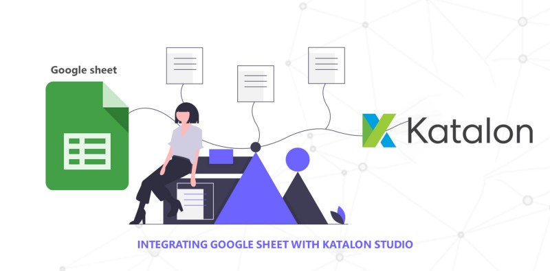
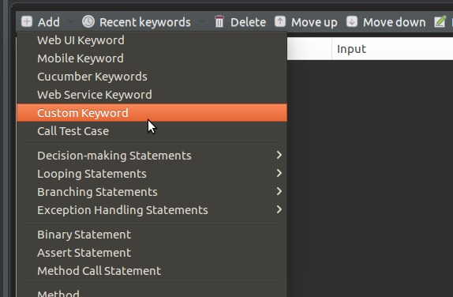

I haven’t found any walk-through about setting up Google sheet as a test data source with Katalon Studio, and since I got to do it and I have the steps fresh in mind, here is the process.

**Katalon Studio** is a powerful automation toolset for web and mobile app testing. It is a free yet feature-packed solution that can be applied to overcome common challenges such as wait-time, pop-up, and iframe in web UI test automation.

**Katalon Studio** brings more intelligence to the entire test automation process testers can now test better, test faster, and launch high-quality software through this user-friendly, versatile solution.

But **Katalon Studio** doesn’t  support **google sheet.** It doesn’t give any plugin that easily integrates with Google sheet.

> 😎🤔🙌🤔 **Maybe I will create a plugin for Google sheet integration.**

Here is my plugin that reads data from your google sheet.

[**Google Sheets Reader**  
_This plug-in makes writing automation tests using Google sheet. much easier by reading, writing Google sheet.. Some key…_store.katalon.com](https://store.katalon.com/product/175/Google-Sheets-Reader "https://store.katalon.com/product/175/Google-Sheets-Reader")[](https://store.katalon.com/product/175/Google-Sheets-Reader)

But for now, we are going to read data from **google sheet with Katalon Studio.**

### Step 1: Turn on the Google Sheets API

In my previous article, We discussed how we can integrate **google sheet with selenium.**

Please follow this for **Turn on the Google Sheets API.**

[**READ DATA FROM GOOGLE SHEET WITH SELENIUM ANS Google Sheets API**  
_I haven’t found any walk-through about setting up Google sheet as a test data source, and since I got to do it and I…_medium.com](https://medium.com/appgambit/read-data-from-google-sheet-with-selenium-ans-google-sheets-api-c5d10595f781 "https://medium.com/appgambit/read-data-from-google-sheet-with-selenium-ans-google-sheets-api-c5d10595f781")[](https://medium.com/appgambit/read-data-from-google-sheet-with-selenium-ans-google-sheets-api-c5d10595f781)

### Step 2: We need to add the following External Libraries.

**If you are using maven** please add following dependencies in `POM.xml` file.

```
<?xml version="1.0" encoding="UTF-8"?>  
<project xmlns="http://maven.apache.org/POM/4.0.0" xmlns:xsi="http://www.w3.org/2001/XMLSchema-instance" xsi:schemaLocation="http://maven.apache.org/POM/4.0.0 http://maven.apache.org/xsd/maven-4.0.0.xsd">

<modelVersion>4.0.0</modelVersion>  
<groupId>groupId</groupId>  
<artifactId>Sample</artifactId>  
<version>1.0-SNAPSHOT</version>  
<dependencies>

<!-- [https://mvnrepository.com/artifact/com.google.api-client/google-api-client](https://mvnrepository.com/artifact/com.google.api-client/google-api-client) -->  
<dependency>  
<groupId>com.google.api-client</groupId>  
<artifactId>google-api-client</artifactId>  
<version>1.22.0</version>  
</dependency>

<!-- [https://mvnrepository.com/artifact/com.google.oauth-client/google-oauth-client-jetty](https://mvnrepository.com/artifact/com.google.oauth-client/google-oauth-client-jetty) -->  
<dependency>  
<groupId>com.google.oauth-client</groupId>  
<artifactId>google-oauth-client-jetty</artifactId><version>1.22.0</version>  
</dependency>

<!-- [https://mvnrepository.com/artifact/com.google.apis/google-api-services-sheets](https://mvnrepository.com/artifact/com.google.apis/google-api-services-sheets) -->  
<dependency>  
<groupId>com.google.apis</groupId>  
<artifactId>google-api-services-sheets</artifactId>  
<version>v4-rev456-1.22.0</version>  
</dependency>

</dependencies>  
</project>
```

**Or else** you need to add the following External Libraries in your **Katalon Studio** project.

For External Libraries Goto `Project > Settings > External Libraries > Add new libraries.`

```
> google-api-client-1.22.0.jar

> google-api-services-sheets-v4-rev483–1.22.0.jar

> google-http-client-1.22.0.jar

> google-http-client-jackson2–1.22.0.jar

> google-oauth-client-1.22.0.jar

> google-oauth-client-jetty-1.22.0-sources.jar

> jetty-util-6.1.25.jar

> jetty-6.1.25.jar
```

### Step 3: Create a Custom Keyword to read data from the Google Sheet.

For add new Custom Keyword Goto Add > Click on Keyword > give a proper keyword name like `ReadSpreadsheet` Copy below code and paste it.

That’s it Now our **Katalon Studio Project integrates with Google sheet API** Now just we have to call this Custom Keyword in our Testcase.

### Step 3: Create a Testcase file to call our Keyword.

we need to create a new Testcase and add our Custom Keyword.

On Manual mode, you need to add our keyword like below



Create New Testcase file > Add > Click on Custom Keyword

On Script mode, Write below code like,

CustomKeywords.’com.java.utilily.ReadSpreadsheet.getSpreadSheetRecords’(‘Login!A2:Z’)

`CustomKeywords` is keyword to call our custom keywords then after giving classpath of out keyword and pass parameter if any.

here we need to pass of columns that we need to get from the google sheet.

here we want to mean our keyword return all data of A2 to Z (Second Row of A to Z Column).

😎🙌😎🙌**We configured the Google sheet with our Katalon project**😎🙌😎🙌

_Thank you for reading, if you have anything to add please send a response or add a note!_

I hope this helps!!!