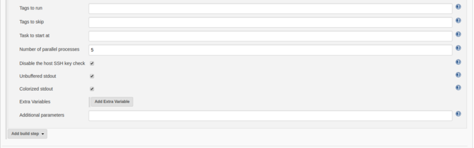

In this article, we are talking about **Jenkins** Integration with **Ansible**. How we can execute **Ansible Playbook** using Jenkins.

As we all know Jenkins is a well-known open-source continuous integration and continuous development automation tool, I talked a lot about Jenkins and today also I’m talking about Jenkins.

In my previous article, we talked about how to configure **Jenkins** with the help of the **Ansible Playbook**.

[**Configure Jenkins With Ansible**  
_Today we will gonna talk about How to configure Jenkins with the help of Ansible._medium.com](https://medium.com/appgambit/configure-jenkins-with-ansible-7bfaa387fb1c "https://medium.com/appgambit/configure-jenkins-with-ansible-7bfaa387fb1c")

We are using this ansible-playbook for demo.

#### Let’s Move on Jenkins now

If you are new with Jenkins I recommend go through my previous article in which I talked about how to configure Jenkins.

[**Setup Jenkins on CentOS with Docker for Selenium**  
_I haven’t found any walk-through about setting up Jenkins on CentOS with Docker for Selenium, and since I got to do it…_medium.com](https://medium.com/appgambit/setup-jenkins-on-centos-with-docker-for-selenium-b7dba07b9ffa "https://medium.com/appgambit/setup-jenkins-on-centos-with-docker-for-selenium-b7dba07b9ffa")

There is 2 way to execute ansible-playbook on Jenkins.

> 1\. Use shell/bash script

> 2\. Use the **Ansible** plugin

#### 1\. Use shell/bash script

The playbook execution is defined in the **Build** > **Execute Shell** section of the job. Generation of input values and playbook execution are scripted in this section and that would look like this:

#env is Jenkins build parameter

$ \`gen-hosts-list $env\` > /path/to/hosts\_list

$ ansible-playbook /path/to/ansible-playbook.yml -i /path/to/hosts\_list -u AUTO\_USER --private-key=/path/to/private-key

#### 2\. Use the Ansible plugin

**Step 1)** For Jenkins Pipeline we need to install the **Ansible** plugin.

Go to **Manage Jenkins > Manage Plugins >Available >** search **Ansible.**

If you are already installed **Ansible Plugin** on your Jenkins  It will display in the **Installed** section.

Now we can see the **Invoke Ansible Playbook** option in the **Build Environment** section but we need to configure Ansible path for Jenkins.

Now let’s configure Ansible on our Jenkins.

Go to **Manage Jenkins > Global Tool Configuration >** It will display **Ansible on** the list.

Now let’s Create New project to execute Ansible playbook.

**Step 2)** Goto Jenkins Home > New Item > Create New Freestyle Project.

We create a new freestyle project now lest configure our project.

Goto source code management section and add your code repository here you are free to use any of the source code management platforms like Github, Gitlab and also Bit bucket.

Now let’s configure ansible plugin.

Goto **Build** section and select **Invoke Ansible Playbook.** Once you select that option it will display ansible-playbook configuration option like below.

Let see all option provided by Ansible Plugin.

*   **Ansible Installation**: It will display all Ansible installation list that we are configured in **Global Tool Configuration > Ansible.**
*   **Playbook path**: We have to provide the **Absolute** or **Relative** path of our Ansible-playbook file.
*   **Inventory**: It gives 3 options to configure our host file.

> **Do not specify Inventory**: We have to give our host list in the subdomain option.

> **File or host list**: add a path of our HOST file.

> **Inline content**: It means we are set our host list on the starting of our ansible-playbook file.

*   **Host subset**: If we want to filter a specific set of the host from the provided Host file.
*   **Credentials**: Configure added host’s username and password.
*   **Vault Credentials**: IF you are using ansible vault then configure that credentials.
*   **become**: If you want to set a specific user for ansible-playbook execution select and add the name of that user.
*   **sudo**: If you need to add a sudo user(root) then select this and ass name of that user.

**In advance View.**

*   **Tags to run**: If you are using tag base script then Jenkins will run only specified tag.
*   **Tags to skip**: If you are using tag base script then Jenkins will skip the specified tag.
*   **Task to start at**: If you are using tag base script then Jenkins will start execution with the specified task.
*   **Number of parallel processes**: Specified number of tasks can run parallel.
*   **Disable the host SSH key check**: Disable the validation of the host’s SSH server keys.
*   **Unbuffered stdout**: Skip standard output buffering for the ansible process. The ansible output is directly rendered into the Jenkins console. This option can be useful for long-running operations.
*   **Colorized stdout**: Check this box to allow ansible to render ANSI color codes in the Jenkins console.
*   **Extra Variables**: Want to add some variable for ansible-playbook execution.
*   **Additional parameters**: Any additional parameters to pass to the ansible command.

`Press Save` 🎊 🎉🤖🎊 🎉

We have successfully integrated ansible-playbook in Jenkins, Now Click on `Build Now`. It will execute ansible-playbook successfully.

_Thank you for reading, if you have anything to add please send a response or add a note!_