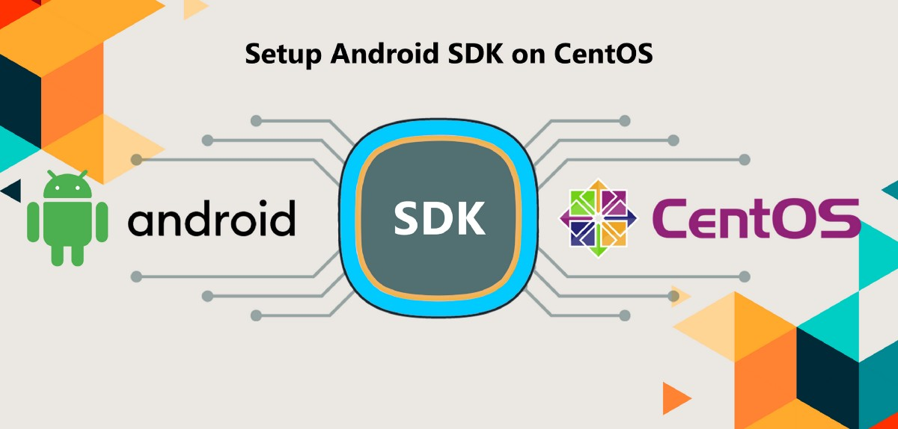
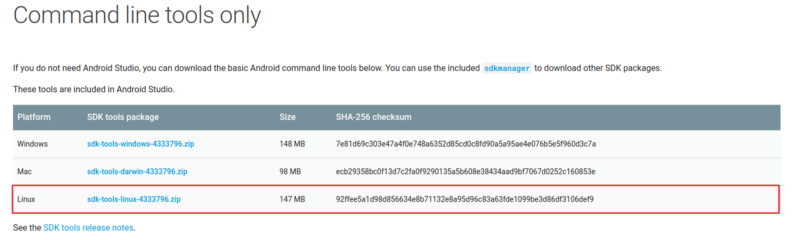

In this article, we are talking about how to Setup Android SDK on CentOS.

### Step 1: Update your System.

One of the system administrators’ bast practice is keeping a system up to date.

$ sudo yum update

After installing the latest stable package reboot system.

$ sudo reboot

### Step 2: Install JAVA

Before you can install Jenkins we need to install JAVA.

$ sudo yum install java-1.8.0-openjdk.x86\_64    (Install jdk 1.8.0)

Check your java version :

$ java -version

Set environment variable for JAVA :

$ sudo cp /etc/profile /etc/profile\_backup

$ echo ‘export JAVA\_HOME=/usr/lib/jvm/jre-1.8.0-openjdk’ | sudo tee -a /etc/profile

$ echo ‘export JRE\_HOME=/usr/lib/jvm/jre’ | sudo tee -a /etc/profile

$ source /etc/profile

Check your environment variables :

$ echo $JAVA\_HOME  
$ echo $JRE\_HOME

Now we can install the Android SDK on our system.

### Step 2: Setup Android SDK

1.  Go to [https://developer.android.com/studio/index.html#command-tools](https://developer.android.com/studio/#downloads) and copy the link address of the Linux binary.

In my case: [https://dl.google.com/android/repository/sdk-tools-linux-4333796.zip](https://dl.google.com/android/repository/sdk-tools-linux-4333796.zip)



2\. Create directory: `/var/lib/jenkins/android-sdk/`

3\. Download the zip file and unzip in the created directory

```
# download android sdksudo curl https://dl.google.com/android/repository/sdk-tools-linux-3859397.zip -o android-sdk.zip
```

```
# install unzip commandsudo apt-get install unzip OR sudo yum install unzip
```

```
# unzip into this foldersudo unzip android-sdk.zip -d .
```

```
# remove the zip filesudo rm android-sdk.zip
```

4\. Update tools (all available packages)

```
sudo 
```

5\. Checklist of all available packages and installed

```
sudo 
```

6\. This step is important to accept the Android SDK license

```
sudo 
```

🎊 🎉🤖🎊 🎉 We successfully set up the Android SDK on CentOS.

In my next article, we will talk about how can we shift this to Ansible or any other configuration management tool.

_Thank you for reading, if you have anything to add please send a response or add a note!_