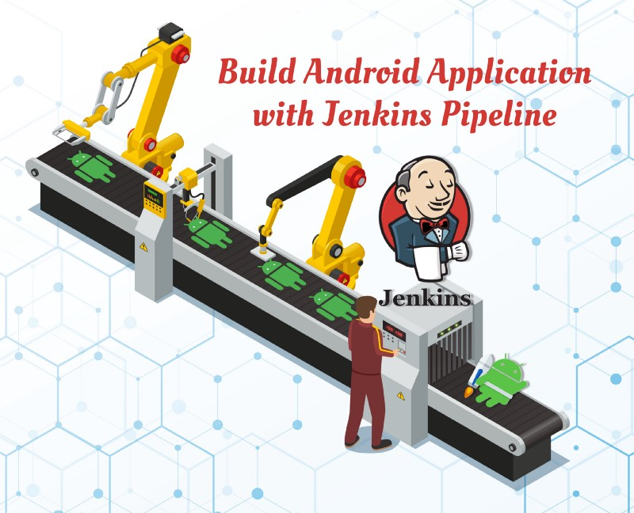
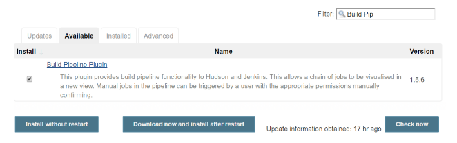
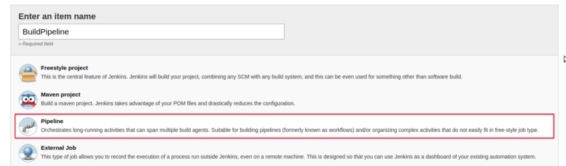
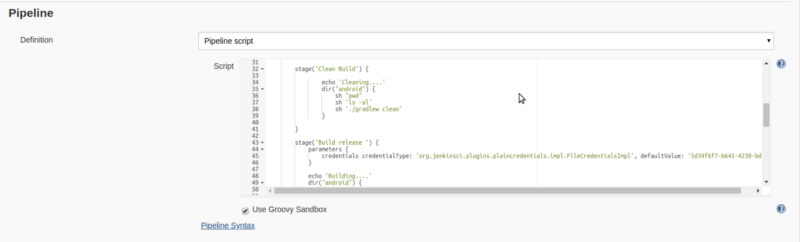
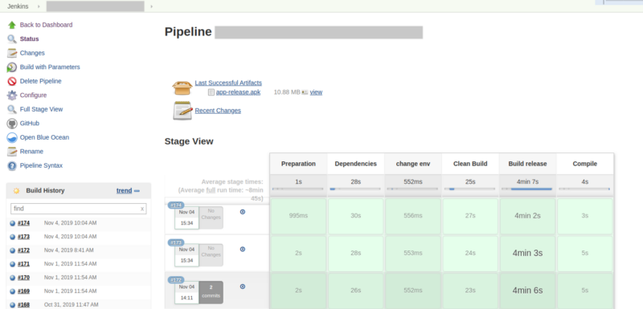

Most of the organizations in the recent world are using Jenkins as a great tool for automating build processes, continuous integration, and automated deployment. Jenkins helps organizations automate every aspect of the development and save the developers precious time.

In this article, we are talking about how to Build Android Application on Jenkins pipeline.

> Following this article, you can also build native as well as hybrid applications also.

#### [Setup Android SDK](https://medium.com/@prashant_48386/setup-android-sdk-on-centos-9a420b928e35 "https://medium.com/@prashant_48386/setup-android-sdk-on-centos-9a420b928e35")

If you don’t have setup Android SDK on your machine please follow this article.

[**Setup Android SDK on CentOS**  
_In this article, we are talking about how to Setup Android SDK on CentOS.I haven’t found any walk-through to setup…_medium.com](https://medium.com/@prashant_48386/setup-android-sdk-on-centos-9a420b928e35 "https://medium.com/@prashant_48386/setup-android-sdk-on-centos-9a420b928e35")[](https://medium.com/@prashant_48386/setup-android-sdk-on-centos-9a420b928e35)

#### [Setup Jenkins](https://medium.com/appgambit/setup-jenkins-on-centos-with-docker-for-selenium-b7dba07b9ffa "https://medium.com/appgambit/setup-jenkins-on-centos-with-docker-for-selenium-b7dba07b9ffa")

If you don’t have setup Jenkins on your machine please follow this article.

[**Setup Jenkins on CentOS with Docker for Selenium**  
_I haven’t found any walk-through about setting up Jenkins on CentOS with Docker for Selenium, and since I got to do it…_medium.com](https://medium.com/appgambit/setup-jenkins-on-centos-with-docker-for-selenium-b7dba07b9ffa "https://medium.com/appgambit/setup-jenkins-on-centos-with-docker-for-selenium-b7dba07b9ffa")[](https://medium.com/appgambit/setup-jenkins-on-centos-with-docker-for-selenium-b7dba07b9ffa)

After setting up Jenkins we need to configure Android SDK on Jenkins.

#### Global Properties

Open Jenkins: **Manage Jenkins** -> **Configure System** -> **Global properties**. Mark “Environment variables” and add:
```
*   `ANDROID_HOME` : <Path of android-SDK directory>
*   `JAVA_HOME` : <Path of java-SDK>
```
#### Install the plugin from Manage Jenkins

Go to Jenkins Dashboard > Manage Jenkins > Manage Plugins > Available > search for **Build Pipeline** > Install.

If you are already installed this plugin on your Jenkins it will display in the Installed section.



#### Create an Android build job

*   Open `Jenkins` -> **New Item**. Enter any job name > Choose **Pipeline >** Click OK.



*   **Pipeline >** There 2 options for Jenkinsfile.

> Pipeline Script

> Pipeline Script From SCM

#### Pipeline Script:

You can write your Pipeline code directly on Jenkins job.



#### Pipeline Script From SCM:

Pipeline supports fetching the DSL (Domain Specific Language) script from the SCM. Typically called Jenkinsfile and located in the root of the project.

*   Select “Pipeline script from SCM” from the definition.
*   Select Git as SCM
*   Git URL to your repo. Take this URL from Github. It should be the format of **git@github.com:{username}/{repo}.git**
*   Credentials: Select the one you created before.
*   Branches to build: `$branch`


For both options, you can use this demo pipeline code.

🎊 🎉🤖🎊 🎉 Our Android project pipeline successfully configured.

Click on **Build Now**.

Now, you can watch the progress in **Console Output**. Once the job is finished successfully, you will see the APK.



You can also integrate your build with slack using the `[Slack Notifications plugin](https://wiki.jenkins.io/display/JENKINS/Slack+Plugin).`

You can create a Slack trigger to run this job So you don’t need to open Jenkins whenever you create the build, Just execute the slack command and your build is up and running.

[**TRIGGER JENKINS JOB FROM SLACK**  
_In my previous blog, I talked about how can we Integrate Jenkins with Slack Notifications._medium.com](https://medium.com/appgambit/trigger-jenkins-job-from-slack-5b07b6131e25 "https://medium.com/appgambit/trigger-jenkins-job-from-slack-5b07b6131e25")[](https://medium.com/appgambit/trigger-jenkins-job-from-slack-5b07b6131e25)

_Thank you for reading, if you have anything to add please send a response or add a note!_