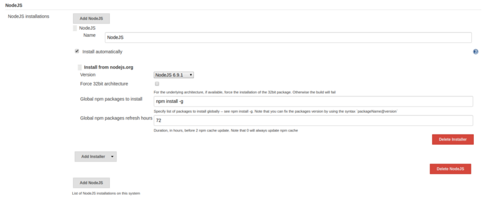
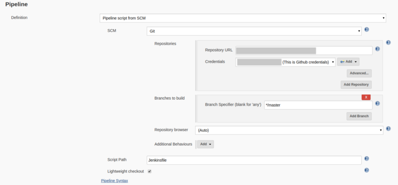

In this article, we are talking about how to Build [Node.js](https://nodejs.org/en/) and [React](https://reactjs.org/) application on Jenkins with Freestyle Project.

> Note: Following this article you can build Node.js and React app with npm

### [Setup Jenkins](https://medium.com/appgambit/setup-jenkins-on-centos-with-docker-for-selenium-b7dba07b9ffa "https://medium.com/appgambit/setup-jenkins-on-centos-with-docker-for-selenium-b7dba07b9ffa")

If you don’t have setup Jenkins on your machine please follow this article.

[**Setup Jenkins on CentOS with Docker for Selenium**  
_I haven’t found any walk-through about setting up Jenkins on CentOS with Docker for Selenium, and since I got to do it…_medium.com](https://medium.com/appgambit/setup-jenkins-on-centos-with-docker-for-selenium-b7dba07b9ffa "https://medium.com/appgambit/setup-jenkins-on-centos-with-docker-for-selenium-b7dba07b9ffa")

After setting up Jenkins we need to configure NodeJS on Jenkins.

#### Install NodeJS plugin

Open Jenkins: **Manage Jenkins > Plugin Manager > Install NodeJS plugin.**

#### Global Tool Configuration

Open Jenkins: **Manage Jenkins > Global Tool Configuration > NodeJS**

Set your compatible node version. We can set multiple NodeJS version for multiple application.

### 1: Build Application with freestyle.

#### Create a Node application job

1.  Open `Jenkins` > **New Item >** Enter any job **name**\> Choose **Freestyle Project >** Click on **Save button**.

**2\. Source Code Management** > Check `Git` and give Repository URL:

*   Git URL to your repo. Take this URL from Github. It should be the format of **git@github.com:{username}/{repo}.git**
*   Credentials: Select the one you created before.
*   Branches to build: `$branch`

**3\. Build Environment** > Provide Node & npm bin/ folder to PATH

Select the Nodejs version that is compatible with your application.

*   NodeJS Installation: It will display all Node version that is added through **Manage Jenkins > Global Tool Configuration > NodeJS**

**4\. Build > Execute shell:**

#!/bin/bash

echo "------> Install node modules <------"  
npm install

echo "------> Gulp webpack <------"  
gulp webpack

Here I’m using `webpack` for my NodeJS application build tool but you can use `Gulp, Grunt, Webpack,Express.js, pm2, Babel` Any tool that you want to use.

### 2: Build Application with Jenkins Pipeline.

you can build an application with the Jenkins Pipeline project.

#### Create a NodeJS application job

*   Open `Jenkins` -> **New Item**. Enter any job name > Choose **Pipeline >** Click OK.

*   **Pipeline >** There 2 options for Jenkinsfile.

> Pipeline Script

> Pipeline Script From SCM

#### Pipeline Script:

You can write your Pipeline code directly on Jenkins job.

#### Pipeline Script From SCM:

Pipeline supports fetching the DSL (Domain Specific Language) script from the SCM. Typically called Jenkinsfile and located in the root of the project.

*   Select `Pipeline script from SCM` from the definition.
*   Select Git as SCM
*   Git URL to your repo. Take this URL from Github. It should be the format of **git@github.com:{username}/{repo}.git**
*   Credentials: Select the one you created before.
*   Branches to build: `$branch`

For both types of the pipeline, you can use this demo pipeline code.

🎊 🎉🤖🎊 🎉 Our CI/CD Pipeline for a NodeJS Application is successfully configured.

Click on **Build Now**.

Now, you can watch the progress in **Console Output**.

You can also integrate your build with slack using the `[Slack Notifications plugin](https://wiki.jenkins.io/display/JENKINS/Slack+Plugin).`

You can create a Slack trigger to run this job So you don’t need to open Jenkins whenever you create the build, Just execute the slack command and your build is up and running.

[**TRIGGER JENKINS JOB FROM SLACK**  
_In my previous blog, I talked about how can we Integrate Jenkins with Slack Notifications._medium.com](https://medium.com/appgambit/trigger-jenkins-job-from-slack-5b07b6131e25 "https://medium.com/appgambit/trigger-jenkins-job-from-slack-5b07b6131e25")

_Thank you for reading, if you have anything to add please send a response or add a note!_