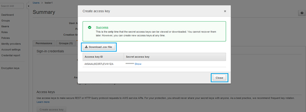

In this article, we are talking about AWS lambda functions deployment with Bitbucket Pipelines.

#### [What Is AWS Lambda?](https://docs.aws.amazon.com/lambda/latest/dg/welcome.html)

AWS Lambda is a service provided by Amazon. More simply, you have to store your function on to cloud and trigger stored function with events like API calls, database modifications and many more, etc.

The Lambda functions can perform any kind of computing task, from serving web pages and processing streams of data to calling APIs and integrating with other AWS services.

Behind the scene, Amazon manages running servers handling function execution and needed resources to complete function execution.

The Lambda functions can perform any kind of computing task, from serving web pages and processing streams of data to calling APIs and integrating with other AWS services.

### Let’s Move on our Demo

#### Step 1: Create a test function

Create New bitbucket repository

[**PrashantBhatasana/lambdaFunction**  
_You can’t perform that action at this time. You signed in with another tab or window. You signed out in another tab or…_github.com](https://github.com/PrashantBhatasana/lambdaFunction "https://github.com/PrashantBhatasana/lambdaFunction")

#### Step 2: Configure AWS credentials

Create an AWS IAM new user with the **AWSLambdaFullAccess** permission.

Create an IAM user.
Attach AWSLambdaFullAccess
Create Acces Key
Download created Access key and secret key

Now Goto bitbucket repository > Settings > Repository variables.

> Add the following variables:

> AWS\_ACCESS\_KEY\_ID: For AWS access key.

> AWS\_SECRET\_KEY\_ID: For AWS secret key.

#### Step 3: Create our Pipelines file

The `bitbucket-pipelines.yml` file has 2 sections to it, steps to :

*   build and .zip up the Lambda codeAn IAM user with sufficient permissions and access to update the Lambda function
*   push the updated code to AWS

In the example below replace the `FUNCTION_NAME` variable with the name of your function.

#### Step 4: Executing our deployment

Once we commit anything to bitbucket repository it will trigger our deployment pipeline.

Goto Pipelines section: it will display a new pipeline with `In Progress` status.

Now you click on that new pipeline it will display your pipeline steps and logs like the above screenshot.

🎊 🎉🤖🎊 🎉 If all goes well, Our lambda function deployed successfully.

_Thank you for reading, if you have anything to add please send a response or add a note!_