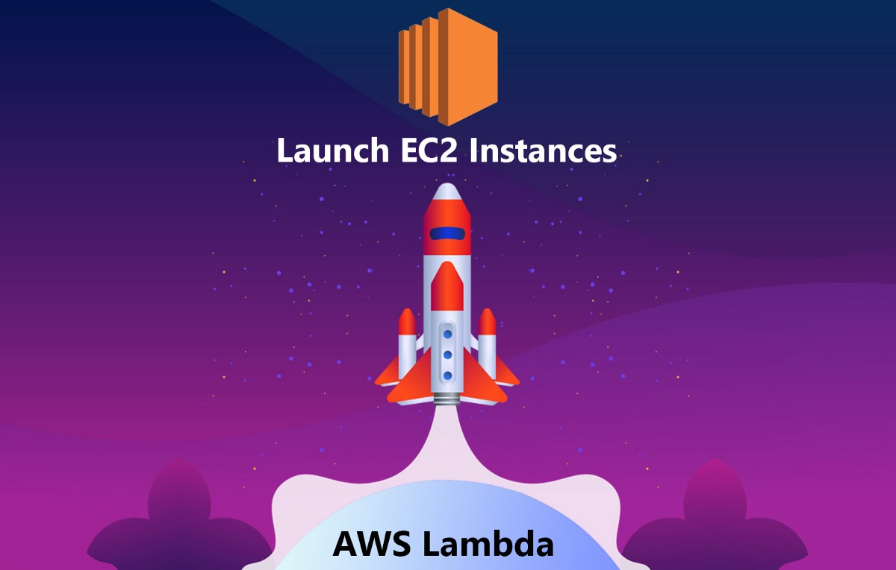

There are a variety of situations where having a [microservice](https://en.wikipedia.org/wiki/Microservices) available that can manage (Create, start, stop or terminate)EC2 instances at will can be handy. In this article, we are going to see how we can use an [AWS Lambda](https://aws.amazon.com/lambda/) to do such a thing on demand without using any extra servers or instances at all.

we will write a Lambda function that will create an EC2 instance. This Lambda function will be written in Python using the Boto3 library. We will also create a custom Lambda execution policy for our IAM role. When we’re done, we will be able to log in to the new EC2 instance via SSH.

### Let’s Move on the [AWS Management Console](https://aws.amazon.com/console/)

Let's navigate to [**AWS** Identity and Access Management (**IAM**)](https://aws.amazon.com/iam/) to create a role for our AWS Lambda function.

Select Role > Create Role > Select `AWS service` > Select `Lambda` As a use case and create a role with the below policy.

{  
    "Version": "2012-10-17",  
    "Statement": \[  
        {  
            "Sid": "VisualEditor0",  
            "Effect": "Allow",  
            "Action": \[  
                "logs:CreateLogStream",  
                "logs:PutLogEvents"  
            \],  
            "Resource": "arn:aws:logs:\*:\*:\*"  
        },  
        {  
            "Sid": "VisualEditor1",  
            "Effect": "Allow",  
            "Action": \[  
                "ec2:\*"  
            \],  
            "Resource": "\*"  
        },  
        {  
            "Sid": "VisualEditor2",  
            "Effect": "Allow",  
            "Action": "logs:CreateLogGroup",  
            "Resource": "arn:aws:logs:\*:\*:\*"  
        }  
    \]  
}

### Let’s Move on the [AWS Lambda](https://aws.amazon.com/lambda/)

1.  Select Functions > Create Function
2.  Enter the name of your lambda function.
3.  Select python as a runtime language.
4.  Click on **Choose or create an execution role** \> Select  Use an existing role.
5.  Click Create Function.
6.  Navigate to [AWS Lambda](https://aws.amazon.com/lambda/)
7.  Select `Functions > Create Function`
8.  Click on `**Choose or create an execution role**`  \> Select  `Use an existing role` .

AWS Lambda > Create a Function dashboard.

9\. Click on Create Function

10\. Add the following code in created lambda function.

AWS Lambda code to create EC2 Instance.

AWS Lambda code editor.

11\. Set the following environment variables:

Environment variables list

1.  **AMI**

*   _Key_: **AMI**
*   _Value_: Open **EC2** in a new browser tab, click **Launch Instance** and copy and paste the `ami` value listed after Amazon Linux 2.

2. **INSTANCE\_TYPE**

*   _Key_: **INSTANCE\_TYPE**
*   _Value_: **t2.micro**

3\. **KEY\_NAME**

*   _Key_: **KEY\_NAME**
*   _Value_: The name of the EC2 key pair you created earlier.

4\. **REGION**

*   _Key_: **REGION**
*   _Value_: The name of the Region.

5\. **SUBNET\_ID**

*   _Key_: **SUBNET\_ID**
*   _Value_: Navigate to **VPC** > **Subnets**, and copy and paste the ID of one of the public subnets in your VPC.

Save the Lambda function 🎊 🎉🤖🎊 🎉.

We have successfully created lambda function, Now Click on `Test`. It will execute our lambda function and create an EC2 instance.

Execution result of AWS Lambda

Let's check to the EC2 dashboard EC2 instance was created or not.

create EC2 instance and up and running

In my next article, we can see how we can Start/Stop and manage EC2 Instance with AWS Lambda**.**

_Thank you for reading, if you have anything to add please send a response or add a note!_