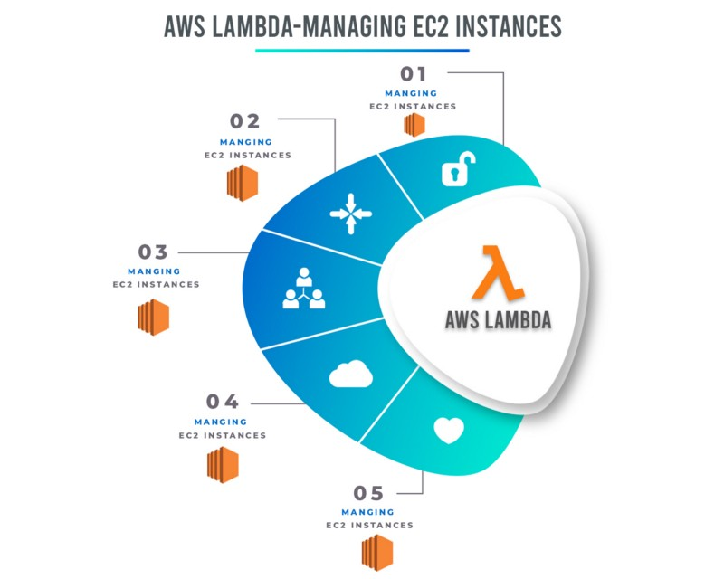
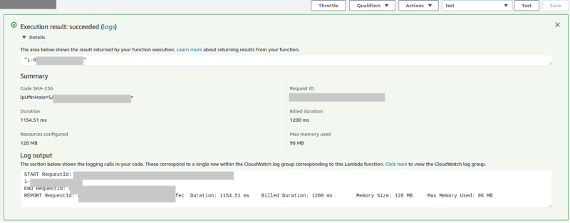

We created an AWS Lambda function that creates an EC2 instance in my previous article. Today we will gonna talk about How can we manage EC2 Instance with AWS Lambda.

we will write a Lambda function that will manage an EC2 instance. This Lambda function will be written in Python using the Boto3 library as well as Javascript. We will also create a custom Lambda execution policy for our IAM role. When we’re done, we will be able to manage EC2 instances via the AWS Lambda function.

### Let’s Move on the [AWS Management Console](https://aws.amazon.com/console/)

Let’s navigate to [**AWS** Identity and Access Management (**IAM**)](https://aws.amazon.com/iam/) to create a role for our AWS Lambda function.

Select Role > Create Role > Select `AWS service` > Select `Lambda` As a use case and create a role with the below policy.

{  
    "Version": "2012-10-17",  
    "Statement": \[  
        {  
            "Sid": "VisualEditor0",  
            "Effect": "Allow",  
            "Action": \[  
                "logs:CreateLogStream",  
                "logs:PutLogEvents"  
            \],  
            "Resource": "arn:aws:logs:\*:\*:\*"  
        },  
        {  
            "Sid": "VisualEditor1",  
            "Effect": "Allow",  
            "Action": \[  
                "ec2:\*"  
            \],  
            "Resource": "\*"  
        },  
        {  
            "Sid": "VisualEditor2",  
            "Effect": "Allow",  
            "Action": "logs:CreateLogGroup",  
            "Resource": "arn:aws:logs:\*:\*:\*"  
        }  
    \]  
}

### Let’s Move on the [AWS Lambda](https://aws.amazon.com/lambda/)

1.  In the [Lambda console](https://console.aws.amazon.com/lambda/), choose to Create function.
2.  Choose Author from scratch.
3.  Under Basic information, add the following:  
    \- For Function name, enter a name that identifies it as the function used to Stop your EC2 instances. For example, “StartEC2Instances”.  
    \- For Runtime, choose `Python 3.7` or `Node.js`.  
    \- Under Permissions, expand Choose or create an execution role.  
    \- Under the Execution role, choose to use an existing role.  
    \- Under the Existing role, choose the IAM role that you created.

4\. Choose to Create a function.

5\. Copy this code, and then under Function code, paste it into the [editor panel in the code editor](https://docs.aws.amazon.com/lambda/latest/dg/code-editor.html#code-editor-code) (lambda\_function).

This code Starts the EC2 instances that you identify.

> If you select `Python` as a runtime environment_,_ You can use this code.

> If you select `_Node.js_` as a runtime environment_,_ You can use this code.

6\. Choose Save.

For Stop and Terminate AWS lambda functions also repeat the above steps just use belove code

This code Stop the EC2 instances that you identify.

> If you select `_Python_` as a runtime environment_,_ You can use this code.

> If you select `_Node.js_` as a runtime environment_,_ You can use this code.

This code Terminates the EC2 instances that you identify.

> If you select `_Python_` as a runtime environment_,_ You can use this code.

> If you select `_Node.js_` as a runtime environment_,_ You can use this code.

🎊 🎉🤖🎊 🎉

We have successfully created lambda functions, Now Click on `Test`. It will execute our lambda function and start/stop an EC2 instance.

Execution result of AWS Lambda

Greta out lambda functions working for we can also create slack command to manage EC2 instances as well as we can create a slack notification when start/stop any EC2 instances.

In my next article, we can see how we can set up the Slack command to create/manage **EC2 Instance**.

_Thank you for reading, if you have anything to add please send a response or add a note!_