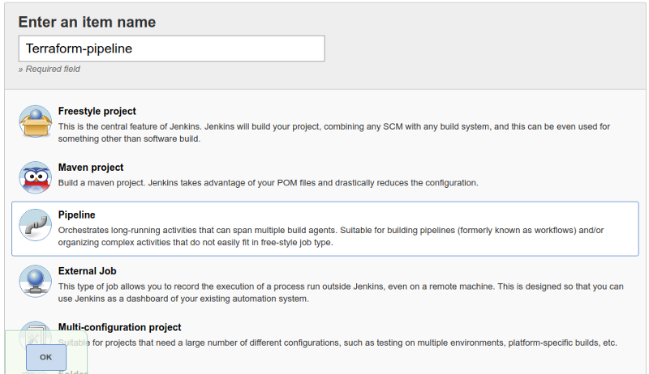

In this article, we are talking about **Jenkins** Integration with **Terraform**. How we can execute the **Terraform Script** using Jenkins.

As we all know Jenkins is a well-known open-source continuous integration and continuous development automation tool, I talked a lot about Jenkins and today also I’m talking about Jenkins.

#### What is Terraform?

Terraform is the infrastructure as a code offering from HashiCorp. It is a tool for building, changing and managing infrastructure in a safe, repeatable way. Operators and Infrastructure teams can use Terraform to manage environments with a configuration language called the HashiCorp Configuration Language (HCL) for human-readable, automated deployments.

#### Infrastructure as Code

If you are new to infrastructure as code as a concept, it is the process of managing infrastructure in a file or files rather than manually configuring resources in a user interface. A resource in this instance is any piece of infrastructure in a given environment, such as a virtual machine, security group, network interface, etc.

At a high level, Terraform allows operators to use HCL to author files containing definitions of their desired resources on almost any provider (AWS, GCP, GitHub, Docker, etc) and automates the creation of those resources at the time of `apply`.

In this track, we will cover the basic functions of Terraform to create infrastructure on AWS.

### Let’s Move on Jenkins now

If you are new with Jenkins I recommend checking my previous blog in which I talked about how to configure Jenkins.

[**Setup Jenkins on CentOS with Docker for Selenium**  
_I haven’t found any walk-through about setting up Jenkins on CentOS with Docker for Selenium, and since I got to do it…_medium.com](https://medium.com/appgambit/setup-jenkins-on-centos-with-docker-for-selenium-b7dba07b9ffa "https://medium.com/appgambit/setup-jenkins-on-centos-with-docker-for-selenium-b7dba07b9ffa")

After installation of Jenkins now we are good to move further 🎊 🎉🎊 🎉

#### Install Terraform plugin

Go to **Manage Jenkins > Manage Plugins >Available >** search **Terraform.**

If you are already installed **Terraform Plugin** on your Jenkins  It will display in the **Installed** section.

Now we can see the **Terraform** option in the **Build Environment** section but we need to configure Terraform for Jenkins.

#### Configure **Terraform**

Go to **Manage Jenkins > Global Tool Configuration >** It will display **Terraform on** the list.

Now let’s Create New project to execute **Terraform** from Jenkins.

#### Create a New Project

*   Open `Jenkins` -> **New Item**. Enter any job name > Choose **Pipeline >** Click OK.

*   **Pipeline >** 2 options for Jenkinsfile.

> _Pipeline Script_

> _Pipeline Script From SCM_

### Pipeline Script:

You can write your Pipeline code directly on Jenkins job.

### Pipeline Script From SCM:

Pipeline supports fetching the DSL (Domain Specific Language) script from the SCM. Typically called Jenkinsfile and located in the root of the project.

*   Select “Pipeline script from SCM” from the definition.
*   Select Git as SCM
*   Git URL to your repo. Take this URL from Github. It should be the format of **git@github.com:{username}/{repo}.git**
*   Credentials: Select the one you created before.
*   Branches to build: `$branch`

We configure our first terraform pipeline on Jenkins.

#### Now its time to run our Jenkins pipeline.

Once pipeline run you can see a new EC2 instance is created on your AWS account.🎊 🎉🎊 🎉🎊 🎉🎊 🎉

> Note: Use belove code for this prectice.

[**PrashantBhatasana/terraform-Jenkins-ec2**  
_This is a demo repository for Terraform integration with Jenkins. - PrashantBhatasana/terraform-jenkins-ec2_github.com](https://github.com/PrashantBhatasana/terraform-jenkins-ec2 "https://github.com/PrashantBhatasana/terraform-jenkins-ec2")

_Thank you for reading, if you have anything to add please send a response or add a note!_