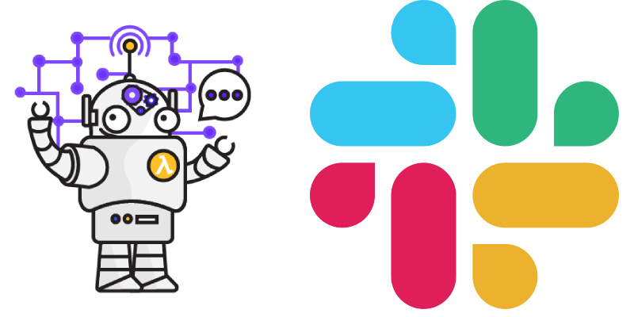

We already discuss so many integration with slack before.

Today we discuss how we can integrate [**AWS Chatbot**](https://aws.amazon.com/chatbot/) with slack so we can get AWS notification on our slack as well as run AWS command from slack also.

#### What is AWS Chatbot?

**AWS Chatbot** is an interactive agent that makes it easy to monitor and interact with your **AWS** resources in your Slack channels and Amazon Chime chat rooms.

With **AWS Chatbot** you can receive alerts and run commands to return diagnostic information, invoke AWS Lambda functions, and create AWS support cases so that your team can collaborate and respond to events faster.

> **AWS Chatbot** is currently in **beta**.

*   Create an SNS (Simple Notification Service) topic.
*   Configure AWS Chatbot with our slack.
*   Configure AWS Chatbot with SNS topic

### Let’s Move on AWS Console now

If you don't have an AWS account, please go to [https://aws.amazon.com/](https://aws.amazon.com/) and create a new account.

#### Create an SNS (Simple Notification Service) topic

Amazon Simple Notification Service (SNS) is a highly available, durable, secure, fully managed pub/sub messaging service that enables you to decouple microservices, distributed systems, and serverless applications. Amazon SNS provides topics for high-throughput, push-based, many-to-many messaging. Using Amazon SNS topics, your publisher systems can fan-out messages to a large number of subscriber endpoints for parallel processing, including [Amazon SQS](https://aws.amazon.com/sqs/) queues, [AWS Lambda](https://aws.amazon.com/lambda/) functions, and HTTP/S webhooks. Additionally, SNS can be used to fan out notifications to end users using mobile push, SMS, and email.

You can get started with Amazon SNS in minutes by using the AWS Management Console, AWS Command Line Interface (CLI), or AWS Software Development Kit (SDK).

Now goto SNS dashboard and create new SNS topic.

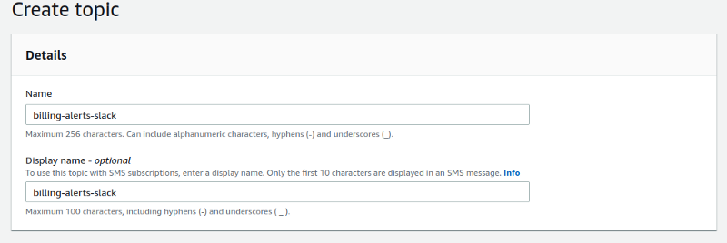

After that scroll down and add the Access policy of our SNS topic like

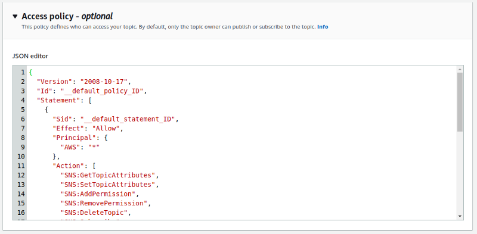

{  
  "Version": "2008-10-17",  
  "Id": "\_\_default\_policy\_ID",  
  "Statement": \[  
    {  
      "Sid": "\_\_default\_statement\_ID",  
      "Effect": "Allow",  
      "Principal": {  
        "AWS": "\*"  
      },  
      "Action": \[  
        "SNS:GetTopicAttributes",  
        "SNS:SetTopicAttributes",  
        "SNS:AddPermission",  
        "SNS:RemovePermission",  
        "SNS:DeleteTopic",  
        "SNS:Subscribe",  
        "SNS:ListSubscriptionsByTopic",  
        "SNS:Publish",  
        "SNS:Receive"  
      \],  
      "Resource": "arn:aws:sns:us-east-1:XXXXXXXXXXXX:billing-alerts-slack",  
      "Condition": {  
        "StringEquals": {  
          "AWS:SourceOwner": "XXXXXXXXXXXX"  
        }  
      }  
    },  
    {  
      "Sid": "AWSBudgetsSNSPublishingPermissions",  
      "Effect": "Allow",  
      "Principal": {  
        "Service": "budgets.amazonaws.com"  
      },  
      "Action": "SNS:Publish",  
      "Resource": "arn:aws:sns:us-east-1:XXXXXXXXXXXX:billing-alerts-slack"  
    }  
  \]  
}

#### Configure AWS Chatbot

Now goto AWS Chatbot dashboard and Configure new client.

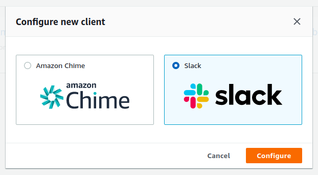
Select Slack > Configure

Once we click on `Configure` button it will redirect to the Slack login screen.

When you click on the configure button it will open a new window for slack login. once you login to your slack account it will display AWS Chatbot (Beta) plugin > Click on Add button.

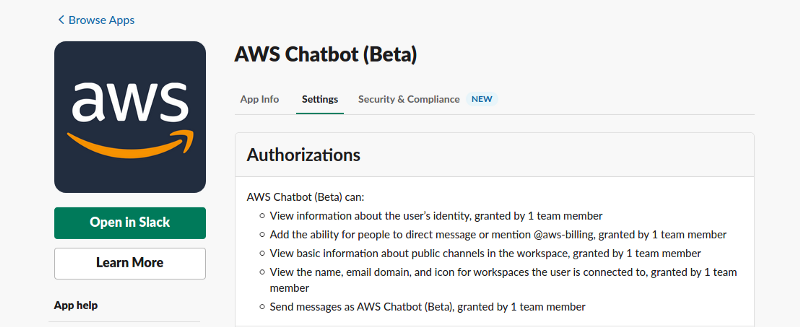

After that rename AWS Chatbot like

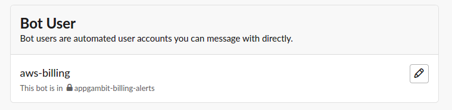

Once we add the plugin into our slack it will ask for permission like belove.

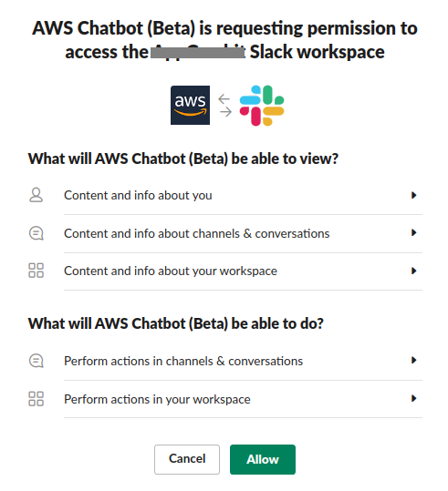

After that, it will redirect to the AWS console, Now we need to configure the slack channel with AWS Chatbot.

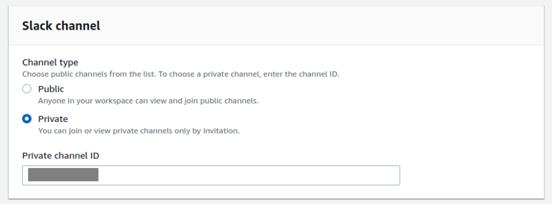

But before that, we need to go on slack and add our AWS Chatbot to specific slack channel.

Create a new Slack channel or go to the existing one and add our created AWS chatbot (Beta) to a specific channel.

```
/invite @aws-billing
```

1.  Select Slack channel type

*   Public channel.
*   Private channel.

2\. Channel name or id.

If anyone not familiar with slack then gets Slack ID like belove.

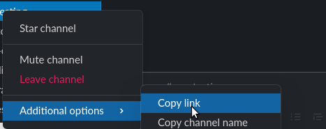

It will copy link like this

[https://my-channel.slack.com/archives/CO0U0CP1N](https://appgambit-surat.slack.com/archives/CF0U0MF1S)

This is the channel ID **CO0U0CP1N**

After that scroll down it will ask for IAM role selection.

*   Select > Create an IAM role using a template
*   give proper name of the role
*   Select policy templates.

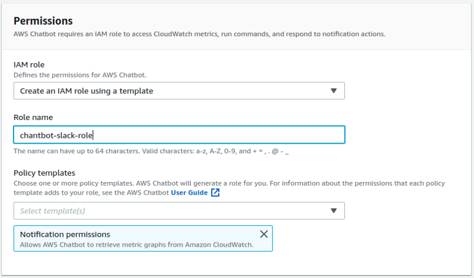

After that scroll down it will ask for SNS topics

Here we need to enter and select out previously create SNS topic name.

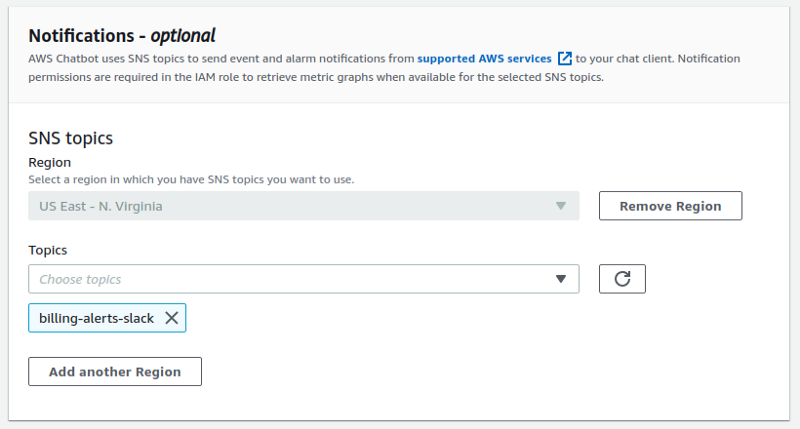

Click on the **configure** 🎊 🎉🎊 🎉

After that, for verification, we need to go to the SNS dashboard and check our SNS topic subscription is displayed or not.

it will automatically add subscription like this

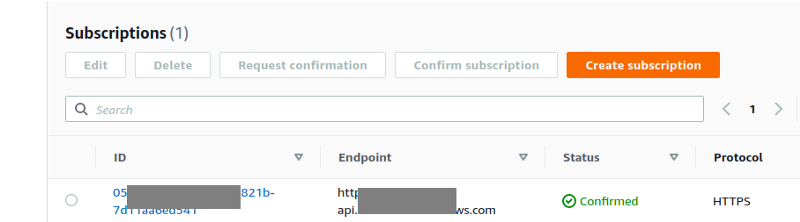

Here we go Our AWS chatbot successfully connected to our slack.

Now for testing, we need to create an AWS CloudWatch alarm and check whether our slack bot is configured successfully or not.

For that, we need the following things.

*   Dummy AWS Lambda function with an error.

Create AWS CloudWatch alarm

1.  Select matrix of you AWS dummy lambda function > Metrix name: Errors

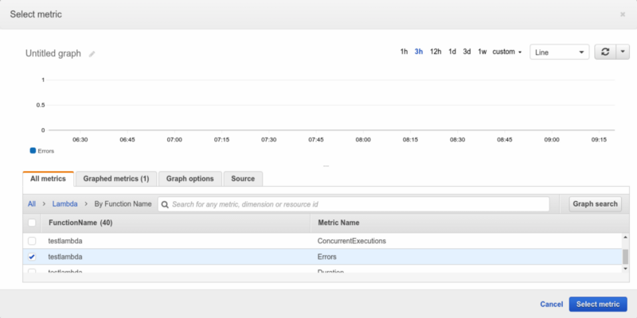

2\. After that configure the matrix period condition.

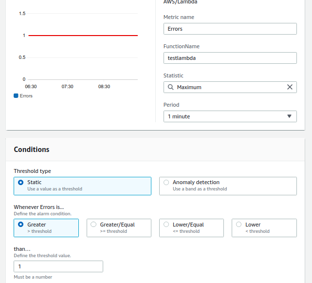

Click on Next.

3\. For notification, we need to configure our previously created SNS topic here.

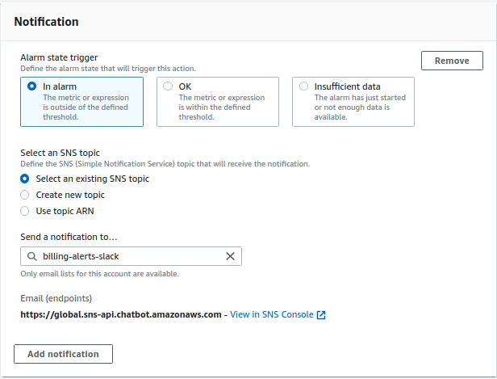

Click on Next > Give a valid name of our AWS CloudWatch alarm.

Now we are good to go 🎊 🎉🎊 🎉

Goto lambda function and run that.

once error will occur AWS chatbot sends a notification to slack like

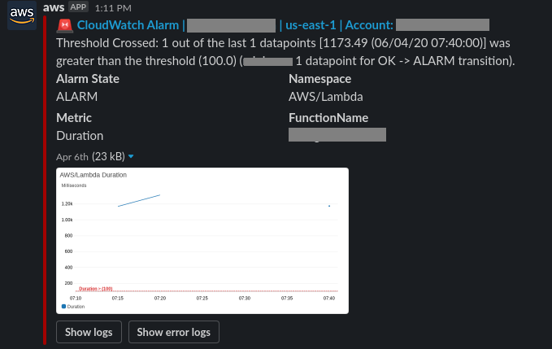

_Thank you for reading, if you have anything to add please send a response or add a note!_