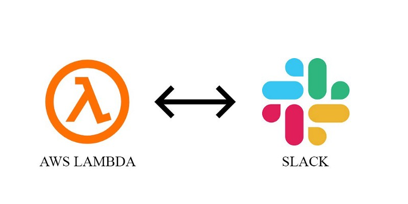
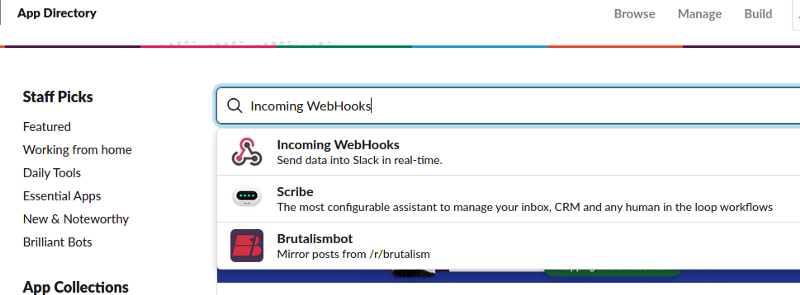
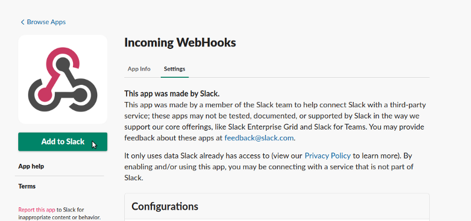
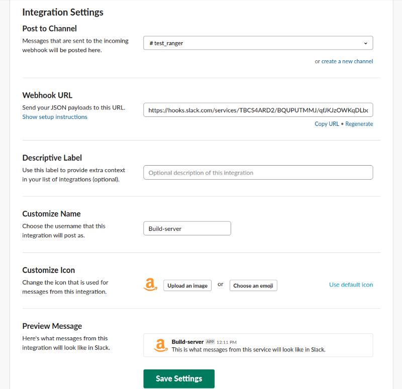
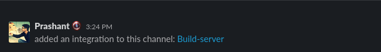
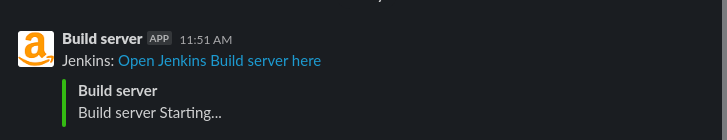

In this article, we are talking about Incoming Webhooks with AWS Lambda. How we can send the slack message from AWS Lambda using Incoming Webhooks.

#### What is the incoming Webhook?

[**Incoming Webhooks**](https://appgambit-surat.slack.com/apps/A0F7XDUAZ-incoming-webhooks?next_id=0) are a simple way to post messages from apps into Slack. Creating an **Incoming Webhook** gives you a unique URL to which you send a JSON payload with the message text and some options. You can use all the usual formatting and layout blocks with **Incoming Webhooks** to make the messages stand out.

#### Let's move on Slack and start our exercise.

#### **Install Incoming WebHooks plugin into your slack.**

Goto App Directory > Search \`Incoming WebHooks\`.

Click on \`Incoming WebHooks\`, It will display like belove

Click on \`Add to Slack\`.

#### Configure Incoming WebHooks in the specific slack channel.

*   Add Slack Channel name to get notification
*   Copy Webhook URL
*   Enter the Description of your WebHook.
*   Enter the Name of your WebHook If you want any customize name default it will be \`**incoming-webhook**\`.
*   If you want any custom icon to add that in Customize Icon section.

Click on **Save Setting**.

Once you setup Incoming WebHooks into any slack channel it will send notification like belove.

Now we successfully add our **Incoming WebHooks** plugin in the slack channel 🎊 🎉🤖🎊 🎉

#### Now let's move on AWS console

1.  In the [Lambda console](https://console.aws.amazon.com/lambda/), choose to Create function.
2.  Choose Author from scratch.
3.  Under Basic information, add the following:
4.  For Function name, enter a name that identifies it as the function used to Stop your EC2 instances. For example, “StartEC2Instances”.
5.  For Runtime, choose `Python 3.7` or `Node.js 12.x`.
6.  Under Permissions, expand Choose or create an execution role.
7.  Under the Execution role, choose to use an existing role.
8.  Under the Existing role, choose the IAM role that you created.
9.  Choose to Create a function.
10.  Copy this code, and then under Function code, paste it into the [editor panel in the code editor](https://docs.aws.amazon.com/lambda/latest/dg/code-editor.html#code-editor-code) (lambda\_function).

> _If you select_ `_Python_` _as a runtime environment, you can use this code._

> _If you select_ `Node.js` _as a runtime environment, You can use this code._

🎊 🎉🤖🎊 🎉

We have successfully created lambda functions, Now Click on `Test`. It will execute our lambda function and start an EC2 instance as well as Send Slack notification.

_Thank you for reading, if you have anything to add please send a response or add a note!_