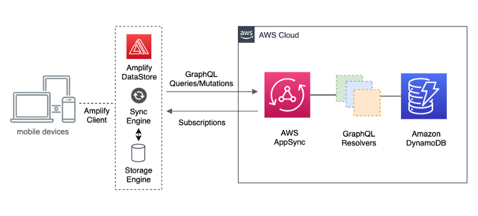
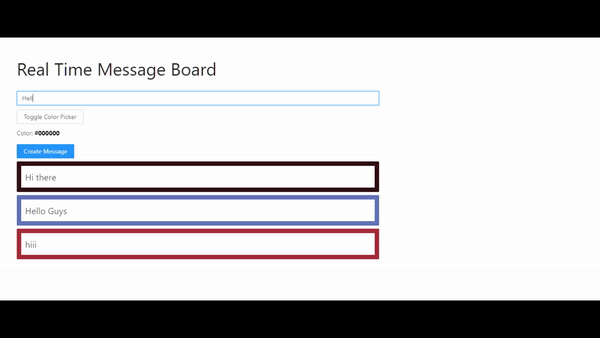

Amplify DataStore provides a programming model for leveraging shared and distributed data without writing additional code for offline and online scenarios, which makes working with distributed, cross-user data just as simple as working with local-only data.

AWS Amplify is a JavaScript library for frontend and mobile developers building cloud-enabled applications

AWS Amplify provides a declarative and easy-to-use interface across different categories of cloud operations. AWS Amplify goes well with any JavaScript based frontend workflow, and React Native for mobile developers.

Our default implementation works with Amazon Web Services (AWS), but AWS Amplify is designed to be open and pluggable for any custom backend or service.

### Real-Time Message Board With AWS Amplify & React

**Start with create-react-app**

```
$ npx create-react-app amplify-datastore — use-npm
cd amplify-datastore
npx amplify-app@latest
```

Once the basic setup completes open the GraphQL schema located in `amplify/backend/api/<datasourcename>/schema.graphql`.

Change graph QL schema:

```
type Message @model {
id: ID!
title: String!
color: String
createdAt: String
}
```

Next, jump back to the command line so we can install the dependencies that will be needing the dependencies that will be adding or ant designed for some UI components react color for a color picker and amplify core and amplify datastore

`$ yarn add antd react-color @aws-amplify/core @aws-amplify/datastore`

amplified datastore uses data models based on your graph QL schema to interact with the datastore API we can generate these models by running

`$ npm run amplify-modelgen`

this command will introspect your graphQL schema and generate the necessary model for our app we can now look in the source directory and see that we have a new models directory next to initialize the amplify project in the cloud we can run amplify Annette here will give our environment name choose our default text editor and then choose our AWS profile.

we’re now ready to deploy our app to do so we can run

`$ amplify push`

since we will be working with the datastore API we can choose no when

asked to generate graphQL code locally

Now that the backend has been deployed.

Now open `` `src/index.js` ``

In this file, we’ll import the ant design styling amplify from amplify core the configuration that was generated for us by the CEO located at AWS exports and then we’ll call amplify dot configure passing in the config

next, we can open up `app.js.`

Now just delete all of the code in `app.js` file and put below code in `app.js` file

**_App.js_**

```
import React, { useState, useEffect } from ‘react’;
import { SketchPicker } from ‘react-color’;
import { Input, Button } from ‘antd’;
import { DataStore } from ‘@aws-amplify/datastore’;
import { Message } from ‘./models’;

const initialState = { color: ‘#000000’, title: ‘’ };

function App() {
  const \[formState, updateFormState\] = useState(initialState);
  const \[messages, updateMessages\] = useState(\[\]);
  const \[showPicker, updateShowPicker\] = useState(false);
  useEffect(() => {
  fetchMessages();
  const subscription = DataStore.observe(Message).subscribe(() =>
  fetchMessages()
);
return () => subscription.unsubscribe();
});

function onChange(e) {
  if (e.hex) {
  updateFormState({ …formState, color: e.hex });
  } else {
  updateFormState({ …formState, title: e.target.value });
}
}

async function fetchMessages() {
const messages = await DataStore.query(Message);
updateMessages(messages);
}

async function createMessage() {
  if (!formState.title) return;
    await DataStore.save(new Message({ …formState }));
    updateFormState(initialState);
}

return (
<div style={container}>
<h1 style={heading}>Real Time Message Board</h1>
<Input
onChange={onChange}
name=”title”
placeholder=”Message title”
value={formState.title}
style={input}
/>
<div>

<Button onClick={() => updateShowPicker(!showPicker)} style={button}>
Toggle Color Picker
</Button>

<p>
Color:{‘ ‘}
<span style={{ fontWeight: ‘bold’, color: formState.color }}>
{formState.color}
</span>
</p>
</div>
{showPicker && (
<SketchPicker color={formState.color} onChange={onChange} />
)}

<Button type=”primary” onClick={createMessage}>
Create Message
</Button>

{messages.map((message) => (
<div
key={message.id}
style={{ …messageStyle, backgroundColor: message.color }} >
<div style={messageBg}>
<p style={messageTitle}>{message.title}</p>
</div>
</div>
))}
</div>
);
}

const container = { width: ‘100%’, padding: 40, maxWidth: 900 };
const input = { marginBottom: 10 };
const button = { marginBottom: 10 };
const heading = { fontWeight: ‘normal’, fontSize: 40 };
const messageBg = { backgroundColor: ‘white’ };
const messageStyle = { padding: ‘10px’, marginTop: 7, borderRadius: 2 };
const messageTitle = { margin: 0, padding: 9, fontSize: 20 };
export default App;
```

Now we are ready to test everything out to do so we can run

`$ npm start`

Now successfully running ..!



Well, it Works !!