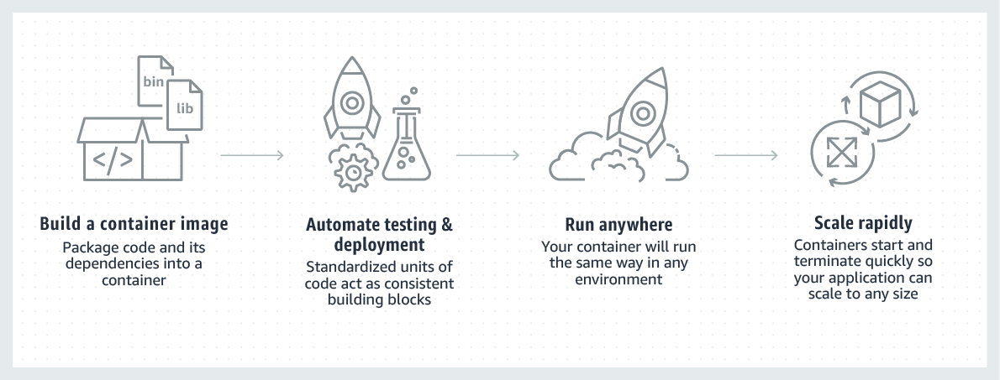
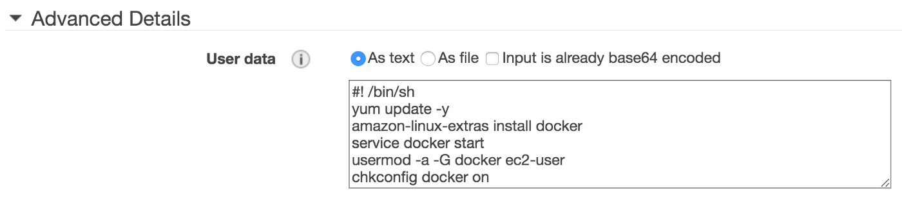
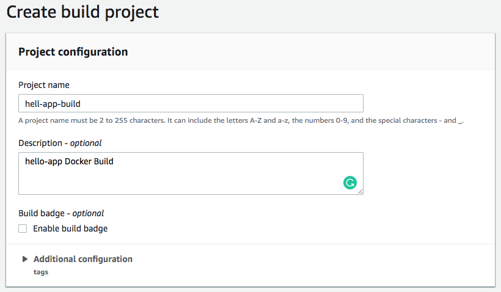
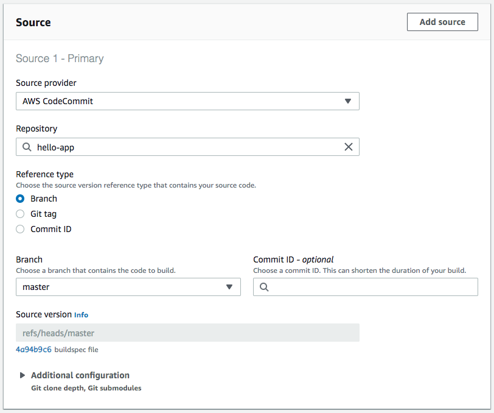
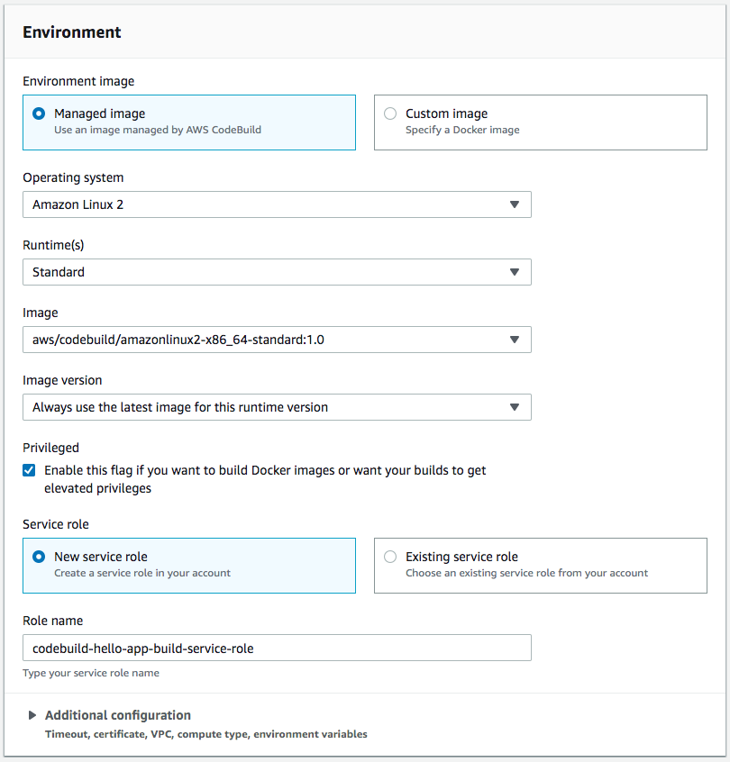
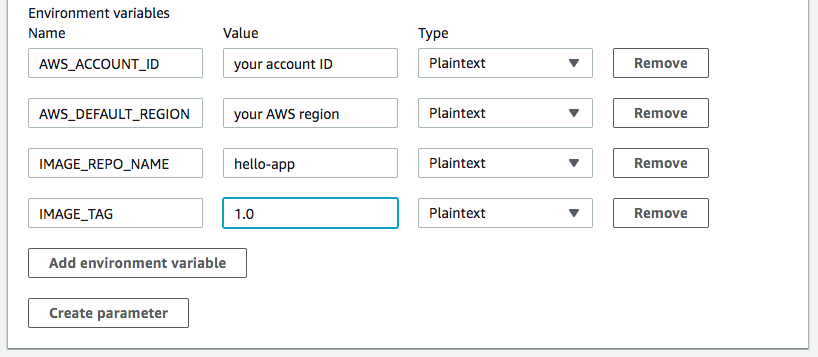
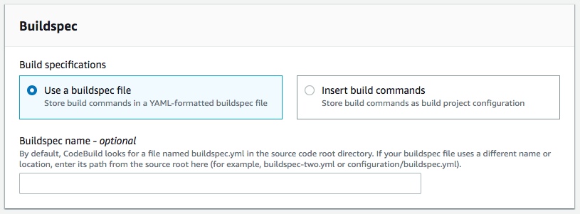
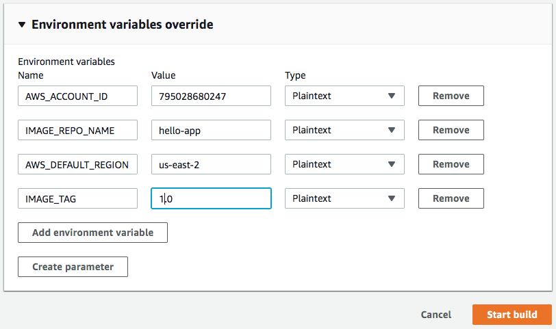
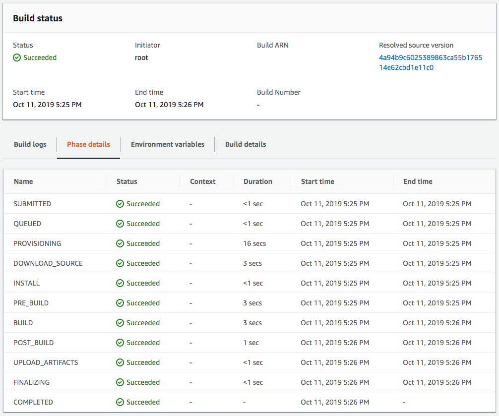

This is a multi-part series, wherein I will show various AWS Compute services like EC2, ECS, Fargate, and EKS to run Docker containers. We will use a number of other AWS services like CodeCommit, CodeBuild, CodePipeline along the way.

> Note: We will not be looking at Docker Networking, Storage, Swarm and Services, Replicas, Load Balancer part in this post. I will cover those in upcoming articles.

### AWS Compute Services for Docker

- Running Docker on EC2 (this one)
- Running Docker on ECS
- Running Docker on Fargate
- Running Docker on EKS

In a nutshell, it looks like this. For full reference visit [Containers on AWS](https://aws.amazon.com/containers/).



### Let’s start

I will not go into the whole “What is Docker” and how it works thingy. Docker is quite popular on its own, and there is a ton of documentation already available for it. So we will go directly into the AWS services from here on.

> For learning Docker, I would suggest reading [Docker Deep Dive by Nigel Poulton](https://www.amazon.in/Docker-Deep-Dive-Nigel-Poulton/dp/9352138554) The book covers most of the Docker concepts in full detail.

We will take `nginx` image as our base image for this example. We will not be adding anything in it and keep it simple for the demo. We will use EC2 Linux 2 AMI machine for this demo.

Let’s create a local image first and make sure it works. Create a new directory `hello-app` and copy the following statements into the `Dockerfile`. You can build the image locally and test. We will do this on EC2 as well.

```
FROM alpine
MAINTAINER dhavaln
LABEL description="Running Docker on AWS EC2"
WORKDIR /src
RUN echo "Hello world" > hello.txt
CMD ["cat", "hello.txt"]
```

### EC2 IAM Role

Before we start on AWS, we need to make sure we have a suitable IAM role available which we can assign to our EC2 instance. The role will allow the instance to communicate with ECR and other AWS resources (in the future).

For this example, I am using a pretty simple EC2 role, which has full access to ECR resources.

```json
{
    "Version": "2012-10-17",
    "Statement": [
        {
            "Effect": "Allow",
            "Action": [
                "ecr:*",
                "cloudtrail:LookupEvents"           
            ],
            "Resource": "*"
        }
    ]
}
```

> If you have set the AWS CLI, make sure you have one configured from [here](https://docs.aws.amazon.com/cli/latest/userguide/cli-chap-configure.html).

### Install Docker on EC2 (Manually)

Create a simple EC2 instance and fire these commands after you SSH into it.

```noLineNumbers
$ sudo yum update -y
$ sudo amazon-linux-extras install docker
$ sudo service docker start
$ sudo usermod -a -G docker ec2-user
```

Logout from the EC2 instance and log back in. Now you should be able to run the `docker` commands without `sudo`.

```noLineNumbers
$ docker info
```

### Install Docker on EC2 (via EC2 User data)

If you do not want to manually configure it, the easiest option is passing the script via `User data` while creating the EC2 machine.

```
#! /bin/sh
yum update -y
amazon-linux-extras install docker
service docker start
usermod -a -G docker ec2-user
chkconfig docker on
```

You can pass the above script in the User data section while creating a new EC2 instance in **Step 3: Configure Instance Details** section.



Now our EC2 instance is ready to run Docker containers. The next part is having the images in the right place so that we can start pulling them.

> Note: It is possible that the User data script take some time to execute and make Docker CLI ready to use. So either wait a few seconds once the EC2 instance is in the ready state or logout and login back after a few seconds if it is not available.

### Build and Upload Docker Images

Based on our example, we know that alpine is a very simple and basic image and we haven’t added any layers as such. Which means the final image will be very simple to move around. So we can build the image from our local machine, and upload it to a repository and pull from there on the EC2 machine.

As you can see based on our original Dockerfile, the docker image is still very small and we can move it around.

```noLineNumbers
$ docker history --human dhavaln/hello-app
IMAGE        CREATED BY                                      SIZE  
f2e8ccf15b3a /bin/sh -c #(nop)  CMD ["cat" "hello.txt"]      0B                  
846cc4b8b31f /bin/sh -c echo "Hello world" > hello.txt       12B                 
5bc247bdeb29 /bin/sh -c #(nop) WORKDIR /src                  0B                  
365332b912fa /bin/sh -c #(nop)  LABEL description=Runnin …   0B                  
46e08cc14fb8 /bin/sh -c #(nop)  MAINTAINER dhavaln           0B                  
961769676411 /bin/sh -c #(nop)  CMD ["/bin/sh"]              0B                  
<missing>    /bin/sh -c #(nop) ADD file:fe64057fbb83dccb9…   5.58MB
```
Now let’s create a simple NodeJS app running as a Docker container on local and check what will be the difference in size.

```noLineNumbers
FROM node:10
MAINTAINER dhavaln
LABEL description="NodeJS Hello World App"
WORKDIR /src
RUN echo "console.log('Hello world');" > hello.js
CMD ["node", "hello.js"]
```

When you build this Docker image and check the size of the final image, it shows a whooping **904MB SIZE**, mainly because the base image that we are using `node:10` (base) is a very big image in itself.


```noLineNumbers
$ docker images
REPOSITORY             TAG                 IMAGE ID            CREATED             SIZE
dhavaln/hello-node   latest              c98a1d3dda34        5 seconds ago       904MB
dhavaln/hello          latest              f2e8ccf15b3a        12 minutes ago      5.58MB
node                   10                  636ef87129d6        4 weeks ago         904MB
alpine                 latest              961769676411        7 weeks ago         5.58MB
```

> Note: We are using the base copy of the Node10 and that is why the size is high. In most production cases, you will use the image variants suitable to your environment and create a multi-stage build for packaging.

> Use this for NodeJS Variants reference: https://hub.docker.com/_/node

Because of this, creating a Docker build from your development machine and then uploading to Docker Container Registry frequently, either public or private, will be a very tedious and time-consuming task. We will still do it manually first and then see how we can simplify that using the AWS Developer Tools Service like [CodeBuild](https://aws.amazon.com/codebuild/).

** Note: We will be using the [AWS Elastic Container Registry (ECR)](https://aws.amazon.com/ecr/) to store our Docker images in a private repository.**

### Manually uploading Docker Image from EC2 to ECR

AWS ECR is a private Docker repository to store all your images in a private and secure environment.

Before we can start using the ECR for our images, we have to do the following steps:

1. Create a repository in ECR
2. Tag your image with ECR Repository URL (this is required for private repo)
3. Get the Login code for ECR on your EC2 machine
4. Do `docker login`

** Note: Make sure you have attached the IAM role to the EC2 otherwise the following commands will not run.**

```noLineNumbers
$ aws ecr create-repository --repository-name hello-app --region (your region of choice)
{
    "repository": {
        "registryId": "yout account id",
        "repositoryName": "hello-app",
        "repositoryArn": "arn:aws:ecr:region:aws_account_id:repository/hello-repository",
        "createdAt": 1505337806.0,
        "repositoryUri": "aws_account_id.dkr.ecr.region.amazonaws.com/hello-repository"
    }
}
```

Next, we will have to tag our local image with repo URL from the last response, so that we can push that to ECR.

```noLineNumbers
$ docker tag hello-app aws_account_id.dkr.ecr.region.amazonaws.com/hello-app
```

Before we can push to the ECR, we have to log in to the ECR service via Docker. The following command will return the full URL which we can use to login to the ECR with `docker login` command.

```noLineNumbers
$ aws ecr get-login --no-include-email --region region

docker login -u AWS -p ..................

Copy the above command and run it in the console to do the docker login
```

Once the login is successfully done, we can push the docker images to ECR.

```noLineNumbers
$ docker push aws_account_id.dkr.ecr.region.amazonaws.com/hello-app
```

After all of these, you can finally see your docker image being pushed to ECR and now ready to consume. We will delete the local image first and then try to pull it back from the ECR.

```noLineNumbers
$ docker pull aws_account_id.dkr.ecr.region.amazonaws.com/hello-app
$ docker run --rm aws_account_id.dkr.ecr.region.amazonaws.com/hello-app

Hello world
```

So finally we have our Docker image ready, pushed to ECR, pulled from ECR and working on an EC2 machine.

### CodeCommit + CodeBuild = 🙌

AWS CodeCommit is a private source repository. CodeBuild is a customizable source code build, test, and packaging service. Both the services are fully managed and we do not need to maintain any infrastructure.

#### Push your code to CodeCommit

So far we have not written any code. We just have a Dockerfile which actually creates an image with a local file. We will push the `Dockerfile` along with the`buildspec.yml` file which will be required as an input to the CodeBuild project.

> Note: Make sure your local development environment is configured to access AWS CodeCommit.
https://docs.aws.amazon.com/codecommit/latest/userguide/setting-up-ssh-unixes.html

```YAML
version: 0.2

phases:
  install:
    runtime-versions:
      docker: 18
  pre_build:
    commands:
      - echo Logging in to Amazon ECR...
      - $(aws ecr get-login --no-include-email --region $AWS_DEFAULT_REGION)
  build:
    commands:
      - echo Build started on `date`
      - echo Building the Docker image...          
      - docker build -t $IMAGE_REPO_NAME:$IMAGE_TAG .
      - docker tag $IMAGE_REPO_NAME:$IMAGE_TAG $AWS_ACCOUNT_ID.dkr.ecr.$AWS_DEFAULT_REGION.amazonaws.com/$IMAGE_REPO_NAME:$IMAGE_TAG
  post_build:
    commands:
      - echo Build completed on `date`
      - echo Pushing the Docker image...
      - docker push $AWS_ACCOUNT_ID.dkr.ecr.$AWS_DEFAULT_REGION.amazonaws.com/$IMAGE_REPO_NAME:$IMAGE_TAG

```


```Dockerfile
FROM alpine
MAINTAINER dhavaln
LABEL description="Part 1 - Running Docker on AWS EC2"
WORKDIR /src
RUN echo "Hello world" > hello.txt
CMD ["cat", "hello.txt"]
```


#### Create the CodeBuild project

Now that we have the source in the CodeCommit repository. We can create a build project to “build docker images and push to ECR” for further use.



Select the CodeCommit source repository



Select the build environment. This is a complicated step and involves more than a few steps.



> Note: One thing you will have to do after the build project is created. You will have to attach the `AmazonEC2ContainerRegistryPowerUser` policy to the role that you typed in the `Role name` configuration in IAM console.

At the bottom, you will see the **Additional configuration** section. We will use that to define the environment variables that we have specified in our `buildspec.yml` file.

> We are defining Environment variables at the time of creating the project, but we can override them before we start the build process.



Next, select the Buildspec file. As we have given the buildspec.yml file as part of the source code, we do not need to define anything here.



Keep other options default, and hit the **Create build project** button at the bottom.

#### Generate a Build

Press the **Start build** button at the top-right corner of the project. It will ask to override any variables. If you want, you can change the **Image Tag** environment variable value to a different version.



Once the build process is completed, you can see the phase detail and your newly created Docker image in the ECR.



You should see the Docker image we just built in the ECR application repository.


#### Pull the newly created build from ECR and Test on EC2

Now that our Docker image is ready to use. We can go back to the EC2 instance, pull the image and run it for a test.

First login to the ECR again from your EC2 instance, if you have not already.

```noLineNumbers
$> $(aws ecr get-login --no-include-email --region us-east-2)
```

Next, pull the image based on the repository URL and the Image Tag

```noLineNumbers
$ docker pull aws_account_id.dkr.ecr.region.amazonaws.com/hello-app:1.0
$ docker run --rm aws_account_id.dkr.ecr.region.amazonaws.com/hello-app:1.0

Hello world
```

> Well, it works (for me) 🎉🎉

It may look like a tedious or lengthy process to set these all things just to build a Docker image, but some of these things are set only once and then you keep re-using it.

You can further automate the process using CodePipeline and other lifecycle events, but that is for some other day.